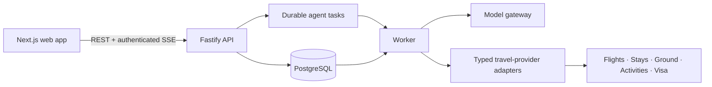

# Wanderly

> **A privacy-first, agentic workspace for planning international trips—individually and together.**

<p>
  <a href="docs/PRD.md">Product requirements</a> ·
  <a href="docs/technical-architecture-overview.md">Architecture</a> ·
  <a href="apps/api/API.md">API reference</a> ·
  <a href="docs/open-source-release.md">Open-source release</a> ·
  <a href="#chinese">中文说明</a>
</p>

| Project status | Stage | Primary interface | Deployment target |
| --- | --- | --- | --- |
| Active development | AWS Hackathon MVP | Responsive web app | AWS |

Wanderly makes international-trip planning a coordinated, evidence-backed workflow rather than a collection of disconnected chats, search tabs, and spreadsheets. Each traveller has a private profile and private Personal Agent. For a shared trip, members explicitly authorize only the trip-specific fields needed for planning; the Shared Agent then assembles a source-backed plan across flights, stays, ground mobility, activities, and visa/entry-readiness tasks.

The system is intentionally designed so that a model, browser, or provider response cannot establish business truth by itself. The server and database are authoritative for consent, immutable constraint snapshots, plan versions, stale state, confirmations, and booking idempotency.

## Product highlights

| Capability | What Wanderly delivers |
| --- | --- |
| Personal travel workspace | Owner-only profiles, durable private agent threads, and individual research. |
| Shared trip planning | Field-level consent, multi-origin comparison, and coordinated destination candidates. |
| Evidence-based outputs | Provider source and capture time on travel facts; unavailable data is never fabricated. |
| Resilient execution | Recoverable server-side tasks with safe progress streaming and final-state recovery. |
| Change-aware plans | Constraint or evidence changes make affected plans `STALE` and trigger a replan. |
| Controlled action | All required members must confirm the same current plan before booking sandbox orchestration. |

## The planning lifecycle


## System guarantees and boundaries

Wanderly is a planning MVP, not an online travel agency or legal service. Its core product guarantees are:

- **Private by default.** Profiles, passports/nationality, and private chats are never shared automatically and must not enter logs, metrics, traces, browser persistence, or fixtures.
- **Evidence over simulation.** Travel facts carry source and capture-time context. A missing, failed, stale, or untrusted live result is `UNAVAILABLE`, never a substitute offer, price, inventory claim, exchange rate, or visa conclusion.
- **Server-enforced authority.** Only the server may create snapshots, activate plans, set stale state, accept confirmations, or invoke booking orchestration.
- **Human confirmation for irreversible actions.** Visa and entry output is a readiness checklist with official-verification next steps—not legal advice, a decision, or an application service. There are no real payments, automatic charges, real reservations, or visa applications.
- **Credentials stay server-side.** Fixtures serve tests and adapter-contract validation only; they never supply the user-facing product path.

Read the complete MVP constraints in [TECH_STACK.md](TECH_STACK.md) and [docs/PRD.md](docs/PRD.md).

## Architecture



The deployed Hackathon topology uses Next.js on AWS Amplify Hosting, Fastify on AWS App Runner, a durable Worker on ECS Fargate, PostgreSQL on Amazon RDS, Cognito for production identity, and AWS Secrets Manager/KMS for secrets. Infrastructure is defined with AWS CDK v2 in [`infra/`](infra/). See the [deployment guide](docs/aws-hackathon-deployment.md).

## Repository layout

```text
apps/
  api/       Fastify API, Worker, Drizzle schema, migrations, and tests
  web/       Next.js 16 frontend (App Router, next-intl, MapLibre)
infra/       AWS CDK v2 stacks and infrastructure tests
docs/        PRD, architecture, operations, implementation contracts, test scenarios
assets/      UI prototypes and design assets
TECH_STACK.md  Architecture decisions and non-goals
```

## Run locally

### Prerequisites

- Node.js 20 or later
- npm
- Docker Desktop / Docker Compose (for PostgreSQL)
- A model-provider API key for conversations and model-backed planning

### 1. Install dependencies and create local configuration

From the repository root:

```bash
npm --prefix apps/api install
npm --prefix apps/web install
```

Create local files only if they do not already exist:

```powershell
if (!(Test-Path apps/api/.env)) { Copy-Item apps/api/.env.example apps/api/.env }
if (!(Test-Path apps/web/.env.local)) { Copy-Item apps/web/.env.example apps/web/.env.local }
```

Add your own `MODEL_GATEWAY_API_KEY` and `MODEL_GATEWAY_MODEL` to `apps/api/.env`. Never put model, provider, database, JWT, or callback secrets in `apps/web/.env.local` or a `NEXT_PUBLIC_*` variable.

For the recommended local authentication configuration and live-provider setup, follow [Local Development Authentication](docs/local-development-auth.md). `custom-local` is the database-backed multi-user mode; `local-dev` is a loopback-only, single-user smoke-test mode. Both are development/test-only—production uses Cognito.

### 2. Start the local stack

Use three terminals:

```bash
# Terminal 1 — PostgreSQL, migrations, and API (port 3000)
cd apps/api
docker compose up -d postgres
npm run db:migrate
npm run dev
```

```bash
# Terminal 2 — Durable Agent Worker
cd apps/api
npm run worker:dev
```

```bash
# Terminal 3 — Web app (port 3001), from the repository root
npm --prefix apps/web run dev -- --port 3001
```

Open [http://localhost:3001](http://localhost:3001). The application redirects to the locale-aware Explore experience. Local Fastify OpenAPI documentation is available at [http://localhost:3000/docs](http://localhost:3000/docs).

`docker compose up -d` starts PostgreSQL only. Use `docker compose --profile full up -d --build` from `apps/api/` only when you specifically want API and Worker containers too.

### Provider credentials

The API is intentionally fail-closed: selecting a provider does not make it usable until its required server-side credential is configured. The relevant capability returns `UNAVAILABLE` rather than substituted data. See the [live-tool credential matrix](docs/local-development-auth.md#live-tool-credentials) and [runtime data policy](docs/runtime-data-policy.md).

## Validate

Run checks for each application independently:

```bash
npm --prefix apps/api run lint
npm --prefix apps/api run typecheck
npm --prefix apps/api test
npm --prefix apps/api run docs:verify

npm --prefix apps/web run lint
npm --prefix apps/web run typecheck
npm --prefix apps/web test
npm --prefix apps/web run build

npm --prefix infra run build
npm --prefix infra test
```

The API test command prepares an isolated test database before Vitest runs. Do not use production provider credentials in tests.

## Project documentation

- [Product requirements and acceptance criteria](docs/PRD.md)
- [Technical architecture overview](docs/technical-architecture-overview.md)
- [API contract](apps/api/API.md)
- [Runtime data and evidence policy](docs/runtime-data-policy.md)
- [Observability SLOs](docs/observability-slo.md)
- [Test scenarios](docs/test-scenarios.md)
- [AWS deployment guide](docs/aws-hackathon-deployment.md)

## Open-source scope

Wanderly's original source code, documentation, and configuration are licensed
under [Apache-2.0](LICENSE). Third-party materials and provider integrations
retain their own terms; see [THIRD_PARTY_NOTICES.md](THIRD_PARTY_NOTICES.md).

**Public-release status:** the repository is source-open, but the tracked visual
assets are excluded from the Apache-2.0 grant until their provenance and
redistribution rights are documented. Before making the repository public,
complete the [open-source release checklist](docs/open-source-release.md),
including a full-history secret scan and the visual-asset review.

---

<details id="chinese">
<summary><strong>中文说明</strong></summary>

<br />

> 面向国际旅行协作规划的、隐私优先的 Agentic 工作空间。

Wanderly 是 AWS Hackathon 的 MVP。每位旅行者拥有私有 Profile 和私有 Personal Agent 对话；在共享行程中，成员只需针对本次行程明确授权最少必要信息，Shared Agent 即可基于来源与检查时间，对航班、住宿、地面交通、活动以及签证/入境准备事项进行协同规划。

### 核心能力

- 中英文 globe-first 探索体验；
- 私有 Profile、私有持久对话与个人旅行研究；
- 三人（也支持单人）共享行程、字段级授权、不可变约束快照与方案版本；
- 通过可恢复的服务端任务，协调航班、住宿、交通、活动与 visa/entry readiness；
- 当授权、成员约束、价格或库存变化时使旧方案进入 `STALE` 并重新规划；
- 只有所有 required members 明确确认同一最新方案后，才调用幂等的 booking sandbox。

### 重要边界

- Profile、国籍/证件资料和私有对话默认不共享；不会写入日志、指标、trace、浏览器持久化或 fixture。
- 所有实时事实都附带来源与检查时间；无数据、不可信或 provider 失败时返回 `UNAVAILABLE`，绝不伪造报价、库存或签证结论。
- 签证/入境能力只提供个人准备清单和官方核验下一步，不提供法律意见、获批承诺或代办申请。
- 不包含真实支付、自动扣款、真实预订或签证申请；预订只是显式确认后的 sandbox 编排。

### 本地运行

需要 Node.js 20+、npm、Docker Desktop，以及用于模型对话/规划的 API key。复制 `apps/api/.env.example` 到本地的 `apps/api/.env`，复制 `apps/web/.env.example` 到 `apps/web/.env.local`，并只在 API 的 `.env` 中填入模型密钥与模型名称。

随后启动 PostgreSQL、迁移、API、Worker 和 Web：

```bash
cd apps/api && docker compose up -d postgres
npm run db:migrate
npm run dev
# 新终端：cd apps/api && npm run worker:dev
# 新终端：npm --prefix apps/web run dev -- --port 3001
```

浏览器打开 [http://localhost:3001](http://localhost:3001)，API 文档位于 [http://localhost:3000/docs](http://localhost:3000/docs)。完整的本地认证、配置和供应商凭据说明请阅读 [本地开发认证指南](docs/local-development-auth.md)。

完整产品边界、架构、验收和部署说明见 [PRD](docs/PRD.md)、[TECH_STACK.md](TECH_STACK.md)、[测试场景](docs/test-scenarios.md) 与 [AWS 部署手册](docs/aws-hackathon-deployment.md)。

</details>
