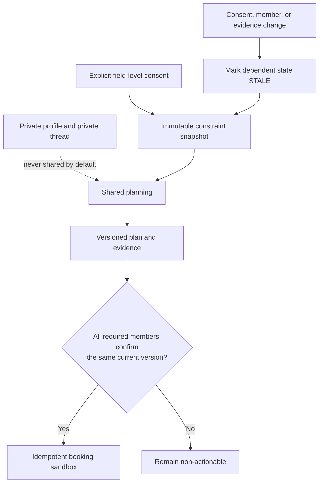
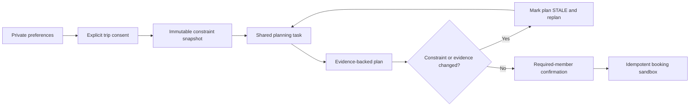
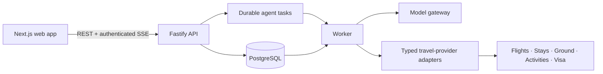
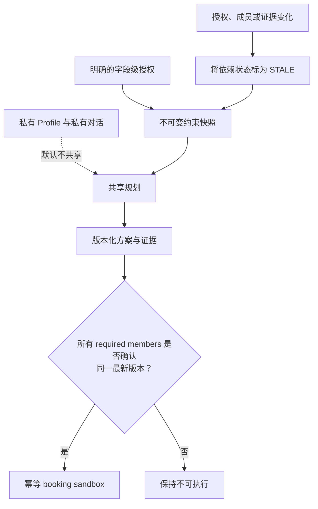

# Wanderly — AI Travel Agent

> **A privacy-first, agentic workspace for planning international trips—individually and together.**

<p>
  
  
  
  
  
</p>

<p>
  <a href="docs/PRD.md">Product requirements</a> ·
  <a href="docs/technical-architecture-overview.md">Architecture</a> ·
  <a href="apps/api/API.md">API reference</a> ·
  <a href="#chinese">中文说明</a>
</p>

Wanderly turns international-trip planning from disconnected conversations and
search tabs into a coordinated, evidence-backed workflow. Every traveller has a
private profile and Personal Agent. For a shared trip, members explicitly
authorize the minimum trip-specific information needed for planning; the Shared
Agent then assembles a source-backed plan across flights, stays, ground
mobility, activities, and visa/entry-readiness tasks.

The model, browser, and provider response are never business truth by
themselves. Consent, immutable constraint snapshots, plan versions, stale
state, confirmations, and booking idempotency are enforced by the server and
database.

## Highlights

| Capability | What it provides |
| --- | --- |
| Personal workspace | Owner-only profiles, durable private agent threads, and personal research. |
| Shared planning | Field-level consent, multi-origin travel comparison, and coordinated destination candidates. |
| Evidence integrity | Source and capture time for travel facts; unavailable data is never fabricated. |
| Durable execution | Recoverable server-side tasks, safe progress streaming, and final-state recovery. |
| Change awareness | Relevant changes make an affected plan `STALE` and initiate a replan. |
| Controlled action | Every required member confirms the same current plan before booking sandbox orchestration. |

## Why this is hard

The difficult part of collaborative travel is not producing attractive prose.
It is deciding **who may use which information, when a result has stopped being
valid, and what can safely happen next**. Wanderly treats those questions as
server-enforced state transitions rather than prompt instructions or browser
state.

| Challenge | Engineering response |
| --- | --- |
| Private preferences must not leak into a group plan. | Members grant field-level, trip-scoped consent; the server creates an immutable minimum-data `constraint_snapshot`. |
| A browser refresh must not abandon an accepted Agent run. | API acceptance persists a task; a leased PostgreSQL Worker performs execution while SSE remains display-only. |
| Live provider data may be absent, expired, malformed, or rate-limited. | Typed adapters normalize evidence and fail closed to `UNAVAILABLE`; fixture data never becomes a live-looking answer. |
| A new preference or price invalidates prior decisions. | The server marks dependent plans and confirmations `STALE`, then creates a fresh planning context. |
| Booking is sensitive and callbacks are unreliable. | Required-member quorum, stable request IDs, HMAC-verified callbacks, and idempotent execution limit action to one sandbox result. |

## Hero demo walkthrough

The core demo uses three travellers planning an international leisure trip from
two departure cities and comparing two or three destinations:

1. **Alice** records a private preference for art districts and avoiding red-eye
   flights. **Bob** sets a budget and explicitly decides whether nationality may
   be used for this trip. **Chen** adds a different departure constraint.
2. They join one Shared Trip and choose only the fields that can enter its
   planning snapshot. Private chat text and unapproved profile data stay private.
3. The Shared Agent coordinates flight, stay, ground, activity, and
   visa/entry-readiness research for each candidate. Every usable fact has a
   provider source and capture time.
4. A price or member-constraint change invalidates the existing plan instead of
   silently reusing it. The system exposes the affected plan as `STALE` and
   replans against a new snapshot.
5. Every required member confirms the same current plan. Only then may the
   booking **sandbox** receive one idempotent orchestration request.

This deliberately demonstrates a production-shaped control plane: privacy,
durability, evidence freshness, and action safety remain correct even when the
model is unavailable or an external provider fails.

## Trust architecture

The highest-value design in Wanderly is not a prompt. It is a set of business
invariants enforced outside the model:



- Private conversations are not a shared data source.
- The model receives only the task- and snapshot-scoped context the server
  grants it; it cannot create consent, plan, confirmation, or booking state.
- A changed dependency invalidates old planning and confirmation state before a
  new planning run can become actionable.
- The booking gate is a quorum check over the latest unexpired plan version,
  not a UI toggle.

### Planning lifecycle



## Engineering decisions

| Decision | Why it matters | Deliberate non-goal |
| --- | --- | --- |
| PostgreSQL as the authoritative control plane | Transactions, constraints, snapshots, audit records, idempotency, and task leases share one durable source of truth. | No browser-owned business state or separate Redis truth store. |
| Durable Worker + authenticated fetch SSE | Navigation and transient streams cannot cancel accepted work; users recover final state from the API. | No WebSocket event bus or connection-owned jobs. |
| Constrained Skill Registry + typed provider ports | Models can request bounded capabilities, but never gain direct database, payment, or arbitrary-network access. | No free-form multi-agent tool use. |
| Fail-closed evidence policy | A provider outage produces a safe, explainable gap rather than an invented price, route, or visa conclusion. | No fixture or “demo data” fallback in a live product path. |
| Low-cardinality telemetry with protected context | Operators can correlate runs safely without putting conversations, nationality, passport data, or IDs into metric labels. | No private conversation or sensitive profile data in observability. |

## Failure modes we handle

| Situation | System behaviour |
| --- | --- |
| Provider is not configured, times out, rate-limits, or returns invalid data | Return a bounded `UNAVAILABLE` outcome, preserve only safe research context, and never synthesize a substitute offer. |
| Consent is revoked or an authorized constraint changes | Invalidate dependent plans and confirmations; require a new snapshot and planning run. |
| A member rejects the plan | Keep the plan non-actionable; booking quorum is not met. |
| A task lease expires or a worker is replaced | A Worker can recover the durable task lease; browser disconnection is not task cancellation. |
| A booking callback is duplicated or arrives late | Stable orchestration/event identifiers and callback authentication preserve one result without reopening a stale plan. |
| Model output fails schema or evidence validation | Reject or repair within bounded server policy; model text never writes business truth directly. |

## Safety and product boundaries

Wanderly is an engineering prototype, not an online travel agency or legal service.

- **Private by default.** Profiles, passports/nationality, and private chats
  are not shared automatically and must not enter logs, metrics, traces,
  browser persistence, or fixtures.
- **Evidence over simulation.** A missing, failed, stale, or untrusted live
  result is `UNAVAILABLE`—never a substitute price, inventory claim, exchange
  rate, or visa conclusion.
- **Server-enforced authority.** Only the server creates snapshots, activates
  plans, changes stale state, accepts confirmations, and invokes booking.
- **No irreversible consumer action.** Visa and entry output is a personal
  readiness checklist with official-verification next steps, not legal advice
  or an application service. There are no real payments, automatic charges,
  reservations, or visa applications.
- **Credentials stay server-side.** Fixtures are for tests and adapter-contract
  validation only; they never supply the user-facing product path.

Read the full prototype constraints in [TECH_STACK.md](TECH_STACK.md) and
[docs/PRD.md](docs/PRD.md).

## Architecture



The reference AWS deployment runs Next.js on AWS Amplify Hosting, Fastify on
AWS App Runner, a durable Worker on ECS Fargate, PostgreSQL on Amazon RDS,
Cognito for production identity, and AWS Secrets Manager/KMS for secrets.
Infrastructure is defined with AWS CDK v2 in [`infra/`](infra/). See the
[deployment guide](docs/aws-deployment.md).

## Evidence index

The project is intended to be inspectable by reviewers and interviewers. These
links connect the claims above to implementation contracts and representative
tests—not just presentation copy.

| Claim | Implementation / contract | Representative verification |
| --- | --- | --- |
| Consent creates a minimal, immutable planning input | [Consent service](apps/api/src/services/consent-service.ts) · [snapshot policy](apps/api/src/policy/snapshot-policy.ts) | [Consent and planning scenarios](docs/test-scenarios.md) |
| Accepted Agent work survives UI and worker churn | [Task repository](apps/api/src/tasks/task-repository.ts) · [Agent Worker](apps/api/src/workers/agent-task-worker.ts) | [Task observability tests](apps/api/tests/task-observability.test.ts) |
| Provider failures remain honest | [Resilience policy](apps/api/src/config/resilience-policy.ts) · [runtime data policy](docs/runtime-data-policy.md) | [Provider error tests](apps/api/tests/provider-error-diagnostics.test.ts) |
| Stale state cascades before new work is accepted | [Stale cascade service](apps/api/src/services/consent-service.ts) | [Race-condition coverage](apps/api/tests/team-orchestration/stale-cascade-race.test.ts) |
| Booking orchestration remains scoped and idempotent | [Booking service](apps/api/src/services/booking-service.ts) · [callback route](apps/api/src/routes/bookings.ts) | [Stale-booking tests](apps/api/tests/booking-service-stale.test.ts) |
| Telemetry stays useful without exposing sensitive data | [Metrics policy](apps/api/src/observability/metrics.ts) · [SLOs](docs/observability-slo.md) | [Observability hardening tests](apps/api/tests/observability-hardening.test.ts) |

For a portfolio or interview, a contributor can trace the product story through
one of these rows, explain the trade-off, and point to the corresponding
implementation and verification rather than relying on a generic technology
list.

## Team contributions

The mapping below is based on non-merge commits and the files changed in Git
history. Aliases that clearly share one contributor identity are grouped. The
team should still verify wording before using the table in a public portfolio.

| Contributor (Git identity) | Primary responsibility | Representative code | Technical challenge to discuss |
| --- | --- | --- | --- |
| **KuGua215 / 苦瓜KuGua** | Shared planning and replan, evidence-bound itinerary generation, Worker correctness, AWS delivery, and the record-room project experience | [Planning service](apps/api/src/services/planning-service.ts) · [Agent Worker](apps/api/src/workers/agent-task-worker.ts) · [Infrastructure](infra/) · [Projects UI](apps/web/src/components/projects/) | Carrying task leases and provider evidence through model synthesis while preserving stale/version guards; shipping the same modular monolith across App Runner, Fargate, and RDS. |
| **dhtt** | Conversation-driven trip setup, destination/offer cues, flight research from trip briefs, and Explore/Trip interaction flows | [Conversation task handler](apps/api/src/tasks/handlers/conversation-task-handler.ts) · [Deterministic flight draft](apps/api/src/services/deterministic-flight-draft.ts) · [Explore chat](apps/web/src/components/explore/travel-agent-chat.tsx) | Turning ambiguous natural-language intent into explicit, recoverable confirmation steps without letting cues silently mutate shared trip state. |
| **RUOFEI GAO / Ruofei / Vivian** | Personal-Agent conversation backend, frontend/backend integration contracts, deterministic planning, plan-output and API security, observability hardening, frontend visual system, and bilingual UX | [Conversation service](apps/api/src/services/chat-conversation-service.ts) · [Plan validator](apps/api/src/policy/plan-output-validator.ts) · [API schemas](apps/api/src/types/schemas.ts) · [Integration tests](apps/api/tests/integration.test.ts) · [Web components](apps/web/src/components/) | Aligning route and model-output contracts while enforcing security and telemetry boundaries, then keeping those complex states consistent across English and Chinese interfaces without silent schema drift. |

## Demo media

The Mermaid diagrams above are architecture media, not product screenshots.
For a public portfolio or recruiting release, publish media captured from a
configured, authenticated run—not from a static prototype or fixture-only
screen—and keep the claims in the caption narrow.

| Media | Recommended content | Publication standard |
| --- | --- | --- |
| Two or three product screenshots | Explore globe, consent/snapshot review, and the stale-plan or confirmation state | Show the visible source/time or `UNAVAILABLE` state where relevant; redact every personal field. |
| 30–60 second walkthrough | Alice/Bob/Chen flow: consent → comparison → change → replan → confirmation | Record a reproducible run with no credentials, personal data, or claim of real booking. |
| Architecture diagram | The trust and runtime diagrams in this README | Keep the diagram synchronized with [technical architecture](docs/technical-architecture-overview.md). |

The repeatable three-minute Demo acceptance scenario is documented in
[TS-P1](docs/test-scenarios.md#ts-p1--run-the-three-minute-hero-demo-deterministically).

## Repository layout

```text
apps/
  api/       Fastify API, Worker, Drizzle schema, migrations, and tests
  web/       Next.js 16 frontend (App Router, next-intl, MapLibre)
infra/       AWS CDK v2 stacks and infrastructure tests
docs/        PRD, architecture, operations, implementation contracts, test scenarios
assets/      UI prototypes and design assets
TECH_STACK.md  Architecture decisions and non-goals
```

## Run locally

### Prerequisites

- Node.js 20 or later
- npm
- Docker Desktop / Docker Compose for PostgreSQL
- A model-provider API key for conversations and model-backed planning

### 1. Install and configure

Run from the repository root:

```bash
npm --prefix apps/api install
npm --prefix apps/web install
```

Create local configuration without overwriting an existing file:

```powershell
if (!(Test-Path apps/api/.env)) { Copy-Item apps/api/.env.example apps/api/.env }
if (!(Test-Path apps/web/.env.local)) { Copy-Item apps/web/.env.example apps/web/.env.local }
```

Set `MODEL_GATEWAY_API_KEY` and `MODEL_GATEWAY_MODEL` only in
`apps/api/.env`. Never put model, provider, database, JWT, or callback secrets
in `apps/web/.env.local` or a `NEXT_PUBLIC_*` variable.

[Local Development Authentication](docs/local-development-auth.md) explains the
recommended local authentication and provider setup. `custom-local` is the
database-backed multi-user mode; `local-dev` is loopback-only and intended for
a single-user smoke test. Production uses Cognito.

### 2. Start the stack

Use three terminals:

```bash
# Terminal 1 — PostgreSQL, migrations, and API (port 3000)
cd apps/api
docker compose up -d postgres
npm run db:migrate
npm run dev
```

```bash
# Terminal 2 — Durable Agent Worker
cd apps/api
npm run worker:dev
```

```bash
# Terminal 3 — Web app (port 3001), from the repository root
npm --prefix apps/web run dev -- --port 3001
```

Open [http://localhost:3001](http://localhost:3001); the application redirects
to the locale-aware Explore experience. Fastify OpenAPI documentation is at
[http://localhost:3000/docs](http://localhost:3000/docs).

`docker compose up -d` starts PostgreSQL only. Use
`docker compose --profile full up -d --build` from `apps/api/` only when you
specifically want API and Worker containers as well.

### Provider credentials

Selecting a provider does not make it usable until its required server-side
credential is configured. The affected capability returns `UNAVAILABLE` rather
than substituted data. See the [live-tool credential matrix](docs/local-development-auth.md#live-tool-credentials)
and [runtime data policy](docs/runtime-data-policy.md).

## Validate

```bash
npm --prefix apps/api run lint
npm --prefix apps/api run typecheck
npm --prefix apps/api test
npm --prefix apps/api run docs:verify

npm --prefix apps/web run lint
npm --prefix apps/web run typecheck
npm --prefix apps/web test
npm --prefix apps/web run build

npm --prefix infra run build
npm --prefix infra test
```

The API test command prepares an isolated test database before Vitest runs. Do
not use production provider credentials in tests.

## Documentation

- [Product requirements and acceptance criteria](docs/PRD.md)
- [Technical architecture overview](docs/technical-architecture-overview.md)
- [API contract](apps/api/API.md)
- [Runtime data and evidence policy](docs/runtime-data-policy.md)
- [Observability SLOs](docs/observability-slo.md)
- [Test scenarios](docs/test-scenarios.md)
- [AWS deployment guide](docs/aws-deployment.md)

---

<details id="chinese">
<summary><strong>中文说明</strong></summary>

<br />

> 面向国际旅行协作规划的、隐私优先的 Agentic 工作空间。

Wanderly 是一个面向国际多人旅行协作的工程原型。它将分散在聊天、搜索页和表格中的
规划过程，收敛为一个可追溯的工作流。每位旅行者拥有私有 Profile 和 Personal
Agent 对话；在共享行程中，成员仅授权本次规划所需的最少信息。Shared Agent
基于来源与检查时间，对航班、住宿、地面交通、活动以及签证/入境准备事项进行
协同规划。

模型、浏览器和供应商响应都不能自行成为业务真相。授权、不可变约束快照、方案
版本、`STALE` 状态、确认和 booking 幂等性均由服务端与数据库强制维护。

### 核心能力

- 中英文 globe-first 探索体验；
- 私有 Profile、持久对话与个人旅行研究；
- 单人或多人共享行程、字段级授权、不可变约束快照与方案版本；
- 可恢复的服务端任务，协调航班、住宿、交通、活动与 visa/entry readiness；
- 约束、价格或库存变化时使方案进入 `STALE` 并重新规划；
- 所有 required members 确认同一最新方案后，才调用幂等的 booking sandbox。

### 为什么这件事难

多人旅行最困难的部分不是写出一个吸引人的目的地推荐，而是决定**谁可以使用哪
些信息、旧结果何时失效，以及系统接下来能否安全行动**。Wanderly 将这些问题
建模为服务端状态转换，而不是交给 prompt 或浏览器状态处理。

| 挑战 | 工程响应 |
| --- | --- |
| 私人偏好不能泄露到团队方案。 | 成员授予字段级、行程范围的授权；服务端生成不可变且最小化的 `constraint_snapshot`。 |
| 刷新浏览器不能丢弃已接受的 Agent 工作。 | API 先持久化 task；带 lease 的 PostgreSQL Worker 执行任务，SSE 只负责展示。 |
| 实时供应商数据可能缺失、过期、损坏或限流。 | 类型化 adapter 归一化 evidence，并 fail closed 为 `UNAVAILABLE`；fixture 不会伪装成实时结果。 |
| 偏好或价格变化会使既有决定失效。 | 服务端将依赖方案和确认标为 `STALE`，并在新快照下重新规划。 |
| 预订敏感且 callback 不可靠。 | required-member quorum、稳定 request ID、HMAC callback 和幂等执行最多产生一组 sandbox 结果。 |

### 信任架构

项目最有价值的设计不是一段 prompt，而是一组位于模型之外的业务不变量：



- 私有对话不是共享数据源。
- 模型只能获得服务端授予的 task/snapshot 范围上下文；不能创建授权、方案、确认或
  booking 状态。
- 依赖变化会先使旧方案和旧确认失效，新的规划结果才可能变为可执行。
- booking gate 是对未过期最新方案版本的 quorum 校验，不是一个前端开关。

### Hero Demo walkthrough

核心演示使用三位旅行者、两个出发地与两到三个国际目的地候选：

1. **Alice** 在私有 Profile 中表达艺术街区和避免红眼航班的偏好；**Bob** 设置预算，
   并明确决定国籍是否可以用于本次行程；**Chen** 提供另一出发地的时间限制。
2. 三人加入同一 Shared Trip，只选择可进入规划 snapshot 的字段。私聊原文和未经
   批准的 Profile 信息不会进入团队方案。
3. Shared Agent 针对每个候选协调航班、住宿、地面交通、活动与 visa/entry
   readiness；每项可用事实都携带供应商来源和检查时间。
4. 价格或成员约束变化后，系统不会静默复用旧结果，而是将方案显示为 `STALE`，并
   在新 snapshot 下重新规划。
5. 所有 required members 确认同一最新方案后，booking **sandbox** 才接收一条
   幂等 orchestration request。

它展示的是具备生产系统形态的控制面：即使模型不可用或供应商失败，隐私、任务
持久性、证据新鲜度与行动边界仍然成立。

### 关键工程决策

| 决策 | 为什么重要 | 明确不做 |
| --- | --- | --- |
| PostgreSQL 作为权威控制面 | 事务、约束、snapshot、audit、idempotency 和 task lease 使用同一个持久真相源。 | 不将浏览器状态或 Redis 当作业务真相。 |
| Durable Worker + authenticated fetch SSE | 页面跳转或流中断不会取消已接受的任务；用户可通过 API 恢复最终状态。 | 不建 WebSocket 事件总线，也不让连接生命周期拥有任务。 |
| 受限 Skill Registry + typed provider ports | 模型只能请求有界能力，不能直接访问数据库、支付或任意网络。 | 不允许自由多 Agent 工具调用。 |
| Fail-closed evidence policy | provider 故障会产生安全、可解释的缺口，而非编造价格、路线或签证结论。 | 运行时不使用 fixture 或 Demo data 回退。 |
| 低基数遥测与受保护上下文 | 运营可关联 run，同时避免私聊、国籍、护照资料或 ID 进入 metrics label。 | 不向可观测性写入敏感旅行数据。 |

### 已处理的失败模式

| 情况 | 系统行为 |
| --- | --- |
| Provider 未配置、超时、限流或返回无效数据 | 返回有界的 `UNAVAILABLE`，仅保留安全 research context，绝不生成替代 offer。 |
| 撤回授权或已授权约束变化 | 使依赖方案和确认失效；必须用新 snapshot 再次规划。 |
| 成员拒绝方案 | 方案保持不可执行，booking quorum 不成立。 |
| Task lease 到期或 Worker 被替换 | Worker 可恢复持久化 task lease；浏览器断线不是取消任务。 |
| Booking callback 重复、迟到或乱序 | 稳定 orchestration/event ID 与 callback 认证确保只保留一组结果，且不会重启 stale plan。 |
| 模型输出未通过 schema/evidence 校验 | 在有界服务端策略中拒绝或修复；模型文字不能直接写入业务真相。 |

### 重要边界

- Profile、国籍/证件资料和私有对话默认不共享；不会写入日志、指标、trace、
  浏览器持久化或 fixture。
- 所有实时事实均附带来源与检查时间；无数据、不可信或 provider 失败时返回
  `UNAVAILABLE`，不会伪造报价、库存或签证结论。
- 签证/入境能力仅提供个人准备清单和官方核验下一步，不提供法律意见、获批承诺
  或代办申请。
- 不包含真实支付、自动扣款、真实预订或签证申请；预订只是显式确认后的 sandbox
  编排。

### 系统架构与工程证据

系统采用共享代码库、权威 PostgreSQL 与独立 Next.js 前端的模块化单体：浏览器负责
交互与短期缓存；Fastify API 负责身份、命令与结果读取；独立 Worker 通过 lease 执行
已持久化的 Agent task。因此，页面切换、刷新或 SSE 断开不会取消已接受的工作。
完整架构图与技术栈见[技术架构全景](docs/technical-architecture-overview.md)。

| 主张 | 实现/契约 | 代表性验证 |
| --- | --- | --- |
| 授权生成最小、不可变的规划输入 | [Consent service](apps/api/src/services/consent-service.ts) · [snapshot policy](apps/api/src/policy/snapshot-policy.ts) | [授权与规划测试场景](docs/test-scenarios.md) |
| Agent 工作可跨 UI 与 Worker 变化恢复 | [Task repository](apps/api/src/tasks/task-repository.ts) · [Agent Worker](apps/api/src/workers/agent-task-worker.ts) | [Task observability tests](apps/api/tests/task-observability.test.ts) |
| Provider 失败保持诚实 | [Resilience policy](apps/api/src/config/resilience-policy.ts) · [runtime data policy](docs/runtime-data-policy.md) | [Provider error tests](apps/api/tests/provider-error-diagnostics.test.ts) |
| 新工作接受前先级联失效旧状态 | [Stale cascade service](apps/api/src/services/consent-service.ts) | [Race-condition coverage](apps/api/tests/team-orchestration/stale-cascade-race.test.ts) |
| Booking 编排有范围且幂等 | [Booking service](apps/api/src/services/booking-service.ts) · [callback route](apps/api/src/routes/bookings.ts) | [Stale-booking tests](apps/api/tests/booking-service-stale.test.ts) |
| 遥测可用且不泄露敏感数据 | [Metrics policy](apps/api/src/observability/metrics.ts) · [SLOs](docs/observability-slo.md) | [Observability hardening tests](apps/api/tests/observability-hardening.test.ts) |

用于作品集或面试时，贡献者应从其中任意一行出发，解释取舍并指向实现与验证，而不只
罗列技术名词。

### 团队贡献

以下对应关系依据非 merge commit 及其实际改动文件整理；明显属于同一贡献者的 Git
别名已合并。公开用于作品集前，团队仍应共同确认职责描述是否准确。

| 贡献者（Git 身份） | 主要负责领域 | 代表性代码 | 可讲述的技术挑战 |
| --- | --- | --- | --- |
| **KuGua215 / 苦瓜KuGua** | Shared planning/replan、证据绑定的日程生成、Worker 正确性、AWS 交付与唱片室项目体验 | [Planning service](apps/api/src/services/planning-service.ts) · [Agent Worker](apps/api/src/workers/agent-task-worker.ts) · [Infrastructure](infra/) · [Projects UI](apps/web/src/components/projects/) | 在模型生成过程中持续携带 task lease 与 provider evidence，同时守住 stale/version gate；将同一模块化单体部署到 App Runner、Fargate 与 RDS。 |
| **dhtt** | 对话式行程补全、目的地/offer cue、基于 Trip brief 的航班研究，以及 Explore/Trip 交互流程 | [Conversation task handler](apps/api/src/tasks/handlers/conversation-task-handler.ts) · [Deterministic flight draft](apps/api/src/services/deterministic-flight-draft.ts) · [Explore chat](apps/web/src/components/explore/travel-agent-chat.tsx) | 将有歧义的自然语言意图转换为明确、可恢复的确认步骤，同时防止 cue 静默修改共享行程状态。 |
| **RUOFEI GAO / Ruofei / Vivian** | Personal Agent 对话后端、前后端集成契约、确定性规划、方案输出与 API 安全、可观测性加固、前端视觉系统和双语体验 | [Conversation service](apps/api/src/services/chat-conversation-service.ts) · [Plan validator](apps/api/src/policy/plan-output-validator.ts) · [API schemas](apps/api/src/types/schemas.ts) · [Integration tests](apps/api/tests/integration.test.ts) · [Web components](apps/web/src/components/) | 对齐 route 与模型输出契约并守住安全和遥测边界，同时保持复杂状态在中英文界面中的一致性，避免前后端演进时出现静默 schema drift。 |

### 演示媒体

上方的 Mermaid 图是架构媒体，不是产品截图。面向作品集或招聘的公开发布，应
使用经过配置和身份验证的真实运行录制素材，而不是静态原型或仅 fixture 的界面；图注
必须限制在实际可验证的范围内。

| 媒体 | 建议内容 | 发布标准 |
| --- | --- | --- |
| 2–3 张产品截图 | Explore globe、consent/snapshot review、stale plan 或 confirmation state | 展示可见的 source/time 或 `UNAVAILABLE` 状态；遮盖所有个人字段。 |
| 30–60 秒 walkthrough | Alice/Bob/Chen：授权 → 比较 → 变化 → replan → 确认 | 使用可复现 run；不出现密钥、个人数据，也不声称真实预订。 |
| 架构图 | 本 README 的 trust/runtime 图 | 与[技术架构全景](docs/technical-architecture-overview.md)保持同步。 |

可重复执行的三分钟 Hero Demo 验收场景见
[TS-P1](docs/test-scenarios.md#ts-p1--run-the-three-minute-hero-demo-deterministically)。

### 本地运行

需要 Node.js 20+、npm、Docker Desktop，以及用于模型对话/规划的 API key。
复制 `apps/api/.env.example` 到本地的 `apps/api/.env`，复制
`apps/web/.env.example` 到 `apps/web/.env.local`，并只在 API 的 `.env` 中
填入模型密钥与模型名称。

启动 PostgreSQL、迁移、API、Worker 和 Web 的完整步骤见英文版
[Run locally](#run-locally)；本地认证、配置与供应商凭据请阅读
[本地开发认证指南](docs/local-development-auth.md)。

完整产品边界、架构、验收和部署说明见 [PRD](docs/PRD.md)、
[TECH_STACK.md](TECH_STACK.md)、[测试场景](docs/test-scenarios.md) 与
[AWS 部署手册](docs/aws-deployment.md)。

</details>
