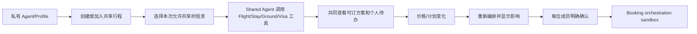

# PRD — Personal Agents + Shared Trip Workspace Hackathon MVP

**状态：** 可开发的 Hackathon MVP；所有需求价值均待验证  
**输入：** [Product Strategy](product-strategy.md) · [Discovery](discovery.md)

## 1. Summary

本 MVP 让每位旅行者拥有一个可控的 Personal Travel Agent：用户通过私有对话维护自己的旅行偏好和资料。创建共享行程后，成员明确授权本次相关信息进入 Shared Trip Workspace；Shared Trip Agent 协调航班、酒店、地面交通，以及按成员国籍区分的 visa/entry readiness 待办。

系统在价格或计划变化后重新编排，并在每位成员明确确认后调用 sandbox/已批准的 booking orchestration 工具。系统不自动扣款、不承诺真实全球预订、不提供法律意见或签证代办。

## 2. Problem, users and objectives

### Problem

现有旅行工具让用户反复解释自己，多个同行者还要在群聊、OTA、地图、签证网站间协调。不同国籍会带来不同准备事项，价格/库存变化会使整个计划重新碎裂。主组织者承担重复沟通与遗漏风险。

### Target users — Assumption

两到四位共同计划国际休闲旅行的朋友/伴侣；首个 Hero Demo 使用两位、不同国籍的测试旅行者。单人旅行使用同一 Personal Agent，但不是单独 MVP 流程。

### Objectives

1. 用户第一次设定 Profile 后，下一次旅行可复用稳定偏好而不必重填。
2. 成员在私有 Agent 中补充要求，并只把明确授权的本次信息共享到共同旅程。
3. Shared Agent 输出一套机票、酒店、地面交通组合和每人成员的 visa readiness 待办。
4. 变化发生时，系统重新编排并解释每个人的影响。
5. 明确确认后调用受控 booking orchestration；不得自动付款或无确认预订。

### Non-goals

- 用户复制/上传群聊，或产品内原生群聊；
- 未经明确同意推断人格、分享私聊内容或共享所有 Profile；
- 全球实时库存、价格保证、签证法律结论、自动签证申请；
- 真实支付、支付分摊、退款、改签或全天候客服；
- 完整单人专属 UX、社交网络或通用旅行内容社区。

## 3. Hero user journey

**Aha moment：** Alice 的 Agent 自动带入已保存的非红眼、艺术街区偏好；Bob 的 Agent 带入预算和本次授权的国籍资料，但 Alice 看不到 Bob 没有共享的个人资料。  
**Final wow：** 航班价格变化后，系统用两人的授权约束重新组合机酒交通，同时将对应的个人 visa 待办保留下来；二人确认后，sandbox 返回一个可追踪的编排确认。

## 4. MVP scope

### HERO

| ID | Capability | User problem / technical proof |
|---|---|---|
| H1 | 可编辑的 Personal Travel Profile 与私有 Agent 对话 | “Agent 了解我”，消除每次重填。 |
| H2 | Shared Trip Workspace、邀请和按字段授权 | 多人协调，不要求复制群聊，也不暴露隐私。 |
| H3 | Shared Agent 的 Flight/Stay/Ground 组合 | 用工具编排降低跨平台协调。 |
| H4 | 按成员国籍、目的地和路线的 visa/entry readiness checklist | 减少跨国同行的准备遗漏。 |
| H5 | 变化检测、重新编排和影响说明 | 自我修正的 Agentic wow。 |
| H6 | 每成员确认后的 booking orchestration sandbox | 证明从规划到行动，不做自动付款。 |

### PROOF

- 每个工具事实都显示来源、时间或 `Demo data` 标签；
- 每条共享约束显示来自哪个成员、哪个 Profile/本次对话字段及其授权状态；
- 每次 Agent run 记录 Profile 版本、共享授权快照、工具快照和方案版本；
- 预订编排只在所有所需成员确认后执行，并返回 sandbox 参考号。

### SUPPORT

- 最小身份/会话：两名测试用户彼此隔离；
- 预置 Profile、固定示例路线、两国籍规则数据与稳定变化事件；
- 对无可行方案、缺少授权、工具失败、签证规则不确定和成员拒绝确认给出恢复路径；
- 结构化日志、低基数指标和 trace，不记录私聊全文、护照号或支付信息。

### PRODUCT-LATER

- 真实支付、自动扣款、真实供应商结算、退款、改签；
- 全球航班/酒店/交通覆盖与价格保证；
- 申请、提交或代办签证；
- 原生群聊、支付分摊、长期社交功能；
- 代替用户做任何不可逆行动。

## 5. Functional requirements

### FR-1 Personal profile and private Agent

1. 用户可以保存、查看、编辑和删除稳定偏好：预算区间、住宿风格、旅行节奏、兴趣、航班偏好和风险/舒适度取舍。
2. 用户可以通过私有对话为本次旅行添加或覆盖偏好；本次覆盖不得静默改写稳定 Profile。
3. 系统必须显示每条资料的来源（Profile 或本次对话）和最近修改时间。
4. 系统不得把任何 Profile 或私有对话字段默认共享给同行者。

### FR-2 Shared Trip Workspace and consent

1. 创建者可创建一个共享行程并邀请第二位测试用户加入。
2. 每个成员在加入时可逐项选择共享本次的偏好、预算上限、出发限制和国籍/旅行证件相关数据；国籍共享须有单独确认。
3. Shared Workspace 只显示成员已授权的字段；其他成员不可读到未授权 Profile、私聊或历史反馈。
4. 成员更新授权或本次约束时，当前方案标记为过期并触发重算前确认。

### FR-3 End-to-end trip orchestration

1. Shared Agent 必须用同一共享约束快照请求 Flight、Stay 和 Ground 工具/fixture。
2. 输出必须包含至少一个航班、酒店和地面交通项目，或明确显示缺失项目与原因。
3. 每个项目必须显示总价/币种（如适用）、来源、时间、取消/变化状态（如数据可得）和它满足的共享约束。
4. Agent 必须解释方案如何使用每位成员授权的约束；不得引用未授权资料。

### FR-4 Visa/entry readiness

1. 对每位授权共享国籍资料的成员，系统必须基于目的地及已知转机/路线数据生成独立的 readiness checklist。
2. 每项待办必须显示来源、检查时间、适用对象和下一步；无法确认时显示“请向官方来源核验”。
3. 系统不得声称签证资格已获批准、提供法律意见或代替用户申请。
4. 未授权国籍资料时，系统只显示“需要该成员自行完成入境准备检查”，不能推断国籍。

### FR-5 Change handling and self-correction

1. 系统必须支持一个确定性变化事件：航班价格/库存变化、成员日期变化或酒店失效。
2. 变化必须生成新的工具和授权快照，并使旧方案/确认过期。
3. 重新编排必须显示旧/新项目、保留/受影响的成员约束、个人待办影响和原因。
4. 没有可行替代时，系统必须说明阻塞约束并请求成员调整，而不是静默放弃约束。

### FR-6 Confirmation and booking orchestration

1. 每个成员必须对当前方案版本显式选择 `Confirm` 或 `Needs changes`。
2. 只有所有 required members 确认、方案未过期且数据快照一致时，才可调用 sandbox/已批准 booking orchestration 工具。
3. 调用前 UI 必须显示项目、总价/币种、谁确认了、来源和 `No automatic charge` 提示。
4. 工具结果必须返回每个项目的确认参考号或失败原因；成功不表示系统已扣款。
5. 成员拒绝、数据变化、重复请求或工具失败不得产生重复编排或不可逆预订。

### FR-7 Privacy and observability

1. Profile、共享授权、工具调用、方案、变化和确认均必须有会话/关联 ID 与版本记录。
2. 日志、metrics 和 traces 不得包含私聊全文、护照/证件号、支付数据或未授权 Profile 字段。
3. 指标必须跟踪 Profile reuse、共享授权完成、工具成功/失败、方案完成、visa checklist 状态、重算、确认和 orchestration 结果。
4. 用户可删除个人 Profile 字段；删除后，未来 Agent run 不得使用它。已有审计记录仅保留最小、无敏感摘要，并遵循后续合规政策。

## 6. Important edge cases

| Scenario | Required behavior |
|---|---|
| 成员没有 Profile 或不愿共享任何偏好 | 允许加入；Shared Agent 只使用其本次明确输入，提示资料不足。 |
| 成员撤回国籍授权 | 失效相关 visa checklist 和当前方案；要求重新计算。 |
| 两名成员预算/时间冲突 | 显示冲突及受影响成员；不静默偏向创建者。 |
| 航班、酒店或地面交通工具无数据 | 显示缺口和来源失败；只可使用明确标注的 demo fixture。 |
| visa 规则来源不确定或过期 | 显示官方核验链接/提示；不得给出确定结论。 |
| 航班价格上涨 | 原方案与确认失效；展示重新组合的影响。 |
| 成员在重算期间更改私有 Profile | 旧 run 过期；仅使用新的授权/版本快照。 |
| 成员拒绝确认 | 不调用 orchestration；显示谁需要调整和可编辑入口。 |
| orchestration 回调重复或乱序 | 用请求 ID 幂等处理；最多生成一组参考号。 |

## 7. Success metrics and release criteria

### Success metrics — Assumptions

- 演示成员创建共享行程时至少复用一条 Profile 偏好，无需重新填写；
- 所有成员能指出共享了什么、没有共享什么；
- 一个方案中至少有航班、酒店、地面交通和按成员区分的 readiness 输出；
- 变化后 ≤10 秒给出可解释的重新编排；
- 0 次自动扣款、无确认编排或无来源签证结论。

### Release criteria

- 两名隔离测试用户可完整运行 `Profile → invite → consent → tools → visa → replan → confirm → sandbox orchestration`；
- 测试覆盖授权撤回、冲突、工具失败、visa 不确定、变化、成员拒绝与重复 orchestration；
- 每个 Agent/工具结果带 Profile/consent/tool snapshot 版本；
- sandbox 与真实数据/fixture 的边界对用户清晰可见；
- 3 分钟 Hero Demo 可以用固定数据稳定复现；
- 不存储未授权 Profile、私聊全文、证件号码或支付信息。
