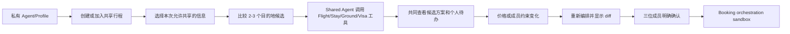

# PRD — Personal Agents + Shared Trip Workspace Hackathon MVP

**状态：** 可开发的 Hackathon MVP；所有需求价值均待验证  
**输入：** [Product Strategy](product-strategy.md) · [Discovery](discovery.md)

## 1. 概述

本 MVP 让每位旅行者拥有一个可控的 Personal Travel Agent：用户通过私有对话维护自己的旅行偏好和资料。创建共享行程后，成员明确授权本次相关信息进入 Shared Trip Workspace；Shared Trip Agent 协调航班、酒店、地面交通，以及按成员国籍区分的 visa/entry readiness 待办。

系统在价格或计划变化后重新编排，并在每位成员明确确认后调用 sandbox/已批准的 booking orchestration 工具。系统不自动扣款、不承诺真实全球预订、不提供法律意见或签证代办。

## 2. 问题、用户与目标

### 问题

现有旅行工具让用户反复解释自己，多个同行者还要在群聊、OTA、地图、签证网站间协调。不同国籍会带来不同准备事项，价格/库存变化会使整个计划重新碎裂。主组织者承担重复沟通与遗漏风险。

### 目标用户 — 假设

两到四位共同计划国际休闲旅行的朋友/伴侣；首个 Hero Demo 使用三位测试旅行者、两个出发地、两到三个目的地候选与至少两种国籍。单人旅行使用同一 Personal Agent，但不是单独 MVP 流程。

### 目标

1. 用户第一次设定 Profile 后，下一次旅行可复用稳定偏好而不必重填。
2. 三位成员在私有 Agent 中补充要求，并只把明确授权的本次信息共享到共同旅程。
3. Shared Agent 比较两到三个目的地候选，并为每个候选输出按两个出发地协调的机票、酒店、地面交通组合和每人的 visa readiness 状态。
4. 变化发生时，系统重新编排并解释每个人及候选方案的影响。
5. 三位成员明确确认同一最新版本后调用受控 booking orchestration；不得自动付款或无确认预订。

### 非目标

- 用户复制/上传群聊，或产品内原生群聊；
- 未经明确同意推断人格、分享私聊内容或共享所有 Profile；
- 全球实时库存、价格保证、签证法律结论、自动签证申请；
- 真实支付、支付分摊、退款、改签或全天候客服；
- 完整单人专属 UX、社交网络或通用旅行内容社区。

## 3. Hero 用户旅程

**Aha moment：** 三位成员从两个出发地进入同一共享行程；Alice 的 Agent 自动带入非红眼、艺术街区偏好，Bob 的 Agent 带入预算和授权国籍资料，Chen 带入自己的出发限制，但任何成员都看不到彼此未共享资料。
**Final wow：** 一项成员约束或航班价格变化后，系统比较两到三个目的地候选，以三人的授权约束重新组合机酒交通，同时保留对应个人 visa 待办；三人确认后，sandbox 返回一个可追踪的编排确认。

## 4. MVP 范围

### HERO

| ID | Capability | User problem / technical proof |
|---|---|---|
| H1 | 可编辑的 Personal Travel Profile 与可持久化私有 Agent 对话 | “Agent 了解我”，消除每次重填，并让用户可回看和纠正本次沟通。 |
| H2 | Shared Trip Workspace、三人邀请和按字段授权 | 多人协调，不要求复制群聊，也不暴露隐私。 |
| H3 | 两出发地、两到三个目的地候选的 Flight/Stay/Ground/Activities 比较 | 用工具编排降低跨平台协调与目的地选择成本。 |
| H4 | 按成员国籍、目的地和路线的 visa/entry readiness checklist | 减少跨国同行的准备遗漏。 |
| H5 | 变化检测、重新编排和影响说明 | 自我修正的 Agentic wow。 |
| H6 | 每成员确认后的 booking orchestration sandbox | 证明从规划到行动，不做自动付款。 |

### PROOF

- 每个工具事实都显示来源和检查时间；无可验证数据时显示不可用原因与重试/官方核验下一步；
- 每条共享约束显示来自哪个成员、哪个 Profile/本次对话字段及其授权状态；
- 每次 Agent run 记录 Profile 版本、共享授权快照、工具快照和方案版本；
- 预订编排只在所有所需成员确认后执行，并返回 sandbox 参考号。

### SUPPORT

- 最小身份/会话：三名测试用户彼此隔离；
- 预置 Profile、两个出发地、两到三个目的地候选、至少两国籍规则数据与稳定变化事件；
- 对无可行方案、缺少授权、工具失败、签证规则不确定和成员拒绝确认给出恢复路径；
- 结构化日志、低基数指标和 trace，不记录私聊全文、护照号或支付信息。
- 探索地图可在用户显式点击后显示来源化、离线的国家/最近城市**位置参考**；也可为服务端认可稳定 `sourceId` 的地点显示共享、非个性化的短介绍。两者均为匿名只读 API、按客户端限流，不创建身份、候选或持久化坐标；地点介绍只持久化无用户数据的 7 天缓存，且不构成价格、库存、签证或预订事实。

### PRODUCT-LATER

- 真实支付、自动扣款、真实供应商结算、退款、改签；
- 全球航班/酒店/交通覆盖与价格保证；
- 申请、提交或代办签证；
- 原生群聊、支付分摊、长期社交功能；
- 代替用户做任何不可逆行动。

## 5. 功能需求

### FR-1 个人资料与私有 Agent

1. 用户可以保存、查看、编辑和删除稳定偏好：预算区间、住宿风格、旅行节奏、兴趣、航班偏好和风险/舒适度取舍。
2. 用户可以创建、回看和删除仅自己可访问的私有对话线程；线程归所属用户所有，可选关联一次行程（即`this trip`= 线程创建时绑定的 `tripId`，**不**替代 trip 本身）；同一用户在同一 trip 上可拥有多个线程（例如私有 scratchpad 与个人规划草稿），但每线程的 `ownerUserId` 唯一，其他 trip 成员或 Shared Agent 不得通过 trip 关联读取线程。
3. 用户可以通过私有对话为本次旅行添加或覆盖偏好；本次覆盖不得静默改写稳定 Profile，且只有用户确认的提案才能写入 Profile 或 trip override。trip override 标记为 `this trip`，与稳定 Profile 严格隔离，且未经独立授权不得自动随 snapshot 共享给同行者。
4. 系统必须显示每条资料的来源（Profile 或本次对话）和最近修改时间。
5. 系统不得把任何 Profile 或私有对话字段默认共享给同行者。对同一 owner 的同一私有 thread，Personal Agent 可使用服务端构造的最近、有预算的原文对话窗口作为 LLM 上下文，以便用户重新进入该 thread 后延续对话；窗口外的内容不送入模型，模型应在需要时坦诚说明未保留早期上下文。原文窗口只能发送给已配置模型 provider，绝不进入长期 Profile memory、共享 snapshot、Shared Agent、日志、trace、audit、metric 或客户端持久状态；浏览器不得提交或拼接 history。
6. 删除对话线程须删除其消息正文；仅保留最小、无敏感的审计摘要（线程 id、操作者、时间）。删除 Profile/override 后，未来 Agent run 不得使用对应数据。
7. Personal Agent 对话、planning 与 replan 均须作为服务端持久任务执行，并支持鉴权流式状态事件。每条已接受的 Personal Agent 对话必须绑定一个既有 Trip、归属于唯一 owner；加入 Trip 的成员自动获得空白默认私有线程，并可在该 Trip 下创建更多私有线程。浏览器关闭、刷新、网络断开或 SSE 断开不得取消已接受任务；只有用户显式 Stop 可以请求取消。私有对话文本仅在通过流式安全 gate 后增量显示，且只有最终完整校验成功的 ASSISTANT 内容可持久化。
8. 探索首页进入、新地图浏览、坐标点击和打开聊天不得创建 Trip。用户首次提交聊天消息时，系统必须以幂等单事务创建其 `DRAFT` Trip、默认私有 thread 与初始 membership，再在该 thread 接受 turn。站内路由返回探索页继续当前浏览器内存会话；新标签页、整页刷新或重新打开探索页开始新会话。未发送消息的探索不得持久化为项目。
9. `DRAFT` Trip 仅限创建者进行私有探索和编辑 brief；不得邀请成员、授权字段、创建 snapshot、planning/replan、确认或 booking。创建者填写正式 brief 后点击“开始规划/邀请同行者”才可激活为 `PLANNING`。
10. 系统可从重复、非敏感旅行行为生成长期偏好**提案**，但提案在用户确认前不是 Profile 事实、不得进入共享 snapshot 或计划输入。国籍、旅行证件、出生日期、健康和无障碍信息只能由用户通过 Profile 表单维护，禁止从私有对话或行为自动提取。
11. 用户点击服务端认可的稳定地图地点时，系统可在地点抽屉自动展示按语言共享的短介绍；有效期内不得重复调用 LLM。该内容不得使用任何用户、Profile、Trip、thread 或私聊输入，也不得创建 Draft Trip 或聊天消息。无稳定 `sourceId` 的灵感点不提供该能力。

### FR-2 共享行程工作台与授权

1. 创建者可创建一个共享行程并邀请另外两位测试用户加入。
2. 每个成员在加入时可逐项选择共享本次的偏好、预算上限、出发限制和国籍/旅行证件相关数据；国籍共享须有单独确认。
3. Shared Workspace 只显示成员已授权的字段；其他成员不可读到未授权 Profile、私聊或历史反馈。
4. 成员更新授权或本次约束时，当前方案标记为过期并触发重算前确认。
5. Team memory 仅属于当前 Trip。Shared Agent 只能读取服务端按当前 consent 构建的最小化 memory projection，不能直接读取成员的 Profile、个人长期记忆或私有对话；任何投影来源变更均使依赖方案过期。

### FR-3 端到端行程编排

1. Shared Agent 必须用同一共享约束快照请求 Flight、Stay、Ground 和 Activities 工具，并将三位成员映射到两个出发地。模型可在 Shared PLAN/REPLAN 中真实请求 `flight.search` 和 `activities.search`；Personal Agent 私有聊天可调用 `flight.search` / `activities.search`，但查询结果仅作为当前 conversation 的输入上下文，不直接生成或修改 plan、不触发 STALE/replan，但允许进入 Shared 视图作为后续 Shared turn 的参考资料。服务端必须校验参数，并在最终方案生成前保证已查询所有必需的候选目的地与出发地组合。
2. 系统必须比较两到三个预设目的地候选；每个候选包含至少一个航班、酒店、地面交通和活动项目，或明确显示缺失项目与原因。
3. 每个项目必须显示总价/币种（如适用）、来源、时间、取消/变化状态（如数据可得）和它满足的共享约束。
4. Agent 必须解释候选之间的取舍及其如何使用每位成员授权的约束；不得引用未授权资料。
5. Planning/replan 运行期间可实时显示安全阶段状态（例如 snapshot、research、validation、persistence），但不得向客户端发送内部推理、原始 prompt、未验证模型输出、未持久化 provider 结果或未授权 snapshot 数据；最终 plan 仅在验证并持久化后展示。
6. Activities 工具与 Flight 工具相互独立：拥有独立的 typed port、覆盖矩阵、stale 触发器和 evidence 写入；同一 PLAN/REPLAN durable task 内作为并列子阶段，各自拥有独立的并发与失败语义。

### FR-4 签证/入境准备

1. 对每位授权共享国籍资料的成员，系统必须基于每个显示的目的地候选及已知转机/路线数据生成独立的 readiness checklist 或明确缺口。
2. 每项待办必须显示来源、检查时间、适用对象和下一步；无法确认时显示“请向官方来源核验”。
3. 系统不得声称签证资格已获批准、提供法律意见或代替用户申请。
4. 未授权国籍资料时，系统只显示“需要该成员自行完成入境准备检查”，不能推断国籍。

### FR-5 变化处理与自我修正

1. 系统必须支持一个确定性变化事件：航班价格/库存变化、成员日期/出发地限制变化或酒店失效。
2. 变化必须生成新的工具和授权快照，并使旧方案/确认过期。
3. 重新编排必须显示旧/新项目、保留/受影响的成员约束、个人待办影响和原因。
4. 没有可行替代时，系统必须说明阻塞约束并请求成员调整，而不是静默放弃约束。
5. Replan 的流式阶段事件必须绑定当前 `tripId`、`runId` 与 plan/snapshot version；撤回授权、约束变更或 run 过期后，旧 run 不得继续发布可操作结果。

### FR-6 确认与预订编排

1. 三位 required members 必须对当前方案版本显式选择 `Confirm` 或 `Needs changes`。
2. 只有三位 required members 全部确认、方案未过期且数据快照一致时，才可调用 sandbox/已批准 booking orchestration 工具。
3. 调用前 UI 必须显示项目、总价/币种、谁确认了、来源和 `No automatic charge` 提示。
4. 工具结果必须返回每个项目的确认参考号或失败原因；成功不表示系统已扣款。
5. 成员拒绝、数据变化、重复请求或工具失败不得产生重复编排或不可逆预订。

### FR-7 隐私与可观测性

1. 每个共享行程有独立 `tripId`（UUIDv4）；每个私有对话线程有独立 `conversationId`（UUIDv4，可选关联一个 `tripId`）；每个 HTTP 请求有独立 `correlationId`（UUIDv4，server 在 `x-correlation-id` 响应头与错误体中回显）；每个 Agent run 与敏感操作均有独立 `runId` 与版本记录。四类 ID 各自独立、不得互相替代：`tripId` 标识项目，`conversationId` 标识私聊线程，`correlationId` 标识请求链路，`runId` 标识 Agent 调用。W3C `traceparent` 是附加在 correlation 之上的 OTel 链路标识：HTTP 入口解析、worker 持久化 trace_context、SSE 事件回传 traceparent。`trace_id` 与 `span_id` 必须出现在 log（`trace_id`/`span_id` bindings）与 span 属性（由 SDK 自动绑定），但不能以字段形式附加到 span 属性集合中。
2. 日志、metrics 和 traces 不得包含私聊全文、护照/证件号、支付数据或未授权 Profile 字段。
3. 指标必须跟踪 Profile reuse、共享授权完成、工具成功/失败、方案完成、visa checklist 状态、重算、确认和 orchestration 结果；`conversationId` 仅在 trace/log 中以关联 id 出现，**不**作为 metric label。
4. 私有消息正文不得进入日志、metric 标签、trace 属性、共享 snapshot 或未经用户选择的模型上下文；审计 summary 仅记录操作与关联 ID（ownerUserId / conversationId / 关联 tripId / 时间），不包含正文片段。
5. 流式协议事件不得包含 prompt、模型思维链、未验证 assistant token、原始 provider payload、私有全文或未授权约束。`conversationId`、`tripId`、`runId` 和 request ID 仅可用于连接、日志/trace 关联和服务端状态查询，不得成为 metric label。

## 6. 重要边界场景

| 场景 | 必需行为 |
|---|---|
| 成员没有 Profile 或不愿共享任何偏好 | 允许加入；Shared Agent 只使用其本次明确输入，提示资料不足。 |
| 成员撤回国籍授权 | 失效相关 visa checklist 和当前方案；要求重新计算。 |
| 三名成员预算、出发地或时间冲突 | 显示冲突及受影响成员；不静默偏向创建者。 |
| 航班、酒店或地面交通工具无数据 | 显示 `UNAVAILABLE`、缺口和来源失败；不得使用替代报价或 demo fixture。 |
| visa 规则来源不确定或过期 | 显示官方核验链接/提示；不得给出确定结论。 |
| 航班价格上涨 | 原方案与确认失效；展示重新组合的影响。 |
| 成员在重算期间更改私有 Profile | 旧 run 过期；仅使用新的授权/版本快照。 |
| 成员拒绝确认 | 不调用 orchestration；显示谁需要调整和可编辑入口。 |
| orchestration 回调重复或乱序 | 用请求 ID 幂等处理；最多生成一组参考号。 |
| 用户删除私有对话线程 | 本人后续不能读取正文；删除不改变已确认的 Profile/override、共享 snapshot 或既有方案，除非用户另行删除这些结构化数据。 |
| 用户显式停止对话或规划 | 已提交输入保留；服务端记录取消请求并由 Worker 中止上游调用，任务最终为 `CANCELLED`；不保存任何未完成或未经最终安全校验的 ASSISTANT 内容。 |
| 浏览器/SSE 断连 | 不改变服务端任务状态或取消上游调用；用户回来后从 task 状态和最终持久化结果恢复，运行中的任务仅继续发送之后的易失流式事件。 |
| provider 流中失败 | 保留输入与最小安全错误码；仅网络/5xx 类短暂失败最多自动重试两次。安全拒绝、schema/policy、授权失效和数据不足不重试，且不得泄露流中半成品。 |

## 7. 成功指标与发布标准

### 成功指标 — 假设

- 三位演示成员创建共享行程时各自至少复用一条 Profile 偏好，无需重新填写；
- 所有成员能指出共享了什么、没有共享什么；
- 两到三个候选中均有航班、酒店、地面交通和按成员区分的 readiness 输出或可解释缺口；
- 变化后 ≤10 秒给出可解释的重新编排；
- 0 次自动扣款、无确认编排或无来源签证结论。

### 发布标准

- 三名隔离测试用户可完整运行 `Profile → invite → consent → candidate comparison → tools → visa → replan → confirm → sandbox orchestration`；
- 测试覆盖授权撤回、冲突、工具失败、visa 不确定、变化、成员拒绝与重复 orchestration；
- 每个 Agent/工具结果带 Profile/consent/tool snapshot 版本；
- sandbox、真实 provider 数据与 `UNAVAILABLE` 的边界对用户清晰可见；
- 新注册用户可在真实服务配置完整时完成端到端流程；live API 不可用时不创建伪造计划，并明确显示恢复路径；
- 私有对话线程可持久化且仅归其所有者；不得进入共享 snapshot 或遥测。Personal Agent 仅可使用同 owner、同 thread 的服务端有界原文窗口作为模型上下文；用户删除后不再保留消息正文。
