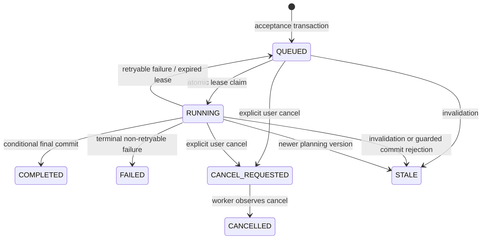

# 持久 Agent 执行与可重连流式输出实施规范

**状态：** 已批准的实施规范
**范围：** Personal Agent 对话、共享行程规划与重规划
**取代：** `docs/agent-streaming-implementation.md` 中关于断连/取消的生命周期语义
**主要实施目标：** Next.js Web + Fastify API + PostgreSQL/RDS + ECS Fargate Worker

## 实施状态（2026-08）

- **Phase 1：** 已在适用范围内实现持久 task 基础设施。
- **Phase 2：** `CONVERSATION` 的持久接受、独立 Worker、恢复、显式取消、SSE 观察和 Web 恢复已实现并完成本地验证。
- **Phase 3：** `PLAN` / `REPLAN` 的持久 task 迁移仍是必需的后续工作；本阶段未将其定义为可选或完成。
- **Phase 4：** 可重连 planning / streaming 工作仍按本规范后续执行。
- **Phase 5：** 运营硬化与最终验收仍按本规范后续执行。

## 1. 目标与不可协商规则

即使提交任务的浏览器已关闭、刷新、离线或断开 SSE，Agent 工作也必须继续。浏览器只是服务端任务的已认证观察者，绝不是任务执行的所有者。

本规范适用于三类操作：

- `CONVERSATION`：仅 owner 可访问的 Personal Agent 对话轮次。
- `PLAN`：首次共享行程规划。
- `REPLAN`：由有效变化事件或用户主动重新运行触发的规划。

以下规则必须遵守：

1. 只有已认证用户的显式取消操作才能请求取消。页面卸载、路由切换、丢失的 `fetch`、SSE 关闭和网络中断绝不取消任务。
2. PostgreSQL 是 task 状态、幂等、最终消息、snapshot、plan 与取消状态的权威来源。SSE 和内存中的连接状态不是权威，可丢失。
3. 系统必须在多个并发 Worker 下保持正确。Worker 的 desired count 为 1 只是容量选择，不能成为正确性前提。
4. 任务执行是 at-least-once；通过租约、幂等与条件化终态写入，最终业务效果为 at-most-once。系统不得宣称模型调用 exactly-once。
5. 只有最终完整且经安全校验的 assistant 文本可以写入 `chat_messages`。原始 provider token、partial 文本、prompt、工具 payload、思维链和私有 snapshot 永不写入 task record、outbox payload、audit event、日志、trace 或 metrics。
6. 面向用户的实时文本只能在通过 streaming safety gate 后发送，禁止原样转发 provider token。
7. 只有现有 provider、snapshot、授权、evidence 与 plan-output 校验全部成功后，plan 才能激活。因 consent、约束或较新规划版本而失效的 task 以 `STALE` 结束，不能写入 active plan。

## 2. 与现有系统的集成

### 2.1 复用组件

| 现有组件 | 本方案中的用途 |
|---|---|
| `apps/api/src/db/schema.ts` 与 Drizzle migrations | 继续作为关系型业务状态的来源；新增持久 task schema 与索引。 |
| `chat_threads`、`chat_messages` | 继续保存仅 owner 可访问的原始会话历史；在任务入队前创建已接受的 USER message。 |
| `idempotency_records` 与 `claimIdempotency()` | 继续提供稳定的客户端请求幂等；将 task 创建时的 claim 移入 acceptance transaction。 |
| `outbox_events` | 继续作为事务性唤醒/audit 集成机制；不作为 task 状态权威。 |
| `ModelGateway`、`LLMGateway`、Skill registry、policy gates | 继续是唯一模型与 Skill 边界；Worker 通过这些抽象调用，而不直接调用 SDK。 |
| `planning-service`、provider adapters、plan-output validator、visa service | 由 `PLAN` 和 `REPLAN` handler 复用，执行从 HTTP route 移入 task handler。 |
| consent、snapshot、confirmation、booking services | 继续作为服务端业务权威；task 或 stream 不得绕过它们。 |
| `recordAudit`、telemetry redaction、metrics allow-list | 继续强制用于 task 生命周期的可观测性。 |
| Web `HttpTravelApi`、TanStack Query、Cognito token provider | 复用于命令提交、状态刷新及鉴权 SSE 订阅。 |

### 2.2 修改组件

| 模块 | 所需变更 |
|---|---|
| `routes/chat-threads.ts` | 用返回 `202` 的持久接受流程替换同步 turn 执行；增加 owner 范围的 run 读取、取消及事件订阅 route。 |
| `services/chat-conversation-service.ts` | 拆分为接受、Worker 执行、最终提交和回放/读取函数。模型运行时不得持有 HTTP request 或 DB transaction。 |
| `routes/planning.ts` | 用返回 `202` 的 `PLAN` task acceptance 替换同步生成循环。 |
| `services/change-event-service.ts` | 失效后持久化 `REPLAN` task，而不是在 HTTP request 中调用 `generatePlan()`。 |
| `planning-service.ts` | 使 snapshot/version 分配具备并发安全性，并暴露带最终提交 guard、可由 Worker 调用的规划编排。 |
| `agents/skill-registry.ts` | 除 Skill timeout signal 外接收外部 `AbortSignal`，以便显式 task 取消中止上游工作，而不是将其等同于浏览器断连。 |
| `providers/model-gateway.ts` 与 `llm-gateway.ts` | 添加受控对话流及可安全生成内部 delta 的 callback/async-iterable 接口；保留最终 structured validation 与错误分类。 |
| `app.ts` / 部署入口 | 注册 task routes 并创建 API 侧 stream relay listener；不得在 Fastify request process 中运行 task Worker loop。 |
| Web chat 与 planning UI | 将提交的工作建模为服务端状态（`QUEUED`、`RUNNING`、终态）；组件内存仅保留当前 attempt 的临时文本，unmount 时绝不取消工作。 |

### 2.3 新增模块

```text
apps/api/src/
  tasks/
    contracts.ts
    task-repository.ts
    task-service.ts
    task-claim-service.ts
    task-recovery-service.ts
    task-cancellation-service.ts
    task-stream-publisher.ts
    handlers/
      conversation-task-handler.ts
      planning-task-handler.ts
  workers/
    agent-task-worker.ts
    worker-main.ts
  routes/
    agent-runs.ts
```

实际目录名可遵循仓库约定，但 route 代码、持久化/租约代码与 operation handler 必须保持分离。

## 3. 技术栈与部署

| 关注点 | 决策 |
|---|---|
| API | 现有 Node.js LTS、TypeScript、Fastify 服务，部署于 AWS App Runner。 |
| 数据库 | 现有 Amazon RDS for PostgreSQL 与 Drizzle ORM。PostgreSQL 实现持久 task 状态、租约、恢复扫描及可选的易失 stream 通知通道。 |
| Worker | 新增容器化 Node.js/TypeScript ECS Fargate service。与 API 共享 package/image 或 workspace package，但有独立的 `worker-main.ts` 命令与 task-role IAM identity。 |
| 模型与 provider | 现有 `ModelGateway` 与类型化 provider adapter。所有模型 key 仍仅存于服务端 Secrets Manager。 |
| 客户端状态 | 现有 TanStack Query 管理 task/read API；React component state 仅保存实时、未持久化的文本 bubble。 |
| 实时交付 | 鉴权的 `fetch` + `text/event-stream` 订阅。PostgreSQL `LISTEN/NOTIFY` 将 Worker 的、已批准且易失的 delta 分发至 API instance；它绝不承担 task 正确性。 |
| 队列/工作流产品 | 不增加 Redis、Temporal、Step Functions 或 WebSocket。本实施阶段不引入 SQS；PostgreSQL task claim 与 transactional outbox 对已批准 MVP 范围已足够。 |

### 3.1 ECS Worker 要求

- 至少运行一个期望的 Fargate task，但必须假定部署、恢复和扩缩容期间可以同时存在两个或更多 task。
- 使用独立 ECS task role，仅授予模型/provider 所需 Secrets Manager 读取、RDS 连通性和 telemetry 写入/导出权限。
- 处理 `SIGTERM`：停止接受新 claim，给当前 claim 有界 grace period，随后通过进程退出释放；lease expiry 与 recovery 必须覆盖强制终止。
- 使用有界并发设置，例如 `AGENT_WORKER_CONCURRENCY=2`，且绝不 claim 超出可被主动监管的工作量。
- 发布进程 liveness/readiness 及 task backlog/lease metrics 健康状态，不得暴露用户/task 标识符。

## 4. 持久数据模型

### 4.1 `agent_task_runs`

新增 PostgreSQL 表及对应 Drizzle schema。现有 `agent_runs` 仍是单次模型/Skill 调用的 telemetry metadata，并不被替换为业务可观测性记录。

| 列 | 要求 |
|---|---|
| `id` | UUID 主键；公共 API run identifier。 |
| `operation` | `CONVERSATION`、`PLAN` 或 `REPLAN`。 |
| `status` | `QUEUED`、`RUNNING`、`CANCEL_REQUESTED`、`COMPLETED`、`FAILED`、`CANCELLED` 或 `STALE`。 |
| `created_by_user_id` | 已认证提交者；用于授权/audit。 |
| `thread_id` | `CONVERSATION` 必填；其他 operation 可空。 |
| `trip_id` | `PLAN`/`REPLAN` 必填；未绑定 conversation 可空。 |
| `snapshot_id` | `PLAN`/`REPLAN` 必填；conversation 可空。 |
| `request_id` | 稳定客户端 UUID。 |
| `user_message_id` | conversation 必填引用；消息正文仍仅存在于 `chat_messages`。 |
| `assistant_message_id` | 可空；仅在成功完成 conversation 持久化后设置。 |
| `result_plan_id` | 可空；仅在验证后的 plan 已持久化/激活后设置。 |
| `generation_attempt` | 从 1 开始；Worker recovery retry 开始新生成时递增。 |
| `attempt_count`、`max_attempts` | 初始计数为 0，最多固定三次总尝试。 |
| `lease_token`、`lease_expires_at` | queued/terminal 时可空；每次 claim 生成新的随机 lease token。 |
| `started_at`、`finished_at`、`cancel_requested_at` | 时间戳生命周期字段。 |
| `next_attempt_at`、`expires_at` | backoff 与最大 queue/runtime 边界。 |
| `error_code` | 可空，只允许稳定 allow-list code。 |
| `created_at`、`updated_at` | audit 排序与运营用途。 |

task record 不得包含 prompt、原始会话文本、partial assistant 文本、原始工具结果、passport/nationality payload 或不受约束的 JSON request blob。

### 4.2 约束与索引

- 非空 conversation 行的 `(thread_id, request_id)` 唯一。
- 非空 planning 行的 `(trip_id, request_id)` 唯一。
- partial unique index：每个 `thread_id` 最多一个 active（`QUEUED`、`RUNNING`、`CANCEL_REQUESTED`）conversation task。
- partial unique index：每个 `trip_id` 最多一个 active planning/replanning task。
- 对 nonterminal 行建立 `(status, next_attempt_at, lease_expires_at, created_at)` claim index。
- 对 `users`、`chat_threads`、`shared_trips`、`constraint_snapshots`、`chat_messages` 与 `itinerary_plans` 建立 foreign key，并使用避免终态结果成为 orphan 的删除策略。
- 使用 check constraint 确保 operation 特定引用存在，并且 `assistant_message_id` / `result_plan_id` 仅在终态成功时出现。

### 4.3 Outbox event

在接受 task 的同一 transaction 中，写入仅含 `taskId`、operation 和安全 correlation reference 的 `AGENT_TASK_QUEUED` outbox event。其作用是及时唤醒与 audit 集成；若 event 延迟或丢失，Worker 对 `agent_task_runs` 的 polling 仍是恢复路径。

以相同 payload 纪律写入 `AGENT_TASK_CANCEL_REQUESTED`、`AGENT_TASK_STALE` 和 terminal task event。Outbox payload 永不包含 question text、snapshot、model output、provider payload 或 streamed delta。

## 5. Task 状态机与并发契约



### 5.1 原子 claim

repository 必须用一个 database transaction 选择并转换 runnable task。实现必须使用等效于 `FOR UPDATE SKIP LOCKED` 的 row lock，然后写入全新的、密码学随机 `lease_token`、`lease_expires_at`、`RUNNING`、`attempt_count + 1` 和 `generation_attempt + 1`。

Worker 在拥有 active task 时必须于 lease 到期前续租。lease renewal 必须以 `(id, lease_token, status = RUNNING)` 为条件；续租失败说明 Worker 已失去所有权，必须停止发送事件并丢弃本地结果。

### 5.2 条件化最终提交

每次 terminal write 必须携带当前 `lease_token` 与所需 validity predicate。Conversation 的最终 transaction 原子写入 ASSISTANT message、idempotency result、audit event 和 `COMPLETED` 状态。Planning 仅在 snapshot 仍有效时，才原子写入 provider evidence、plan/visa effect、active-plan transition、audit 和 `COMPLETED`。

若条件 update 影响零行，说明 Worker 已失去所有权、task 已取消或 run 已 stale。Worker 不得重试 finalization 或继续发布 delta。

### 5.3 取消

`POST /agent-runs/:runId/cancel` 是唯一取消机制。它验证 owner 或授权 trip member，随后在 transaction 中条件化更新 nonterminal task 为 `CANCEL_REQUESTED`，并记录 audit/outbox state。

Worker 在外部调用前、streaming 中、每个 planning stage 前及 finalization 前立即检查取消状态。取消会调用 task 的 `AbortController`、丢弃 partial memory，并在不产生 ASSISTANT message 或 plan effect 的情况下以 `CANCELLED` 终结。浏览器生命周期事件绝不调用此 endpoint。

### 5.4 重试与恢复

可重试 code 限于已分类网络失败和 upstream HTTP 5xx。重试将状态设为 `QUEUED`、清空 lease、递增 attempt count，在下次 claim 时递增 generation attempt，并以有界 exponential backoff with jitter 设置 `next_attempt_at`。最多允许三次总尝试。

`SAFE_REFUSAL`、schema failure、policy denial、consent/authorization invalidation、data unavailability、unsupported operation、user cancellation 和 task expiry 都是 terminal，绝不自动重试。

每个 Worker instance 都运行 recovery scan。它以相同 claim/conditional-update 纪律 reclaim 已过期 lease 或将过期 task 终态失败。多个 recovery scanner 按设计是安全的。

## 6. API 契约

所有 endpoint 继续使用现有 Fastify authentication。请求 body 中的 ID 绝不作为 authority；owner/membership 只从已验证 Cognito user 派生。

### 6.1 Commands

| Endpoint | 行为 |
|---|---|
| `POST /threads/:threadId/turns` | 验证 owner 和现有 request DTO；在 transaction 中接受 task 并返回 `202 Accepted`。现有同步 response contract 退役，或仅作为显式 compatibility endpoint 暂时保留。 |
| `POST /planning/generate` | 验证 trip membership，事务性创建 immutable snapshot 与 `PLAN` task，返回 `202 Accepted`。 |
| `POST /change-events` | 保持 change-event idempotency 与 invalidation；enqueue `REPLAN` 而不是在 request 中执行 planning，返回 run ID。 |
| `POST /agent-runs/:runId/cancel` | 显式取消请求；幂等的 terminal response。 |

Accepted response contract：

```json
{
  "runId": "uuid",
  "operation": "CONVERSATION",
  "status": "QUEUED",
  "generationAttempt": 0,
  "userMessage": {
    "id": "uuid",
    "role": "USER",
    "content": "owner-only submitted content",
    "createdAt": "ISO-8601"
  }
}
```

### 6.2 Read API

| Endpoint | 行为 |
|---|---|
| `GET /agent-runs/:runId` | 仅返回 owner/member 已授权的安全 run status、operation、timestamp、attempt number、安全 error code，以及存在时的 final message/plan reference。 |
| `GET /threads/:threadId/conversation` | 现有 owner-only history endpoint 保留，作为完成 conversation result 的恢复来源。 |
| `GET /planning/:tripId/latest` | 现有授权读取保留，作为完成 plan 的恢复来源。 |

### 6.3 SSE 订阅

`GET /agent-runs/:runId/events` 是鉴权、只读的 SSE subscription，使用 `fetch` 消费以便浏览器发送 `Authorization: Bearer <access token>`。它绝不创建、恢复、取消或拥有 task。

Event envelope：

```text
event: run.phase
data: {"runId":"uuid","generationAttempt":1,"phase":"GENERATING"}

event: message.delta
data: {"runId":"uuid","generationAttempt":1,"sequence":12,"delta":"approved display text"}

event: run.completed
data: {"runId":"uuid","generationAttempt":1,"assistantMessageId":"uuid"}
```

Planning/replan 仅允许 `run.phase`、`run.completed` 和 `run.failed`，绝不包含 text delta、raw provider data、snapshot 或未验证 candidate。Conversation 的 `message.delta` 仅在 stream safety approval 后允许。

SSE event 不保证跨连接 replay。重连时客户端先读取 `GET /agent-runs/:runId`，再订阅后续实时 event。若 task 在断线期间完成，客户端获取持久化 conversation 或 plan result。

## 7. 执行数据流

### 7.1 Conversation 接受与执行

1. 浏览器以新 `requestId` 发送 `POST /threads/:threadId/turns`。
2. API 验证 thread ownership 与 input schema。
3. 一个 transaction claim idempotency、插入 USER message、插入 `agent_task_runs(QUEUED)`、插入 outbox/audit record；对于 duplicate request 返回同一个 accepted result。
4. Worker 原子 claim task，重新加载并验证 thread ownership，只读取被引用的 owner-only message 及 safe recall。
5. Worker 通过 policy/Skill boundary 调用 `thread.recall → travel.conversation → ModelGateway`。
6. 模型 streaming 时，Worker 安全缓冲 UTF-8、应用 size limit 与 streaming safety validation，并发布 approved transient delta；没有 delta 是 durable 的。
7. 完整 candidate 通过现有 final safety 与 schema validation。一个 conditional transaction 插入 ASSISTANT message 并将 task 转为 `COMPLETED`。
8. API relay 发送 `run.completed`；任意客户端也可从持久 owner conversation 恢复。

### 7.2 Planning/replan 接受与执行

1. API 验证 trip membership 并确定 required member。
2. 在并发安全 transaction 中，创建 immutable constraint snapshot 与 `PLAN`/`REPLAN` task。Snapshot version allocation 必须锁定 trip/version allocation，或对 unique constraint 进行 retry。
3. Change-triggered replan task 成为 runnable 前，先运行现有 plan/confirmation invalidation rule。
4. Worker claim task，只发送安全 phase：`SNAPSHOT_CREATED`、`RESEARCHING`、`VALIDATING`、`PERSISTING`、`COMPLETED`、`FAILED` 或 `STALE`。
5. 它调用现有类型化 Flight/Stay/Ground/Visa provider 及 structured planning gateway；所有 query 使用 task snapshot。
6. 持久化前，Worker 检查取消、lease ownership、snapshot validity、consent，以及是否有更新 planning task/version supersede 当前任务。
7. 一个 guarded transaction 仅持久化验证通过的 provider evidence、visa check、plan data、plan activation/version transition、audit/outbox record 和 task completion。Guard 失败时产生 `STALE`，不改变 active plan。

## 8. Streaming Relay 与安全细节

`LISTEN/NOTIFY` 是实时渲染的 availability enhancement，不是 durable event log。每个 API instance 启动后订阅专用 channel，并仅将接到的 event 路由给已通过 run authorization 检查的本地 SSE connection。

- 每个 notification 小于 PostgreSQL payload limit；Worker-side segmentation 强制更小的应用上限。
- Payload 不含 prompt、system instruction、provider raw response、tool response、snapshot field、token usage 或 free-form error。
- Notification failure、listener restart 和无 active subscriber 是预期情况，不改变 task status。
- API relay code 永不持久化接收到的 delta，且永不记录 event body。
- Retry 时 `generationAttempt` 改变。Web client 必须移除之前 temporary bubble，仅展示最新 attempt 的文本；保留 durable USER message。
- 最终完整 response 仍作为整体校验。若校验失败，客户端清除 temporary text，仅展示安全 terminal state。

## 9. 可观测性与运维

新增只含有界 label 的低基数 metrics：

- `agent_task_runs_total{operation,outcome}`
- `agent_task_queue_wait_ms{operation}`
- `agent_task_duration_ms{operation,outcome}`
- `agent_task_lease_reclaims_total{operation}`
- `agent_task_retries_total{operation,error_class}`
- `agent_stream_time_to_first_safe_event_ms{operation}`
- `agent_stream_connections_total{outcome}`

允许的 outcome 包括 `completed`、`failed`、`cancelled`、`stale` 和 `expired`。user、trip、thread、plan、request、run、correlation 与 lease identifier 不得作为 metric label。

Structured audit/log/trace context 可以包含安全 correlation identifier、operation、phase、attempt、terminal status、provider/model name、latency 与 allow-listed error code；不得包含文本、delta、snapshot、credential、raw provider error、nationality、travel document 或 model prompt。

运营告警应覆盖持续 queue age、重复 lease reclaim、retry exhaustion、Worker heartbeat loss 和 terminal failure rate 上升。通过记录于 `.env.example` 的 environment variable 定义 limit，不得嵌入 credential。

## 10. 实施计划

### Phase 0 — 契约与文档

1. 更新第 12 节列出的项目事实来源。
2. 在 API 与 Web contract 中定义 task enum、API Zod schema、安全 error/phase allow-list 和 stream event contract。
3. 决定默认配置：lease length、renewal cadence、operation deadline、queue TTL、retry backoff 以及 per-thread/per-trip concurrency。

**退出条件：** API、Worker、Web、安全和测试 contract 对 task lifecycle 一致，且没有文档称断连会取消工作。

### Phase 1 — 持久 task 基座

1. 增加 `agent_task_runs` 的 migration 与 Drizzle schema、constraint、index 和所需 audit enum value。
2. 实现 acceptance transaction、repository read、多 Worker 安全 claim、lease renewal、terminal conditional commit、cancellation、retry scheduling 与 recovery。
3. 实现 Fargate Worker entrypoint、graceful shutdown、health、configuration validation 和 least-privilege IAM/deployment definition。

**退出条件：** 确定性 integration test 证明 duplicate submission、two-Worker claim contention、lease expiry、recovery、cancellation race 和恰好一个最终 durable result。

### Phase 2 — Personal Agent 后台对话

1. 将 conversation service 重构为 acceptance 与 Worker handler。
2. 增加 Worker-controlled model streaming 与 final safety validation。
3. 增加 task API 和 owner authorization test。
4. 将 Web chat 改为 accepted/pending state、polling recovery、explicit Stop 和 no-unmount-cancellation。

**退出条件：** close/reload/network-loss test 显示 task 完成和 owner recovery；没有 partial text 是 durable 的。

### Phase 3 — Shared planning 与 replan 后台执行

1. 将 planning orchestration 移入 task handler，并使 snapshot/version allocation 能承受并发 request。
2. 使 change event 在 stale transition 后 enqueue idempotent replan。
3. 增加 commit-time consent/snapshot/newer-version guard。
4. 更新 Web planning flow：查询 run state，并只重载持久化的 active plan。

**退出条件：** planning 可在无浏览器情况下持续；authorization revocation 使旧工作 stale；多个 Worker 不能激活冲突 plan version。

### Phase 4 — 可重连实时流

1. 实现 Worker stream publisher 与 API `LISTEN/NOTIFY` relay abstraction。
2. 在 Web 中增加 authenticated fetch-SSE subscription、temporary text bubble、phase UI、reconnection behavior 与 generation-attempt replacement。
3. 在 App Runner/ECS 环境验证 proxy buffering、connection lifecycle 及 telemetry 中无 event body。

**退出条件：** 已连接客户端接收安全 incremental text；断连不取消工作；重连只取得最终持久化 result 与之后的 delta。

### Phase 5 — 加固与发布

1. 运行 load、failure-injection、rolling-deployment、lease-expiry、concurrent-worker、provider-timeout 和 cancellation test。
2. 配置 dashboard/alert，并在 active task 期间执行 Fargate rolling replacement test。
3. 运行全部 API/Web validation 和文档检查。

## 11. 强制测试覆盖

- 两个 Worker 竞争 claim 一个 task；一个模型执行/最终 durable effect 胜出。
- Worker 在 final commit 前死亡；lease 过期；recovery retry；恰好一个 ASSISTANT message 或 active plan 存在。
- Worker 在 final commit 后死亡；recovery 不创建 duplicate result。
- execution 前、期间、之后的 duplicate `requestId` 都返回同一 run，且不复制 USER message。
- 浏览器关闭、reload、offline transition、aborted fetch 和 SSE disconnect 不将 task 改为 cancelled/stopped。
- claim 前、stream 中、final commit 前立即的 explicit cancellation，在取消胜出后不产生 assistant/plan effect。
- 可重试 network/5xx error 最多 retry 两次；policy/schema/auth/data failure 不重试。
- unsafe delta、final safety failure、provider payload、snapshot data 和 message text 不存在于 durable task data 与 observability。
- 运行中 conversation 的 reconnect 只接收未来 approved delta；完成后的 reconnect 读取持久 final message。
- consent revocation、profile/constraint update 和新 replan 在 plan activation 前使旧 planning work stale。
- rolling deployment 与同时 Worker replacement 后，已接受 task 仍可 recovery。

## 12. 必须同步的文档

以下文档必须在同一实施变更中更新。它们当前的 disconnect-cancellation 表述与本已批准设计不兼容。

| 文档 | 所需修订 |
|---|---|
| `TECH_STACK.md` | 描述 ECS Fargate Worker、PostgreSQL durable task/lease、与浏览器无关的执行、transient relay 语义，以及本阶段不使用 Redis/Temporal/Step Functions/SQS。 |
| `docs/PRD.md` | 将 browser-disconnect cancellation acceptance criterion 替换为所有适用 Agent run 的 durable continuation 与 explicit-cancel-only 行为。 |
| `docs/backlog.md` | 将 streaming story 替换为 USER-first task acceptance、durable task recovery、explicit cancellation 和 reconnectable safe streaming。 |
| `docs/test-scenarios.md` | 将 disconnect-abort expectation 替换为 multi-Worker contention、recovery、rolling deployment、explicit cancel、task replay/read、planning/replan stale guard 和 stream reconnection coverage。 |
| `docs/agent-streaming-implementation.md` | 使用本生命周期、data model、Worker、SSE relay 与 implementation plan 替换该文档。 |

当实施引入 route、Worker configuration、metrics 或 deployment configuration 时，还必须同步 `apps/api/ARCHITECTURE.md`、`apps/api/API.md`、`apps/api/README.md`、`docs/agent-architecture.md`、observability 文档、deployment/IaC 文档以及两个 `.env.example`。

## 13. 实施边界

- 不允许 Agent task 调用 booking 或任何不可逆外部操作。现有 confirmation 和 booking sandbox gate 继续是同步的权威 service rule。
- 不得将 partial assistant message 持久化为新的 message role，也不得将 streamed text 作为 business record。
- 不得将 browser state、SSE connection、frontend store、model response 或 provider response 作为 task status、authorization、plan version、confirmation 或 booking 的权威来源。
- 不得用用户提供的 run/thread/trip identifier 绕过 owner/membership check。
- 不得为了异步执行更容易而削弱 provider evidence、`Demo data` label、visa readiness boundary、consent snapshot 或 plan validation。
