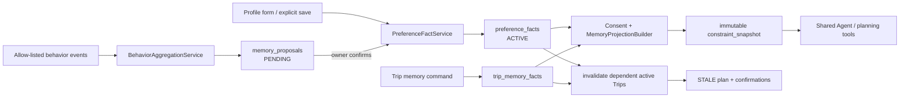

# 长期记忆实施方案

**状态：** 已批准，待实施

**范围：** 个人长期旅行记忆、仅当前 Trip 的共享/团队记忆，以及其向 Shared Trip Agent 的受控投影。
**事实来源：** [TECH_STACK.md](../TECH_STACK.md)、[PRD.md](PRD.md)、[backlog.md](backlog.md)、[test-scenarios.md](test-scenarios.md)、[agent-architecture.md](agent-architecture.md)、[AGENTS.md](../AGENTS.md)。

## 1. 实施决策与不可变边界

### 1.1 已批准决策

1. 第一阶段只使用 PostgreSQL 中的结构化事实；不引入 vector store、embedding、RAG、自动摘要 worker 或独立 memory service。
2. 个人长期记忆默认私有。Shared Agent 不得查询个人 Profile、`preference_facts`、`memory_proposals` 或私有对话；它只消费当前 Trip 的、字段级 consent 导出的不可变 snapshot projection。
3. Team memory 只属于一个 `tripId`，没有跨 Trip 团队记忆、群组偏好档案或跨行程共享检索。
4. 低风险行为可自动聚合，但只能生成有有效期的待确认提案。用户确认前，提案不是长期事实，不进入任何 snapshot、计划或共享视图。
5. 国籍、旅行证件、出生日期、健康和无障碍信息为 form-only 敏感字段：只能由用户的 Profile 表单创建或修改；任何对话、模型或行为路径均不得提取或创建其提案。
6. 原始私聊仍只用于既有的同 owner、同 thread、有界 LLM context。它不进入长期记忆、行为聚合证据、Team memory 或 Shared Agent input。

### 1.2 记忆分类与权威性

| 类型 | 权威存储 | 可写入者 | Shared Agent 输入 | 生命周期 |
|---|---|---|---|---|
| 个人稳定事实 | `user_profiles` + `preference_facts` | owner 表单；owner 确认提案 | 仅当前 Trip consent projection | 跨 Trip，owner 可编辑/删除 |
| 行为建议 | `memory_proposals` | 服务端聚合器；owner 可确认/忽略 | 永不直接输入 | 到期、确认或忽略即终态 |
| 本次个人约束 | `trip_constraint_facts` | owner 确认 proposal 或 owner Trip command | `TEAM_VISIBLE` 或 `ORCHESTRATOR_CONFIDENTIAL` projection；后者仅供 Shared planning | 仅当前 Trip |
| 本次团队决策 | `trip_memory_facts`，`kind=GROUP_DECISION` | 已授权 Trip command | 当前 Trip snapshot 的 group section | 仅当前 Trip |
| 临时会话上下文 | `chat_messages`，Worker 内存 | 既有 conversation 流程 | 永不输入 Shared Agent | thread 删除或窗口裁剪 |

`constraint_snapshots`、plan version、confirmation 与 booking 继续是业务权威状态。记忆事实和提案不能由模型输出直接创建，也不能取代这些状态机。

## 2. 现有系统接入点

| 层 | 现有模块 | 处置 | 原因 |
|---|---|---|---|
| 数据库 | `src/db/schema.ts`、Drizzle migrations、PostgreSQL | 修改并新增表 | 已有事务、外键、审计和 snapshot 控制面；不引入新存储。 |
| Profile | `routes/profiles.ts`、`user_profiles` | 修改 | Profile 仍是敏感 form-only 字段和兼容读取入口；需要与事实服务一致失效。 |
| 偏好事实 | `preference_facts` | 修改并正式接线 | 表已存在但当前未被 profile route、consent projection 或 `profile.memory` 使用。 |
| 授权 / stale | `services/consent-service.ts`、planning invalidation | 修改 | 复用 `buildAuthorizedData` 与 `stalePlansAndConfirmationsForTrip`，扩展至 memory projection。 |
| Personal Agent | `profile-memory-skill.ts`、`profile-change-proposal-skill.ts`、Skill Registry | 修改 | 事实读取和提案只走 owner scope；模型永不直接写库。 |
| Shared Agent | `shared-trip-agent.ts`、plan comparison、snapshot policy/validator | 修改 | 保持只能读取 snapshot；增加 projection schema allow-list。 |
| 私有会话 | `conversation-context-service.ts`、conversation task handler | 复用，不修改读域 | 该路径只提供短期同 thread context，禁止成为长期记忆来源。 |
| Web | Profile form、Trip workspace、TanStack Query contracts | 修改 | 增加个人事实/建议和当前 Trip memory 视图；服务端状态仍为真相。 |
| 观测 | audit、Pino redaction、OTel、metrics | 修改 | 添加无内容的记忆事件、span 和低基数指标。 |

## 3. 目标架构与数据流



### 3.1 个人稳定事实

1. Profile 表单或 owner 确认的 proposal 调用 `PreferenceFactService`。
2. 服务在一个 transaction 内验证字段分类、写入新 active fact、将同字段旧 fact 标记为 `SUPERSEDED`，记录无值 audit，并查找该 owner 对该 field 有生效 consent 的 active Trips。
3. 对每个受影响 Trip 调用既有 `stalePlansAndConfirmationsForTrip`。不修改历史 snapshot；后续 planning 创建新 snapshot。
4. Personal Agent 的 `profile.memory` 只读取 owner 的 active facts 和允许暴露的 Profile 字段，返回来源、更新时间和状态，不返回 proposal 的原始行为证据。

### 3.2 低风险行为建议

行为事件必须来自服务器已经确认的产品动作，不能来自 raw chat 或模型文本。MVP allow-list 仅包括：已确认的住宿风格选择、已确认的 non-red-eye 选择、已确认的兴趣类别选择和已确认的行程节奏选择。

**行为时间信息的边界（取代原先的笼统禁令）：**

> 系统不得保存可重建用户活动轨迹的行为时间线。行为聚合器仅可为 allow-listed、服务端确认的低风险 action 保存单字段、单候选值、按 UTC day 粗化且固定上限的近期观察窗口；窗口外只能保存 observation count、first observed date 等不可还原单次行为的聚合统计。不得保存动作正文、页面路径、聊天、prompt、上下文或对外暴露的 event reference。

固定上限为 `recentDepth = 10` 个 UTC 日期。窗口内允许同一天出现多次，但每次必须来自不同的服务端确认 episode；独立性由既有 action/event idempotency 判定，**不得**由时间间隔推断。

`BehaviorAggregationService` 以 `(user_id, field_key, proposed_value_hash, status=PENDING)` 幂等合并，维护一条聚合记录，并按 §3.5 的 activation 与 §3.6 的触发规则决定是否展示。proposal 不保存聊天正文、prompt、行为时间线全文、动作类型或敏感值。

**唯一接入点（已定）：** allow-list 的四个字段只从 `confirmConstraintProposal` 取证——即 agent 提议、owner 本人确认的那一次写入。归属取 `trip_constraint_facts.owner_user_id`，不取操作者。

方案采用、成员确认、团队决定**均不产生 episode**：它们表达的是对整体方案或群体妥协的同意，而非对该字段的个人偏好，把它们当作习惯正是 §9 风险表第一条。用户在表单里直接声明的值（`saveOverride`、`upsertConstraintFactDirect`）同样不取证——那已是显式表态，再据此提议等于追问用户是否想说自己刚说过的话。

episode id 为 `tripId:fieldKey:ownerUserId:valueHash`，**不含时间戳**。其中三项已在观察的幂等键内，唯一新增信息是 trip，因此同一 trip 内对同一字段同一值的重复确认属于同一 episode，不增加证据——用户无法靠来回切换制造习惯。副作用是 `observation_count`、`distinct_episode_count` 与 `distinct_trip_count` 恒等，见 §3.6。

约束目录与记忆目录各自独立成文，字段名与值形状均不一致（`travel_pace` ↔ `trip_pace`；约束值为对象、记忆值为标量或数组；约束的 `accommodation_style` 多一个 `boutique`）。映射在 `memory-observation-bridge.ts` 中显式列出，表外字段不产生 episode，表内但记忆 schema 不接受的值由 `observeBehavior` 拒绝，**不得**在确认事务内抛错。

写入走 outbox：确认事务内插入 `MEMORY_OBSERVATION` 行，由 Worker 独立 slot 消费。记忆聚合因此永远不会拖慢或失败用户正在等待的确认。

投递保证为 at-least-once，不丢事件。认领将行置为 `PROCESSING`（迁移 0027 新增），租约 300 秒；worker 中途崩溃后该行被下一轮回收重投。重投安全的前提正是 episode id 的幂等性——已落库的观察重放为 `DUPLICATE_EPISODE`，不会重复计数。

### 3.3 当前 Trip memory 与 projection

- `trip_constraint_proposals` 是 Personal Agent 或 owner form 生成的候选，必须由 owner 显式确认。确认后才写入版本化 `trip_constraint_facts`；模型不得直接写事实。
- 每个 Trip fact 都有 `HARD`/`SOFT` strength 和 `TEAM_VISIBLE`/`ORCHESTRATOR_CONFIDENTIAL` visibility。后者只供 Shared planning prompt，禁止出现在同行响应、plan explanation 或 telemetry；确认 UI 必须提示结果可能被间接推断。
- `GROUP_DECISION` 是成员通过显式 Trip command 保存的无敏感协作决定（例如候选优先级或已解决的约束冲突）。它对当前 active members 可见，但仍只可写入当前 Trip。
- `MemoryProjectionBuilder` 是唯一把 active personal fact、owner-confirmed trip constraint 和 group decision 组合到 snapshot 的模块。它先调用/扩展 `buildAuthorizedData`，再应用固定 field allow-list、visibility separation 和 value schema。
- projection 写入新的 immutable `constraint_snapshots.authorized_data.memory` namespace；Shared Skill 和 plan validator 只能引用该 namespace 中的字段。禁止对 memory table 的直接 SQL/Skill 访问。

### 3.4 临时会话信息

`ConversationContextBuilder` 和 `chat_messages` 的现有行为不变：仅同 owner、同 thread、任务接收时 pin 的 sequence boundary 和固定字符/轮次预算。不得在 proposal、fact、Trip memory、outbox、idempotency、audit、logs、traces、metrics 或 SSE 中复制 message body。

### 3.5 记忆强度评分（Petrov hybrid ACT-R）

**衰减只作用于 proposals。`preference_facts` 是用户拥有的权威状态，完全豁免衰减**——用户声明的、以及用户确认 proposal 后形成的事实，在用户主动修改或删除前一直有效。activation 从不写入 `preference_facts`，也不与 active fact 计算交叉点；事实只作为"当前声明值"展示。

采用 ACT-R base-level activation 的 Petrov hybrid 近似：

```
精确式（n ≤ k）：   B = ln( Σⱼ tⱼ^(-d) )

hybrid（n > k）：   B = ln( Σ_{最近 k 次} tⱼ^(-d)  +  tail )

tail = (n - k) / ((1-d)·(T_first - T_k)) · ( T_first^(1-d) - T_k^(1-d) )
```

| 参数 | 值 | 说明 |
|---|---|---|
| `scoringVersion` | `petrov-hybrid-v1` | 随每条 proposal 记录，供日后解释历史决策 |
| `d`（decay） | 0.35 | **初始产品先验，未经旅行行为数据验证**；可由服务端配置覆盖 |
| `k`（recentDepth） | 10 | 精确求和的最近观察数 |
| `τ`（activationThreshold） | 0.50 | 可展示所需的最低 B；可由服务端配置覆盖 |
| candidateMargin | ln(2) | 同字段多候选时，第一名相对第二名的最小领先 |
| minimumIndependentObservations | 4 | 见下方说明；**不是 3** |

实现约束：

1. 时间单位固定为 UTC day；每个 elapsed time 取 `max(ageDays, 1)`，避免 `t = 0` 发散。
2. `d` 必须满足 `0 < d < 1`；`0`、`1`、负值、`NaN`、`Infinity` 一律拒绝。未来时间视为时钟偏差，规范化到下限而非产生负 age。
3. 尾部不得直接丢弃。对长期习惯，尾部常常大于精确项；丢弃会系统性低估稳固偏好。
4. 尾部区间宽度为 0 时使用同龄极限 `(n-k)·T^(-d)`，禁止除零。
5. activation 是随时间变化的**派生值**，不作为长期权威值持久化。可存 `lastEvaluatedAt`，但读取与判定时必须重新计算。
6. 只有 `decay` 与 `activationThreshold` 允许服务端配置覆盖；其余保持版本化常量，否则历史决策无法解释。

**为何不用标准 optimized learning：** 该近似丢弃全部精确项，假设 n 次观察均匀铺满整个 lifetime。Fisher、Houpt 与 Gunzelmann (2018) 发现其 activation **对 d 非单调**，导致 d 不可辨识——这对我们是致命的，因为 d 需要后续调参；他们同时发现 hybrid 在相近计算效率下精度显著更好。

**为何最小观察数是 3：** 在 §3.2 的 episode id 下三次观察即三段独立行程，这本身已是很高的门槛；取 4 会要求四段行程，绝大多数用户到不了，建议将永不出现。3 同时落在 τ = 0.50 的正确一侧：证据分布在窗口内（1/15/30 天）`S = 1.692`，B = 0.526 通过；证据挤在窗口末端（1/30/30 天）`S = 1.608`，B = 0.475 不通过。更长跨度上仍然挡住不构成习惯的证据——4 次摊在 180 天里 B = 0.46。

**为何 k = 10 而非 Petrov 的 k = 1：** Petrov 解决的是"检索激活的瞬时提升"，k=1 对该问题通常已足够。我们的判定是"新习惯是否形成"，更依赖近期观察的**形状**。实测（d=0.35，一次 728 天前观察 + 1/2/3/5/7 天前五次突发）：精确值 3.64，k=1 得 1.76（低估 52%），k=5 得 3.69（误差 1.3%）。k=10 为典型突发留出余量。

### 3.6 触发规则

候选 proposal 必须**同时**满足以下全部条件才进入可展示状态：

- `observation_count >= 3`
- `distinct_episode_count >= 3`
- `distinct_trip_count >= 2`
- first/last evidence span `>= 30` 天
- activation `B >= τ`（0.50）

前三项在 §3.2 的 episode id 下恒等，实际门槛为**三个不同的 trip**。取 3 而非 4 是因为：4 要求四段独立行程，绝大多数用户到不了，建议将永不出现；而 3 恰好落在 τ = 0.50 的两侧——证据分布在窗口内（1/15/30 天）B = 0.526 通过，证据挤在窗口末端（1/30/30 天）B = 0.475 不通过。`distinct_trip_count` 一项目前由 episode id 蕴含，保留显式声明是为了防止将来改动 episode id 时静默丢掉跨行程要求。

同一 field 存在多个候选时：取 activation 最高者，且必须满足 `B_top − B_second >= ln(2)`；否则不展示，继续聚合证据。

## 4. 数据模型与迁移

### 4.1 `preference_facts` 扩展

保留已有 `id`、`user_id`、`profile_id`、`field_key`、`field_value` 与时间字段。新增：

| 字段 | 类型 / 约束 | 用途 |
|---|---|---|
| `category` | enum：`PREFERENCE`、`CONSTRAINT` | 强制字段分类与 UI 分组 |
| `source` | enum：`PROFILE_FORM`、`PROPOSAL_CONFIRMATION` | 可解释来源；不记录 raw conversation |
| `status` | enum：`ACTIVE`、`SUPERSEDED` | append/replace 的当前版本语义 |
| `confirmed_at` | timestamptz nullable | proposal confirmation 时间 |
| `supersedes_fact_id` | FK self nullable | 版本链 |

添加 partial unique index：每个 `(user_id, field_key)` 最多一条 `ACTIVE` fact。迁移先回填已有数据为 `PROFILE_FORM` / `ACTIVE`，在核对重复数据后才添加 unique index。用户删除必须删除该事实链中仍含个人值的记录；audit 只保存 fact ID、field category、操作和关联 ID，不保存 value。

### 4.2 `memory_proposals`（新增）

| 字段 | 说明 |
|---|---|
| `id`, `user_id`, `profile_id` | owner 归属；外键 cascade 删除 |
| `field_key`, `proposed_value` | 仅 allow-listed、非敏感字段；Zod schema 验证 |
| `source` | MVP 固定 `BEHAVIOR_AGGREGATION` |
| `observation_count` | 独立观察总数（含窗口外） |
| `first_observed_on`, `last_observed_on` | UTC date，尾部积分与 evidence span 判定 |
| `recent_observed_on` | UTC `date[]`，**长度上限 10**，按时间排序，允许重复日期 |
| `distinct_episode_count` | 不同服务端确认 episode 数 |
| `distinct_trip_count` | 证据覆盖的不同 Trip 数 |
| `scoring_version` | raise 该 proposal 时生效的评分版本 |
| `status` | `PENDING`、`CONFIRMED`、`DISMISSED`、`EXPIRED` |
| `expires_at`, `resolved_at`, `resolved_fact_id` | 生命周期和确认关联 |
| `created_at`, `updated_at` | 标准时间戳 |

`recent_observed_on` 的长度上限由 DB CHECK 与领域 service **双重**限制。activation 不落库（§3.5 约束 5）。并发观察必须在 transaction 内锁定候选行，保证计数、日期窗口与 distinct 计数不丢失；重放同一 action/event 必须幂等，不增加 `observation_count`。

DB CHECK 与 service allow-list 必须双重拒绝敏感 field key。`CONFIRMED` transition 必须在同一 transaction 内创建/替换 active `preference_fact`，并仅可由 `user_id` 本人执行。

### 4.3 `trip_memory_facts`（新增）

| 字段 | 说明 |
|---|---|
| `id`, `trip_id`, `owner_user_id` | 仅当前 active member；Trip cascade 删除 |
| `kind` | `PERSONAL_OVERRIDE` 或 `GROUP_DECISION` |
| `field_key`, `field_value` | 固定 schema；禁止敏感字段出现在 group decision |
| `status` | `ACTIVE`、`SUPERSEDED`、`DELETED` |
| `source` | `OWNER_SAVE` 或 `GROUP_COMMAND` |
| `supersedes_fact_id`, `created_at`, `updated_at` | 版本与时间 |

**存储位置（实施决定，取代原先的独立表）：** trip 级记忆并入既有的 `trip_constraint_facts`，与 team orchestration 约束共用一张表和一套 snapshot projection（迁移 `0026`）。新增 `kind` 判别列区分 `MEMBER_CONSTRAINT`（编排约束）、`PERSONAL_OVERRIDE`、`GROUP_DECISION`，三者各自保留原有的 active 唯一规则：

- `MEMBER_CONSTRAINT`：`(trip_id, owner_user_id, field_key)`
- `PERSONAL_OVERRIDE`：`(trip_id, owner_user_id, field_key)`
- `GROUP_DECISION`：`(trip_id, field_key)`

原先横跨全表的唯一索引必须按 kind 分域，否则同一成员无法在同一字段上同时持有编排约束和个人 override——这是合表的直接后果，有回归测试固定。

两处形态适配：`value_json` 在该表是对象，而记忆值可能是标量或数组，因此以 `{ value }` 包装存储、读取时解包；`visibility` 承载共享规则——`GROUP_DECISION` 为 `TEAM_VISIBLE`，`PERSONAL_OVERRIDE` 为 `ORCHESTRATOR_CONFIDENTIAL`（owner 私有，直到该 Trip 的字段级 consent 导出它）。记忆一律 `strength = SOFT`：它是偏好，不是硬性规划约束。删除后不保留值；历史 immutable snapshot 不回写，但受影响 active plan 必须 stale。

### 4.4 snapshot projection 契约

新增 server-internal Zod schema，形状固定为：

```ts
type MemoryProjection = {
  members: Record<string, {
    profileFacts: Record<string, unknown>;
    tripOverrides: Record<string, unknown>;
  }>;
  groupDecisions: Record<string, unknown>;
};
```

**实现：** namespace 落在 `authorized_data._meta.memory`（与 v2 的其他特权分区同处 `_meta`，与顶层 v1 兼容形状不冲突）。`members` 以 run-scoped alias 为键而非 userId——快照其余部分已对成员做别名化，唯独承载偏好的这一节若回填真实 id，等于把别名化撤销掉。

profileFacts 来自 `preference_facts` 而非 profile 列：只有事实行带有版本链与目录注册信息，而这两者正是决定能否导出的依据。一条个人事实必须同时满足「字段已在 `MEMORY_FIELD_CATALOG` 注册」「`consentExportable: true`」「该成员对本 Trip 的有效 consent 覆盖该字段」三条才会出现，缺任一即不导出。敏感字段以 `consentExportable: false` 注册，因此是结构性排除，不依赖此处再维护一份名单。

Shared Skill 一侧的唯一读取点是 `skills/shared/memory-projection-input.ts`：skill 嵌入 `sharedMemoryInputSchema`，调用 `readMemoryProjection` 取得已校验的 namespace，不得自行触碰 `authorized_data`。读取走 parse 而非 cast——快照是 JSONB，若不校验，任何进入 `_meta.memory` 的内容都会被原样交给模型。缺少 namespace 的旧快照返回空投影（照常规划，只是没有偏好），形状损坏则抛错。

`authorized_data.memory` 只能由 `MemoryProjectionBuilder` 写入。任何 `field_key` 必须在服务端常量 `MEMORY_FIELD_CATALOG` 中注册其 value schema、敏感级别、允许 source、是否能自动建议、是否允许 consent export。未注册字段 fail closed。

## 5. 服务、Skill 与接口设计

### 5.1 新增服务

| 服务 | 主要方法 | 责任 |
|---|---|---|
| `PreferenceFactService` | `listActive`, `replace`, `delete` | owner-only 个人稳定事实、版本转换、受影响 Trip stale |
| `MemoryProposalService` | `list`, `confirm`, `dismiss`, `expire` | proposal 生命周期与 confirmation transaction |
| `BehaviorAggregationService` | `recordEligibleEvent`, `evaluateOwner` | 仅 allow-listed action 的确定性聚合；不读聊天表 |
| `TripConstraintProposalService` | `create`, `listForOwner`, `confirm`, `dismiss` | owner-only proposal 生命周期；确认触发事实 mutation。 |
| `TripConstraintFactService` | `listForOwner`, `listTeamVisible`, `replace`, `revoke` | 当前 Trip 约束、revision、visibility/strength 与 member authorization。 |
| `MemoryProjectionBuilder` | `buildForSnapshot` | consent-aware projection；唯一共享导出点 |
| `MemoryInvalidationService` | `staleTripsForPersonalFact`, `staleTripForTripFact` | 复用现有 stale transaction，避免遗漏依赖 |

### 5.2 修改的现有模块

- `services/consent-service.ts`：让 `buildAuthorizedData` 委托 `MemoryProjectionBuilder`，仍排除 passport；consent grant/revoke 使 projection-dependent plan stale。
- `routes/profiles.ts`：Profile form 写入与对应 stable facts 保持事务一致；敏感字段只保留此 route。
- `skills/personal/profile-memory-skill.ts`：改为 owner-only active fact read，不再以 Trip consent 为读取个人长期记忆的前置条件。
- `skills/personal/profile-change-proposal-skill.ts`：只允许显式 save 意图创建用户确认 proposal；不允许敏感 key。
- `policy/snapshot-policy.ts`、`policy/plan-output-validator.ts`、Shared Skills：接受已验证的 `authorized_data.memory` 结构，只允许引用投影路径。
- `services/planning-service.ts` / task acceptance：在 snapshot 创建时调用 projection builder；commit guard 重验 projection source 未变化；REPLAN 生成 `PROPOSED` plan，不能绕过 adoption vote 激活。
  - `schema.ts`、migrations、API contracts、Web `TravelApi`：添加类型与 DTO，禁止 client-supplied owner/user IDs。

### 5.3 REST API

所有 endpoint 均使用现有 Cognito/local auth、Fastify request context、严格 Zod schema 和统一 error envelope。所有 ID 从认证身份或 URL resource authorization 推导；请求体不得携带 `userId`。

| Endpoint | 行为 | 授权与状态 |
|---|---|---|
| `GET /profiles/me/memory` | 返回 owner 的 active facts 与 pending proposals，不返回行为原始证据 | owner-only |
| `PUT /profiles/me/memory/facts/:factId` | 替换一个非敏感 stable fact | owner-only；新 fact version + stale affected Trips |
| `DELETE /profiles/me/memory/facts/:factId` | 删除个人事实 | owner-only；移除未来 projection + stale affected Trips |
| `POST /profiles/me/memory/proposals/:proposalId/confirm` | 确认 pending proposal | owner-only；幂等终态返回；创建 fact |
| `POST /profiles/me/memory/proposals/:proposalId/dismiss` | 忽略 pending proposal | owner-only；幂等；设置 180 天 cooldown |

个人记忆端点已实现于 `src/routes/profile-memory.ts`。`GET /profiles/me/memory` 的 `suggestions` 只返回通过 §3.6 全部闸门的候选，字段限于 `id`、`fieldKey`、`value`、`observationCount`、`distinctTripCount`、`expiresAt`——不含 `profileId`、观察日期、Trip 引用、activation 或 score。`PUT` 事实时会在同一 transaction 内清除该字段的 pending proposals；`DELETE` 时连同该字段的全部 proposal 与证据一并删除，否则建议会从用户刚删掉的数据里复活。

新增指标（标签均为有界枚举，禁止 field key、value、日期、Trip ID、activation）：`memory_proposals_total{outcome,source}`、`memory_fact_mutations_total{operation,source}`、`memory_proposal_resolutions_total{outcome}`。
| `GET /trips/:tripId/memory/me` | 返回 caller 的 current-Trip overrides 与其授权状态 | active member / owner-only data |
| `PUT /trips/:tripId/memory/me/overrides/:fieldKey` | 保存或替换 caller 的 Trip override | active member；stale active plan |
| `GET /trips/:tripId/memory` | 返回当前成员可见的 group decisions 与已授权投影摘要 | active member；不得返回私有 facts/proposals |
| `PUT /trips/:tripId/memory/group-decisions/:fieldKey` | 显式保存允许的 group decision | active member；service field allow-list；stale active plan |
| `DELETE /trips/:tripId/memory/:factId` | 删除 caller own override 或有权限的 group decision | active member；stale active plan |

Trip memory 端点已实现于 `src/routes/trip-memory.ts`。非成员一律 403（trip id 来自调用方自己的 URL，其存在性不值得用错误状态码掩盖）。`MemoryInvalidationService` 实现于 `src/services/memory-invalidation-service.ts`：个人事实变更只 stale **对该 field 有生效 consent** 的 Trip——仅是成员还不够，没有授权的 Trip 从未拿到该值，stale 它属于无谓抖动；`field_list` 为空视为覆盖整个 scope（此处 fail open 才是安全方向）。Trip memory 变更只影响该 Trip 自身。两者都在同一 transaction 内完成。

`PUT` body 统一为 `{ "value": <schema-specific value> }`。返回 DTO 只包含 `id`、`fieldKey`、`value`（仅对有权调用者）、`source`、`status`、`updatedAt` 与必要的 proposal metadata。不得返回 `profileId`、行为事件引用、raw chat、snapshot 全文或其他成员私有数据。

## 6. 状态、事务与失效规则

| 触发动作 | 原子写入 | 必须后果 |
|---|---|---|
| form 创建/替换 personal fact | new ACTIVE fact + old SUPERSEDED + audit | stale 所有对该 field 有 active consent 且有 active plan 的 Trips |
| proposal confirm | proposal `CONFIRMED` + active fact version + audit | 同上；不可产生两条 active fact |
| proposal dismiss | proposal `DISMISSED` + 清空 observation dates + 180 天 cooldown + audit | 不影响 Trip 或 plan；cooldown 内不重建同 field/value 建议 |
| proposal expire | 90 天后 `EXPIRED` + 清空 observation dates + 受控 cooldown + audit | 不影响 Trip 或 plan；防止立即重新弹出 |

过期由 Worker 的记忆 slot 在队列空闲时每小时扫一次（`memory-maintenance.ts`）。过期只取决于时间流逝，没有任何请求路径会触发它——不扫就意味着无人回应的建议永远挂着、证据永不清除。扫描是单条带条件的批量更新，多进程并发运行安全；失败被捕获而不会拖垮 Worker 的其他 slot。
| form 直接改事实 | 新 ACTIVE fact + 旧 SUPERSEDED + 清除同字段全部冲突 pending proposals 与 evidence aggregates + audit | stale 受影响 Trips |
| Trip override/group decision change | fact version + audit | stale 当前 Trip active plan/confirmations |
| consent grant/revoke | consent state + audit | stale 当前 Trip；下一 snapshot 重新投影 |
| planning acceptance | immutable snapshot + task | projection version/源事实 version 写入 run guard |
| planning commit | plan persistence | 若 consent、source fact 或 trip memory 已改变，task `STALE`，不激活 plan |

**实现（`src/services/memory-source-fingerprint.ts`）：** snapshot 创建时把投影来源的指纹写入 `authorized_data._meta.memorySourceFingerprint`；`generatePlan` 的提交事务内重新计算并比对，不一致则抛 `MemorySourceChangedError`，已验证的 plan 被丢弃而不会成为权威状态。

指纹只哈希**身份与版本**（consent grant id/scope/granted/fieldList、preference fact id/updatedAt、trip constraint fact id/kind/revision），**绝不包含值**——它落在 snapshot 里，任何能读 plan 的人都能读到，哈希值会泄露某成员的偏好是否变成了某个特定值。行在哈希前排序，结果不依赖数据库返回顺序。没有指纹的历史 snapshot 跳过该检查，而不是让所有旧 plan 失败。

所有写 command 接收客户端 idempotency key，复用现有 `idempotency_records`。proposal confirmation、删除和 trip memory 替换必须在数据库 transaction 内锁定目标行及关联 Trip/plan 行，避免并发确认或 stale race。

## 7. 可观测性、安全与删除

新增 audit actions：`MEMORY_PROPOSAL_CREATE`、`MEMORY_PROPOSAL_CONFIRM`、`MEMORY_PROPOSAL_DISMISS`、`PREFERENCE_FACT_UPDATE`、`PREFERENCE_FACT_DELETE`、`TRIP_MEMORY_UPDATE`、`TRIP_MEMORY_DELETE`、`MEMORY_PROJECTION_CREATE`、`MEMORY_INVALIDATION`。summary 仅允许 action、field category、source、status、count、Trip/plan/run correlation ID；禁止 value、value hash、chat text、nationality、证件或事件时间线。

新增指标：

- `memory_proposals_total{outcome,source}`；
- `memory_fact_mutations_total{operation,source}`；
- `memory_projection_build_total{result}`；
- `memory_invalidation_total{scope}`；
- `memory_proposal_pending_age_ms`。

标签只能使用上述有界枚举。新增 spans `memory.proposal.aggregate`、`memory.fact.mutate`、`memory.projection.build`，属性仅包含操作、结果、source、截断/失效布尔值；ID 仅作为 trace/log correlation context。

Profile、trip memory 或 proposal 的用户删除必须删除存储值、任何未确认的 proposal，以及该字段的 candidate aggregates 与 `recent_observed_on` 观察窗口；proposal 进入 CONFIRMED/DISMISSED/EXPIRED 任一终态后也必须立即清空观察日期，不得长期保留行为轨迹。不从 immutable historical snapshot、plan 或已完成 booking 物理回写，但这些记录永不向新 Agent run 导出。删除后必须 stale 仍活跃的依赖 plan。日志、outbox、idempotency 与 audit 不得含可恢复 value，因此无需对其执行内容回填。

## 8. 开发阶段、顺序与交付物

### Phase 0 - 契约与字段目录

1. 新建 `MEMORY_FIELD_CATALOG`，确定每个 field 的 schema、分类、敏感性、允许 source、proposal eligibility 与 consent export 行为。
2. 更新本方案、TECH_STACK、PRD、backlog、test scenarios、agent architecture、API/architecture 文档与 `.env.example`（如最终引入阈值配置）。
3. 先修复现有文档验证脚本/front-matter 漂移，使 `npm run docs:verify` 成为可用门槛。

**退出条件：** 没有未分类字段；敏感字段与自动聚合边界可由单元测试证明。

### Phase 1 - 数据库与纯领域服务

1. 增加 enums、表、约束、partial indexes 和 Drizzle schema；编写可重放 migration 与旧 `preference_facts` backfill。
2. 实现 `PreferenceFactService`、`MemoryProposalService`、`TripMemoryService` 与无 I/O 的 catalog validators。
3. 覆盖 owner isolation、active uniqueness、proposal terminal idempotency、sensitive deny、hard deletion 与 concurrent replacement。

**依赖：** Phase 0。
**退出条件：** migration 在空库和升级测试库均成功，服务不依赖 LLM、聊天或 Shared Agent。

### Phase 2 - 行为建议与个人 API/UI

1. 从有限的已确认产品 action 接入 `BehaviorAggregationService`；不扫描 `chat_messages`。
2. 实现个人 facts/proposals REST contracts、Profile memory UI、TanStack Query invalidation 与 confirm/dismiss 操作。
3. 为每个 action 增加审计、指标和 redaction regression tests。

**依赖：** Phase 1。
**退出条件：** suggestion 不能绕过确认进入 active fact 或任何 plan input。

### Phase 3 - Trip memory、consent projection 与 planning guard

1. 实现 Trip override/group decision routes、member authorization 与 UI。
2. 实现 `MemoryProjectionBuilder`，将其接入 `buildAuthorizedData`、snapshot creation、snapshot policy 和 plan validator。
3. 实现 personal/trip fact change 的跨 Trip invalidation；在 planning final commit 重验 projection 源版本。

**依赖：** Phase 1；Phase 2 的 facts contract。
**退出条件：** Shared Agent 仅能从 snapshot 读取 current-Trip authorized memory；变更 race 不能激活旧 plan。

### Phase 4 - Agent、端到端与发布验证

1. 更新 `profile.memory` / change-proposal Skills 与 Shared Skill input schema。
2. 执行 TS-H1、TS-H1e、授权撤回、Worker retry、并发 idempotency、cross-user/cross-Trip 和 telemetry leakage 回归。
3. 运行 API typecheck、lint、test、docs verification；如 Web 改动，运行 Web typecheck、lint、test。

**依赖：** Phase 2、3。
**退出条件：** 三名用户可完成 Profile suggestion -> confirmation -> Trip consent -> projection -> planning -> stale/replan 的端到端链路。

## 9. 关键风险与实施注意事项

| 风险 | 控制 |
|---|---|
| 行为推断将一次妥协当作长期偏好 | 固定 allow-list、至少两次独立 action、expiry、owner confirmation；不自动写 active fact。 |
| 个人记忆经 Team path 泄露 | Shared Agent 无 direct repository/Skill；projection builder + snapshot 是唯一导出点；跨 member/Trip tests。 |
| 事实更新让旧计划继续执行 | 在每个 personal/trip/consent mutation transaction 中 stale；planning commit re-check source versions。 |
| 版本链与删除冲突 | active partial unique index；delete 去除含值记录；audit 无 value；historical snapshot 不再导出。 |
| schema 漂移导致不受控字段进入 prompt | field catalog、Zod schema、snapshot validator 和 DB enum/CHECK 四层 fail-closed。 |
| hybrid 近似在尾部本身前重时低估强度 | k 必须覆盖典型突发规模（当前 10）；golden test 固化该误差上界并验证增大 k 可消除。 |
| d 被随意调整导致历史决策无法解释 | 每条 proposal 记录 `scoring_version`；只有 `d` 与 `τ` 可配置，其余为版本化常量。 |
| 观察窗口沦为行为时间线 | 固定上限 10、粗化到 UTC day、单字段单候选、终态即清空、随事实删除；DB CHECK 与 service 双重限制。 |
| 过早引入语义检索 | Phase 1-4 明确不引入 embedding/RAG；如未来需要，必须另立 ADR 并设计 per-fact consent-aware index deletion。 |

## 10. 必须覆盖的测试

除 `TS-H1e` 外，至少新增：

1. `PreferenceFactService`：field allow-list、敏感拒绝、版本替换、删除、跨 Trip stale scope。
2. `MemoryProposalService`：阈值、expiry、同 proposal 幂等、confirm/dismiss race、确认不重复创建 fact。
3. `TripMemoryService`：member scope、owner isolation、跨 Trip denial、group decision schema。
4. `MemoryProjectionBuilder`：仅 active consent、仅 current Trip、profile/override precedence、无 direct fact leakage。
5. planning integration：snapshot source 变更、撤回授权、run retry、final commit race 均终态 `STALE`。
6. observability：所有 memory value、proposal value、raw chat 和敏感字段均不出现在 audit、logs、traces、metrics、SSE、outbox 或 idempotency result payload。

验证命令：

```powershell
cd apps/api
npm run typecheck
npm run lint
npm test
npm run docs:verify

cd ../web
npm run typecheck
npm run lint
npm test
```
