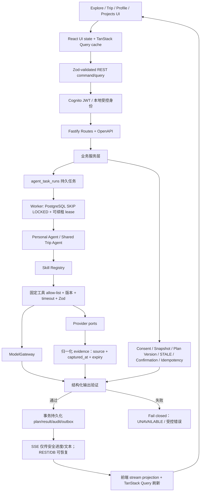
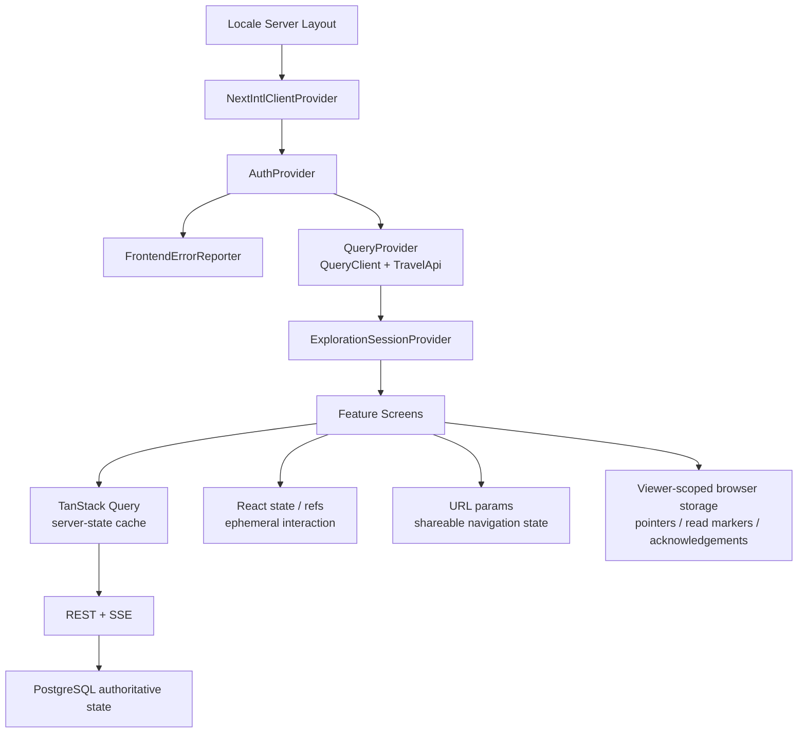
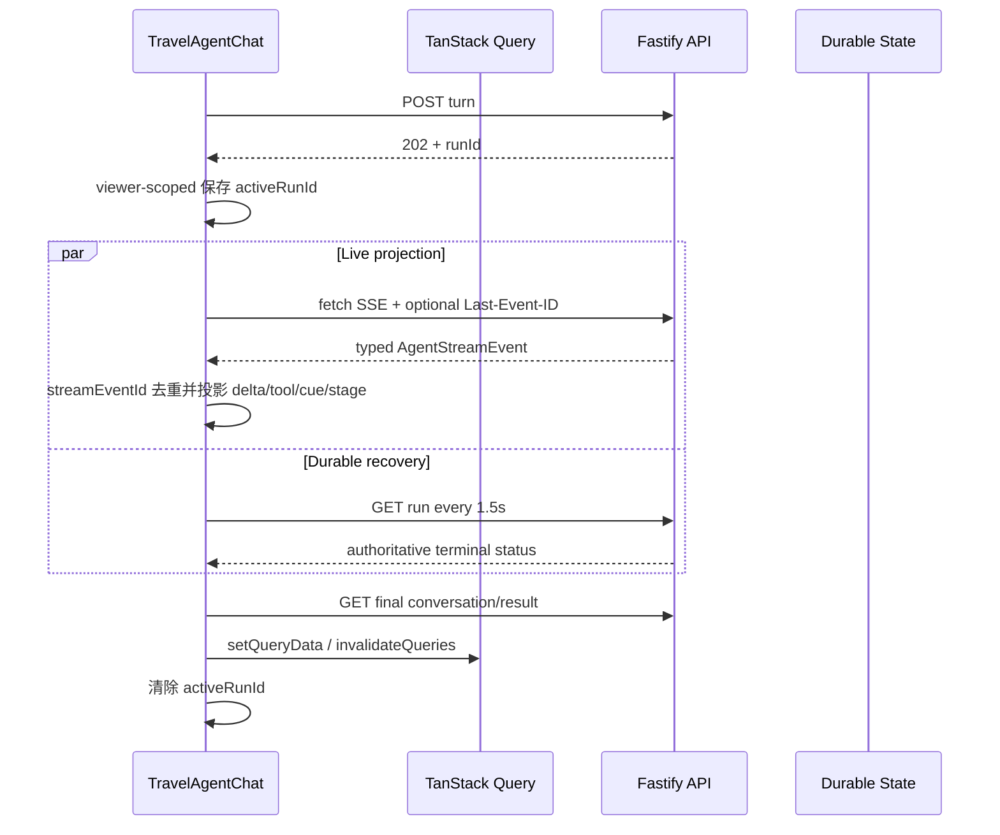
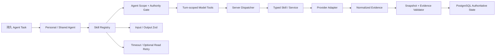
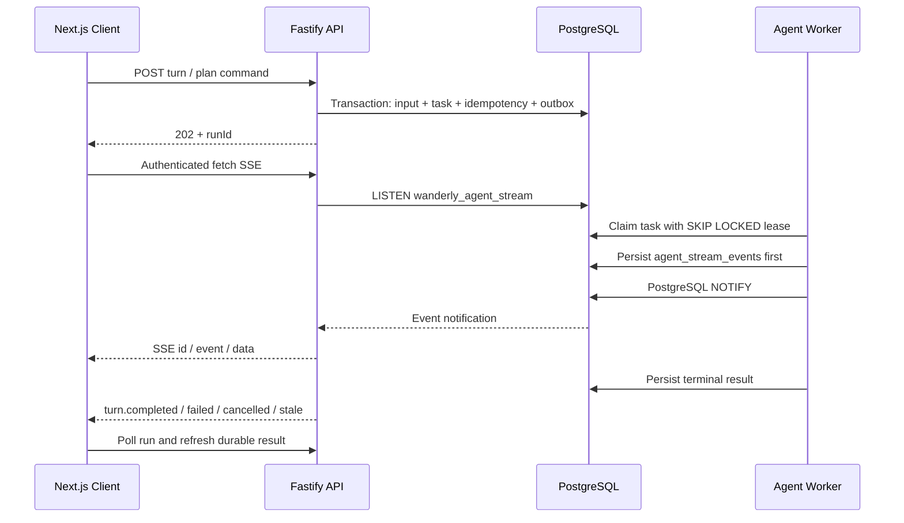
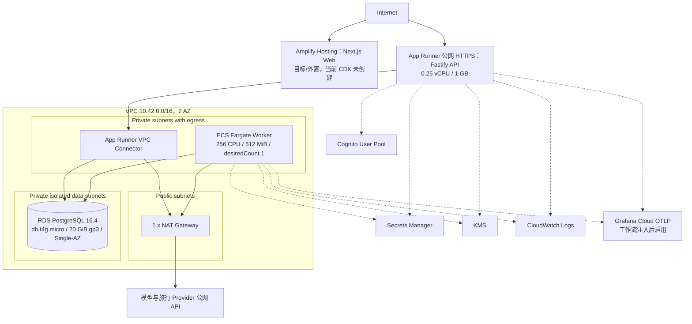

# AI Travel Agent 当前技术架构与技术栈全景

**核对日期：** 2026-09-07  
**事实来源：** `TECH_STACK.md`、`apps/api/ARCHITECTURE.md`、`apps/api/src/`、`apps/web/`、`infra/`、`.github/workflows/`。  
**阅读约定：** “已实现”表示仓库已有生产代码；“默认关闭”表示 adapter 已实现，但当前 CDK 生产环境变量不会启用；“目标/外置”表示技术决策已确定，但不由当前 CDK stack 创建。

## 1. 一图总览

```mermaid
flowchart LR
    user["旅行者浏览器"]

    subgraph web["Browser + Next.js Web"]
        amplify["AWS Amplify Hosting\n目标/外置"]
        router["Next.js 16 App Router\nlocale-aware Server layouts/pages"]
        surfaces["Client Surfaces\nExplore / Projects / Trip / Profile / Auth"]
        webproviders["AuthProvider → QueryProvider\n→ ExplorationSessionProvider"]
        ui["React 19 + Tailwind CSS 4\nshadcn/Radix + Lucide"]
        state["TanStack Query + React state\nURL state + viewer-scoped pointers"]
        contracts["Zod browser contracts\nREST client + fetch SSE parser"]
        map["MapLibre Globe\nremote tiles + versioned local overlays"]
    end

    subgraph runtime["Node.js 模块化单体：同一镜像、两个进程"]
        api["Fastify 5 API\nAWS App Runner"]
        worker["Durable Agent Worker\nECS Fargate"]
        skills["受限 Agent + Skill Registry"]
        policy["Policy Gate + Zod + Plan Validator"]
        providers["类型化 Provider Adapters"]
    end

    subgraph data["权威状态与安全基础设施"]
        postgres[("Amazon RDS for PostgreSQL 16\nDrizzle ORM + SQL migrations")]
        secrets["AWS Secrets Manager"]
        kms["AWS KMS\n国籍字段加密"]
    end

    subgraph external["外部服务"]
        cognito["Amazon Cognito"]
        llm["Gemini / OpenAI / OpenAI-compatible"]
        travel["Flight / Hotel / Activity / Ground APIs"]
        maps["OpenFreeMap + GEBCO"]
        telemetry["CloudWatch + Grafana Cloud\n或本地 Tempo/Grafana"]
    end

    user -->|"HTTPS"| amplify
    amplify --> router
    router --> surfaces
    surfaces --> webproviders
    surfaces --> ui
    webproviders --> state
    surfaces --> map
    state --> contracts
    contracts -->|"Bearer REST/JSON + authenticated fetch SSE"| api
    api -->|"业务事务 + 202 durable task"| postgres
    postgres -->|"SKIP LOCKED：租约领取"| worker
    api --> skills
    worker --> skills
    skills --> policy
    policy --> providers
    worker -->|"结果、审计与 outbox"| postgres
    api -.->|"JWT 验证"| cognito
    worker -.->|"受控模型调用"| llm
    api -.->|"地点介绍模型调用"| llm
    providers -.->|"启用后调用；失败即 UNAVAILABLE"| travel
    map -.->|"公开底图/地势"| maps
    api -.-> secrets
    worker -.-> secrets
    api -.-> kms
    worker -.-> kms
    api -.-> telemetry
    worker -.-> telemetry
```

核心判断：系统是一个共享代码库和数据库的**模块化单体**，前端是独立的 Next.js 应用。浏览器负责交互、短暂展示状态与缓存，不拥有业务真相；HTTP API 负责认证、命令接收和结果读取；已接受的 Agent 任务写入 PostgreSQL，由独立 Worker 通过租约执行，因此页面切换、浏览器刷新或 SSE 断线不会取消任务。

## 2. 端到端业务与控制流

模型不是业务状态机，也不能直接访问数据库。以下不变量由服务端和 PostgreSQL维护：

- Profile、私聊、国籍和证件默认私有；Shared Agent 只能读取当前 Trip 已明确授权的最小字段投影。
- `constraint_snapshot` 不可变；授权撤回、成员约束变化、价格/库存失效会令依赖 plan 与 confirmation 进入 `STALE`。
- 只有三位 required members 对同一最新未过期 plan version 明确确认后，才允许调用 booking sandbox。
- provider 结果必须通过 Zod 归一化并携带来源和采集时间；缺失、超时、schema 漂移或不可信结果统一 fail closed，不使用运行时 fixture fallback。
- SSE 是可丢失的展示通道，不是权威状态；任务、最终结果、幂等和 callback 去重均以数据库为准。

## 3. 前端架构与技术栈

### 3.1 App Router、页面与组件边界

前端位于 `apps/web`，使用 Next.js 16 App Router 和 React 19。`[locale]/layout.tsx` 是异步 Server Component：校验 locale、加载消息、生成静态 locale 参数并组装全局 Provider；页面文件主要保持为轻量 Server Component，交互密集的功能下沉到带 `"use client"` 的 feature component。读取 `useSearchParams` 的 Home 和邀请加入页使用 `Suspense`，避免阻断外层 shell 的预渲染。

| 路由 | 顶层界面 | 主要职责 |
| --- | --- | --- |
| `/[locale]/home` | `ExploreMapPage` | Globe-first 探索、地点选择/介绍、地图与聊天联动、创建临时 Draft Trip |
| `/[locale]/projects` | `ProjectsManager` | 当前用户可访问行程集合、最近行程、归档/删除与进入工作区 |
| `/[locale]/profile` | `ProfilePageContent` | 旅行偏好表单、长期记忆事实与 Personal Notes 管理 |
| `/[locale]/trips/[tripId]` | `TripWorkspace` | 私有 thread rail、Travel Agent chat、Shared Plan、Trip brief、研究缺口与 mini globe |
| `/[locale]/trips/[tripId]/runs/[runId]` | `PlanningRunDetailView` | 持久规划 run、provider evidence 与 service gap 明细 |
| `/[locale]/trips/[tripId]/invite`、`/trips/join/[inviteToken]` | Invitation components | 邀请创建、脱敏预览、接受/拒绝 |
| `/[locale]/login`、`register`、`forgot-password` | Auth pages | Cognito/custom-local 身份入口；高级 Cognito challenge/MFA 尚未实现 |

组件按职责分为 `app-shell`、`explore`、`projects`、`profile`、`trips`、`ui` 和 `observability`。没有在页面层直接散落网络调用：业务读写通过 query hooks 和 `TravelApi` 抽象进入统一客户端。

### 3.2 Provider 树与前端状态分层

前端状态必须按以下边界理解：

- **服务端状态缓存：** Profile、Trips、Threads、Conversation、Plans、Constraints、Votes、Places、Mobility、Research 等都由 TanStack Query 管理。默认 query `staleTime=30s`、失败重试 1 次；mutation 不自动重试，成功后按 query-key 精确更新或失效。
- **持久任务状态：** `agent run` 每 1.5 秒轮询；planning run 仅在非 terminal 状态轮询，并可由 SSE handler 主动失效缓存。缓存只是服务器响应的副本。
- **局部交互状态：** 面板开关、表单草稿、地图 camera、marker、打字动画与本轮 stream projection 留在 React state/ref，不进入全局业务状态。
- **URL 状态：** locale、Trip/Run 标识、当前 thread、Shared Plan view 和 Trip→Explore camera/conversation handoff 放在路由或 query string；接收后仍需服务端校验 membership，URL 中的 ID 不授予权限。
- **探索会话：** `ExplorationSessionProvider` 只在内存保存 `sessionId/tripId/threadId/startRequestId`，并以同一 idempotency key 合并并发或网络失败后的重试；刷新、显式 reset、离开 Home 或身份 revision 变化会清空。
- **浏览器存储：** 只保存当前 run 指针、最近 Trip、Shared Plan 已读版本、真实 provider 确认等辅助信息，并按 viewer scope 隔离；登出会清理。`constraint_snapshot`、plan、confirmation、offer、私有 Profile 和聊天正文不得以此为权威来源。

每次登录、登出或 session restore 都递增 `sessionRevision`，整个 QueryClient 随之重建，避免前一位用户的私有缓存被下一位用户继承。

### 3.3 API client、契约与缓存一致性

`TravelApi` 是 UI 使用的接口，`HttpTravelApi` 是生产实现，底层 `ApiClient` 统一执行：

1. 请求时即时读取 access token，附加 Bearer、`X-Request-Id` 和最近一次服务端 `X-Correlation-Id`；浏览器从不提交 user ID。
2. mutation input 先经过 Zod；所有成功响应再次经过浏览器侧 Zod schema。非 2xx 和响应 schema 漂移统一转换为带 status/correlation 的 `TravelApiError`。
3. query keys 按资源和作用域拆分；mutation completion 使用 `setQueryData`、`invalidateQueries` 或 `removeQueries` 同步相关视图。
4. 身份切换直接销毁整套 query cache，而不是只清空当前 observer。

前后端当前各自维护 Zod HTTP contract，并由测试验证；它们不是从 OpenAPI 自动生成的共享 package。因此新增或改变 API 字段时，必须同步修改服务端 schema、`apps/web/src/lib/api/contracts.ts`、`TravelApi`、`HttpTravelApi` 及契约测试。

### 3.4 浏览器 SSE 生命周期与恢复

浏览器不用原生 `EventSource`，而由 `ApiClient.stream` 基于 authenticated `fetch`、`ReadableStream` 和 `TextDecoder` 解析 SSE，以便携带 Bearer token。

- 首次订阅从 journal 开头回放；重连携带最后成功处理的 `Last-Event-ID`，延迟从 250ms 指数增加到 2s。
- `streamEventId` 在组件内去重。SSE 数据必须先通过 `agentStreamEventSchema`，未知、破损或 partial frame 被忽略，随后依靠 durable read 恢复。
- terminal event 会触发 run refetch；最终 assistant message、plan 或 research result 再通过 REST 写入共享 Query cache。SSE delta 只是临时投影，不是 durable conversation。
- run 指针按 viewer 隔离；403/404、FAILED、STALE 或 CANCELLED 都会释放 composer。页面/聊天 surface 在 run 中切换时，通过共享 query cache 接续最终消息。

### 3.5 Explore 地图与视觉数据管线

Explore 使用 MapLibre GL 6 的 globe projection。地图样式默认取 OpenFreeMap Liberty；底层先显示 Natural Earth raster/实色海洋，再渐进叠加 GEBCO WMS 地势与 provider vector roads/labels。地图失败时仍保留可访问的目的地列表，不阻断核心页面。

版本化的本地展示资产包括：Natural Earth 派生的多 LOD 国界 mesh、China maritime line、国家/地区/城市 label points 和 boundary manifest。国界和文字通过 camera-projected SVG overlay 渲染，并做背面剔除与 zoom 分级；构建脚本使用 TopoJSON 生成这些静态资源。它们只用于展示，不能成为地点解析、路线、价格、签证或旅行事实来源。

地图交互状态由 `ExploreMapPage` 的 React state/ref 和 MapLibre 实例维护，包括 readiness、camera padding、marker、selected destination、pin granularity、globe spin 与 chat handoff。稳定地点介绍必须使用服务端返回的 `stableSourceId` 查询，任意地图 label 不直接进入事实链路。

### 3.6 身份、隐私与客户端安全边界

前端认证通过 `BrowserAuthService` 抽象支持三种模式：

| 模式 | 用途 | 客户端行为 |
| --- | --- | --- |
| `cognito` | 生产身份 | `AuthProvider` 在 effect 中动态加载 AWS Amplify runtime，恢复/刷新 User Pool session；Amplify 不进入 local-dev 初始 bundle |
| `local-dev` | 单机开发 | 仅允许 loopback HTTP API，不提供浏览器登录 token |
| `custom-local` | 非生产可信 LAN/本地账号 | 仅允许 loopback 或 RFC1918 API；token 按 remember-me 存入 sessionStorage/localStorage |

`NEXT_PUBLIC_*` 会编译进浏览器 bundle，只能放 API base、auth mode、公开 Cognito ID 和公开 map style URL，不能放模型/provider key、私有 Profile 或 map secret。客户端路由、隐藏按钮、query cache 和本地存储都不是授权边界；所有私有请求由 API 再做 JWT、owner/membership 和字段级 authority 校验。

### 3.7 UI 系统、国际化与可访问性

- Tailwind CSS 4 负责 tokens/utilities，shadcn `radix-nova` 约定组件风格，Radix Slot 提供组合基础，Lucide 提供图标，`class-variance-authority`、`clsx` 与 `tailwind-merge` 组合 variants/class。
- `next-intl` 支持 `en/zh`，locale prefix 永远存在；middleware 排除 API、Next internals 和静态资产。页面消息来自 `messages/en.json` 与 `messages/zh.json`。
- App Shell 提供共享导航、账户控制和 locale switcher；feature surface 明确处理 loading、empty、error、unavailable、stale、needs-confirmation 等状态。
- 地图保留文本目的地入口、provider attribution 和失败降级；dialog/menu/button 优先复用 UI primitives。当前仓库没有独立的自动化无障碍审计或浏览器端到端测试套件，相关体验主要由组件测试与人工验收覆盖。

### 3.8 前端可观测性、构建与测试

- `ApiClient` 为受支持的关键 mutation 上报 `ui_api_request`；全局 error/unhandled rejection 由 `FrontendErrorReporter` 上报 `ui_client_error`。诊断是 500ms 超时、`keepalive` 的 best effort，失败不会影响用户操作。
- 上报字段经过固定 action/screen/error-category allow-list，不发送 Error、stack、URL、表单内容或用户输入。纯客户端 `recordUiDiagnostic` 当前只在非生产输出 `console.debug`，不是持久遥测。
- 构建使用 Next/Turbopack、TypeScript strict、ESLint 9；样式由 Tailwind PostCSS 处理。Cognito runtime 延迟加载，Radix umbrella import 做 package import 优化。
- 测试使用 Vitest 4、Testing Library 和 jsdom，覆盖组件、hooks、auth、API/SSE parser、viewer storage、地图纯逻辑与部分渲染。质量命令为 `lint`、`typecheck`、`test`、`build`。
- 当前没有 service worker、Web App Manifest 或离线业务缓存，因此实现是响应式 Web，而不是已具备安装/离线能力的完整 PWA；地图也依赖外部 tile/WMS 可用性。

## 4. Agent 运行时技术栈

### 4.1 四层能力模型

仓库中的 `Agent`、`Skill`、`Tool` 和 `Provider` 不是同一个概念：

| 层 | 当前实现 | 权限与事实边界 |
| --- | --- | --- |
| Agent | `personalTravelAgent`、`sharedTripAgent` | 负责注册一组受限 Skill，不拥有数据库或 provider 的任意访问权 |
| Skill | `Skill<I,O>` + `SkillRegistry` + `DefaultPolicyGate` | 服务端定义、Zod 双向校验、版本化、超时、scope allow-list、审计 |
| Model Tool | OpenAI-compatible function schema + server dispatcher | 仅在当前 turn 按 feature flag、capability allow-list 和服务端 authority 动态暴露给模型 |
| Provider Adapter | Flight/Hotel/Activities/Place/Route/Mobility 等 typed port | 只接收服务端绑定的最小参数；原始响应先归一化，失败返回 `UNAVAILABLE` |
| Control Plane | Consent、Snapshot、Planning、Confirmation、Booking、Idempotency 服务 | 不属于模型工具；模型不能直接激活 plan、确认成员、执行 booking 或写数据库 |

### 4.2 Agent 类型与当前注册能力

| Agent kind | 当前状态 | 已注册 Skill |
| --- | --- | --- |
| `personal` | 已运行 | `profile.memory@2.0.0`、`profile.change_proposal@1.0.0`、`consent.explanation@1.0.0`、`thread.recall@1.0.0`、`travel.conversation@1.2.0`、`trip.constraint.propose@1.0.0`、`thread.title.suggest@1.0.0`、`trip.destination.label.suggest@1.0.0`、`destination.cue.decide@2.0.0` |
| `shared` | 已运行 | `plan.comparison@1.0.0`、`readiness.check@1.0.0`、`flight.search@1.0.0`、`hotel.search@1.0.0`、`accommodation.discover@1.0.0`、`activities.search@1.0.0`、`places.search@1.0.0`、`places.adopt@1.0.0`、`navigation.route@1.0.0`、`mobility.search@1.0.0` |
| `review` | 仅有 read-only policy 预留 | 允许 `snapshot:read`，当前没有注册 Review Skill 或独立 Review Agent 进程 |
| `public-content` | 类型与空 scope policy 已预留 | 当前地点介绍直接通过受限 service + `ModelGateway.generateLocationIntroduction`，不经过 Skill Registry；当前 registry 的 agent-kind 检查也没有开放此 kind |

API 与 Worker 启动时都会注册 Personal/Shared Skill，保证接受请求与执行任务看到相同的契约集合。Agent 只是注册和编排边界，不是可自由互聊、动态生长或自行授权的多 Agent 群。

### 4.3 Skill 契约与强制约束

每个 Skill 必须声明：`name`、`agent`、`version`、`input`、`output`、`allowedTools`、`timeoutMs`、`needsConfirm`、可选 `retry` 和支持 `AbortSignal` 的 handler。

一次 `invokeSkill` 的固定顺序是：

```mermaid
flowchart LR
    lookup["按名称查找"] --> version["expectedVersion 检查"]
    version --> scope["Agent scope allow-list"]
    scope --> snapshot["Shared snapshot 必需"]
    snapshot --> input["Input Zod parse"]
    input --> attempt["单次 timeout / 可选 retry"]
    attempt --> output["Output Zod parse"]
    output --> audit["SHA-256 outputHash + SKILL_INVOKE audit"]
    audit --> metrics["低基数 metrics / 安全 runtime log"]
```

关键约束：

- Personal Skill 注册期禁止声明 `bookings` 和 `plan:write:propose`；运行期还要通过 Personal/Shared/Review 各自的固定 scope allow-list。
- Shared Skill 必须收到服务端构造的 immutable snapshot；flight/hotel/place 等执行上下文中的 trip、snapshot、preference version、provider 绑定和 candidate resolver 都不能来自浏览器或模型。
- Skill 输入在 handler 前校验，输出在 handler 后校验；调用方可通过 `expectedVersion` 锁定契约版本。
- `needsConfirm` 目前只是 UI/契约元数据，不会自动阻止持久化。真实确认边界由 route/service、authority gate 和 `requiresOwnerConfirmation` 决定。
- Skill 可以声明只读 retry，但注册器禁止带任意 write scope 的 Skill 声明 retry，`maxAttempts` 被限制在 1–3；调用方取消、schema/policy/version 错误永不重试。
- 当前已注册 Skill 均未声明 `Skill.retry`，所以 registry 层目前是单次执行；provider adapter 自己使用集中式 resilience policy。
- 成功调用写 `SKILL_INVOKE` audit，只保存 Skill 名、版本、尝试次数、延迟和 canonical output hash，不保存 raw input/output。

### 4.4 Tools：模型可见函数与服务端 dispatcher

#### Shared Planning Tools

Shared Planning 可按本次 snapshot、受控机场/目的地列表和 feature flag 动态构建以下模型工具：

| Tool | 暴露条件与作用 |
| --- | --- |
| `flight.search` | 存在受控 origin/destination airport；服务端补全日期、乘客、舱位、币种和 preference version |
| `activities.search` | `PLAN_ENABLE_ACTIVITIES=true`；查询受控目的地与 locale/theme |
| `places.search` | `PLAN_ENABLE_PLACES=true`；返回本 run 的候选 ID |
| `places.propose` / `places.adopt` / `places.revoke` | 与 places 同时开放；只能引用本 run 搜索/创建的 ID，候选字段不能由模型回填 |
| `navigation.route` | places 与 navigation 都启用；只能连接本 run 已采用的两个 ACTIVE trip places |
| `hotel.search` | `PLAN_ENABLE_HOTEL=true`，且 task 已持久绑定 hotel provider 与必要授权 |
| `accommodation.discover` | `PLAN_ENABLE_ACCOMMODATION_DISCOVERY=true`；仅产生非价格住宿发现 evidence |

`mobility.search` 虽然是已注册 Shared Skill，也可由 RESEARCH capability loop 调用，但当前 `buildPlanningToolDefinitions` 没有把它暴露给 plan-synthesis 模型。模型工具列表因此小于 Shared Skill 列表。

Shared dispatcher 重新解析每个工具的参数，使用 `DefaultPolicyGate("shared")` 调用具体 Skill，并把失败转换为有界 `UNAVAILABLE`/service gap；取消和 lease loss 除外，它们必须终止当前 run。

#### Personal Conversation Tools

Personal 对话只有在以下三项同时成立时才获得模型工具：

1. `PERSONAL_CONVERSATION_TOOL_DISPATCH_ENABLED=true`；
2. `MODEL_GATEWAY_TOOL_CALLING_ENABLED=true`；
3. capability 存在于 `PERSONAL_RESEARCH_ALLOWED_CAPABILITIES`。

当前 allow-list 为：`flight.search`、`hotel.search`、`accommodation.discovery`、`activities.search`、`places.search`、`navigation.route`。`mobility.search` 因没有可用 Amadeus 凭据而保持关闭，`visa.*` 尚未进入 capability enum。

- flight/hotel 使用各自的专用 dispatcher，可合并同一 thread 保存的部分搜索条件，并持久化更丰富的 offer evidence。
- places/accommodation/activities/navigation 使用通用 Personal Research dispatcher；模型不能提供 `ownerUserId`、`tripId`、`threadId` 或 `runId`，这些由 Worker closure 绑定。
- dispatcher 每次调用都重新核对 trip membership、Zod draft、capability allow-list 和 owner-only authority。
- `activities.search` 当前需要本轮用户明确确认；flight、hotel、places、navigation、accommodation 当前为只读自动调用。工具调用不能 booking 或支付。
- 同一 turn 内，相同工具与 canonical arguments 只执行一次；重复调用返回 `DUPLICATE_CALL`，不会再次消耗 supplier quota。
- 未知工具、无权限、无配置、参数错误、超时、限流和 provider 失败都以结构化不可用结果返回模型；不会让模型自行补造事实。
- 只有实际 provider round trip 或仍在有效期内的已持久化 flight/hotel evidence，才能把价格、库存类对话标记为 evidence-backed。

### 4.5 Loop 与编排模型

项目不存在一个无限运行的通用 “Agent loop”。当前有以下彼此独立、全部有界的循环：

| Loop | 当前实现与上限 | 退出/失败方式 |
| --- | --- | --- |
| Worker polling loop | 每个 Worker slot 默认每 500 ms 尝试恢复过期任务，再优先 claim 一个 `CONVERSATION`，否则 claim `PLAN/REPLAN/RESEARCH/PERSONAL_RESEARCH`；默认 concurrency 1，可配置 1–8 | 没有任务则等待；进程收到 SIGTERM/SIGINT 后停止；单任务由 terminal state、取消或 lease loss 退出 |
| Lease/cancellation loop | 默认 lease 30 秒、每 10 秒续租；每 250 ms 检查取消 | 续租失败立即 abort，防止失去所有权的 Worker 继续写；取消进入 `CANCELLED` |
| Durable retry loop | `agent_task_runs.max_attempts` 默认 3；只对 `TIMEOUT/NETWORK/UPSTREAM_5XX/UPSTREAM_FAILURE` 等分类为 retryable 的任务重新排队并 backoff | schema、policy、stale preference、data unavailable、unknown Skill、tool max-turn 等为 terminal failure |
| Shared RESEARCH capability loop | 先做 flight/stay coverage，再按 `requestedCapabilities` 顺序逐项调用 Skill；每个目的地搜索也是有界顺序循环 | 单能力失败记录 service gap 后继续；`RESEARCH_ONLY` 产出安全 summary，`PROPOSE_PLAN` 只有存在可引用 live evidence 才进入 synthesis |
| Shared planning model/tool loop | 默认 `MODEL_GATEWAY_TOOL_CALLING_MAX_TURNS=8`，另有 `MODEL_GATEWAY_PLAN_REPAIR_BUDGET=2`；最后一个正常 turn 强制保留给 synthesis | 覆盖完整后撤回搜索工具；耗尽后返回 `TOOL_CALL_MAX_TURNS` 或 `SCHEMA_PARSE`，不会无限追问 |
| Personal conversation tool round | 第一段 streaming completion 可产生一个或多个 tool calls；服务端依次 dispatch 后，只再发起第二段 stream 生成最终文本 | 第二段不再进入第三轮 dispatch；协议歧义、空结果或 mid-stream 失败终止，pre-stream transient failure 才允许模型 transport retry |
| Skill retry loop | 机制支持每次独立 timeout、最多 3 次、指数 backoff+jitter，`RATE_LIMITED` 用固定时钟 | 当前没有 Skill 启用该 retry；write scope、caller abort、输入/输出/schema/policy 错误不重试 |
| Provider retry loop | `RESILIENCE_POLICY` 集中定义；大多数读能力默认每次 5–15 秒、最多 2 次，readiness 仅 1 次 | 仅 timeout/upstream/rate-limit 等声明的 transient code 重试；最终仍归一化为 `UNAVAILABLE` |

Shared planning tool loop 还有以下防失控机制：

- `origin × destination` 航班 coverage matrix 必须逐格得到 `LIVE` 或 `UNAVAILABLE`；仍有 `MISSING` 时不接受提前 final answer。
- 同 run 的工具结果按工具名+参数缓存；flight 额外按标准化 route cell 缓存。纯重复 turn 最多返还 2 次预算，之后照常消耗 turn 并最终退出。
- capability 已由 orchestrator 一次性研究后，对应模型工具会被撤回；航班 coverage 完整后强制撤回 `flight.search`。
- 同一工具参数连续被 schema 拒绝 2 次后撤回；places 失败时会一并撤回依赖候选 ID 的 place mutation 和 navigation 工具族。
- synthesis 开始后工具永久关闭；模型若仍发出 tool call，服务端只返回 `SYNTHESIS_PHASE`，不调用 provider。
- final JSON 先做结构校验，再做 snapshot/evidence validator；确定性 critique 最多消耗 repair budget，不会放宽硬约束。最终提交前服务层再次执行同一权威校验。
- 整个 plan synthesis 默认还有 `PLANNING_RUN_DEADLINE_MS=180000` 的外层 wall-clock 上限。

Personal conversation 使用分离预算：默认纯模型时间 30 秒、工具时间 20 秒、整个 turn 硬上限 120 秒。工具执行期间暂停模型预算，但计入工具预算；工具预算耗尽返回 `TOOL_BUDGET_EXHAUSTED`，让模型用已有信息完成回答，而不是伪装成模型超时。

### 4.6 SSE、事件日志与断线恢复

SSE 技术细节：

- 浏览器使用带 Bearer token 的 `fetch` 流，而不是原生 `EventSource`，以支持 Cognito/custom-local 鉴权。
- Worker 先写 `agent_stream_events` journal，再通过 PostgreSQL `NOTIFY wanderly_agent_stream` 发布；API 使用独立 DB connection `LISTEN`，按 `runId` 转发。
- API 先订阅 live relay，再读取 journal，消除“订阅与回放之间”的竞态；一次最多回放 1,000 条。
- 每个 event 带递增 `streamEventId`。浏览器去重并在重连时发送 `Last-Event-ID`，只回放缺失后缀；重连退避从 250 ms 增长到 2 秒。
- API 每 15 秒发送 keep-alive；单个 approved `message.delta` 默认最多 1,024 bytes，schema 绝对上限 2,048 chars，PostgreSQL NOTIFY payload 上限 7,500 bytes。
- 浏览器同时每 1.5 秒轮询当前 run。SSE journal/NOTIFY 失败不会回滚业务任务；terminal run、assistant message、plan、brief/cue 等可从 REST/PostgreSQL恢复。
- SSE 事件只携带安全投影。主要类型包括 `turn.started`、`run.phase`、`message.delta`、`tool.started`、`tool.settled`、`research.stage`、`trip.brief_proposed`、destination/offer cue、handoff、completed/cancelled/stale/failed。
- `tool.started/settled` 不发送模型 arguments 或 raw provider payload；flight/hotel 的 settled event 只允许最多 5 条与持久化 evidence 同形的受限 offer 摘要。
- 流式文本先经过 `SafeConversationDeltaGate`，以 clause 为单位发布；最终回复再次做无依据价格/库存/行程写入声明检查。未完成 partial assistant text 不会成为 durable chat message。

### 4.7 Context、Memory 与 Grounding

- Conversation task 接受时固定 `contextMaxMessageSequence`，重试不能读到接受之后新增的消息。
- Personal Agent 只读取同一 owner、同一 thread 的完整 USER→ASSISTANT 对；默认最多 8 turns、12,000 UTF-16 chars。公共 HTTP body 不能提交自定义 history。
- `travel.conversation` input schema 最多接受 24 条 context message、20,000 chars；单条 question 最多 4,000 chars，最终回复最多 8,000 chars。
- 长期记忆从 owner 的结构化事实与 Personal Note 构造，最多 36 条；最近研究 evidence 最多 12 条。两者均由服务端读取，不接受浏览器伪造。
- Shared Agent 不读取 Personal raw transcript 或跨 Trip Team memory，只接收 immutable snapshot 的最小授权投影和 run-scoped provider evidence。
- 模型回复不是事实来源。价格、库存、offer、route 和 plan selection 只有在当前/未过期 evidence 中精确匹配时才可展示或持久化。

### 4.8 Agent 状态、错误与可观测性

Durable task operation 为 `CONVERSATION | PLAN | REPLAN | RESEARCH | PERSONAL_RESEARCH`；典型状态为 `QUEUED → RUNNING → COMPLETED/COMPLETED_WITH_GAPS`，并支持 `CANCEL_REQUESTED`、`CANCELLED`、`STALE`、`FAILED`。claim 使用 `FOR UPDATE SKIP LOCKED`，所有 completion/failure 写入都校验 lease token。

错误被收敛为稳定 code：Skill 层包含 `UNKNOWN_SKILL`、`TOOL_NOT_ALLOWED`、`INPUT_INVALID`、`OUTPUT_INVALID`、`TIMEOUT`、`RATE_LIMITED`、`PLAN_VALIDATION_FAILED` 等；Worker 再映射为 retryable 或 terminal task outcome。provider 错误正文和用户输入不得成为 metric label、trace attribute 或普通日志字段。

每个 run 跨 durable boundary 持久化 W3C `traceparent/tracestate` 与 `correlationId`。Worker span 通过 link 关联原 HTTP span；LLM/provider、Skill、task claim/lease、SSE delivery、audit 与安全日志使用同一组低基数 operation/outcome/error code 维度。日志使用 Pino redaction，指标拒绝任意高基数 label。

## 5. AWS 部署拓扑

`FoundationStack` 创建 VPC、RDS、Cognito、KMS 和运行时 secrets；`RuntimeStack` 构建同一 API Docker 镜像，并分别启动 App Runner API 与 Fargate Worker。生产 migration 作为一次性 Fargate task 运行，不由 API 启动时隐式执行。

## 6. 技术栈清单

| 层 | 当前选型 | 仓库中的职责 |
| --- | --- | --- |
| 语言与运行时 | TypeScript 5、Node.js >= 20 | Web、API、Worker、CDK 统一语言栈 |
| Web 框架 | Next.js 16.3、React 19.2、next-intl | 响应式 Web、国际化、Server/Client Component 边界；当前未实现离线/安装型 PWA |
| UI | Tailwind CSS 4、shadcn、Radix Slot、Lucide | 组件、样式、图标和可访问交互 |
| 前端状态 | TanStack Query 5、React Hook Form、Zod 4 | 服务端状态缓存、表单草稿、边界校验；未使用 Redux，当前依赖中也没有 Zustand |
| 地图 | MapLibre GL 6、OpenFreeMap Liberty、GEBCO WMS、Natural Earth 派生边界、版本化本地地点数据 | 探索 globe 与视觉参考；不得成为路线、签证、价格或库存事实来源 |
| API | Fastify 5、REST/JSON、Swagger/OpenAPI、fetch-based SSE | 认证边界、命令接收、查询、流式展示 |
| Agent | `@openai/agents`、自研受限 Agent/Skill Registry、ModelGateway、server-side tool dispatcher | Personal/Shared agent、固定 scope、动态工具目录、有界 loop、schema/timeout/audit |
| 模型 | OpenAI SDK 7；Gemini OpenAI-compatible、OpenAI 或自定义 compatible endpoint | 结构化规划、私聊回复、计划差异和公共地点介绍 |
| 数据库 | PostgreSQL 16、`postgres` driver、Drizzle ORM、手写 SQL migrations | 唯一业务真相、事务、不变量、任务租约、审计、outbox、缓存 |
| 身份与密钥 | Cognito、`aws-jwt-verify`、Secrets Manager、KMS、HMAC-SHA256 | 用户身份、secret 注入、provider-only 国籍加密、callback/邀请签名 |
| 流式与异步执行 | PostgreSQL `agent_task_runs` + `agent_stream_events` + `LISTEN/NOTIFY` + fetch SSE + `FOR UPDATE SKIP LOCKED` + renewable lease | 无 Redis、SQS、Temporal、Step Functions 或 WebSocket；Worker 可恢复/重试/取消，SSE 可回放并由 REST polling 兜底 |
| 可观测性 | Pino、Prometheus text metrics、OpenTelemetry OTLP、CloudWatch Logs、Grafana Cloud；本地 Tempo/Grafana | 结构化脱敏日志、低基数指标、API→DB→Worker→provider 跨进程 trace |
| 部署/IaC | AWS CDK 2、Docker、ECR asset、App Runner、ECS Fargate、RDS、VPC/NAT | Foundation/Runtime 两栈部署与可回滚 Worker service |
| 测试与质量 | Vitest、Testing Library、jsdom、ESLint、TypeScript、CDK assertions、GitHub Actions + PostgreSQL 16 service | 单元/集成/契约、类型、lint、docs-source 一致性和 IaC 测试 |

## 7. Provider 能力矩阵

| 能力 | 已实现 adapter | 当前 CDK 默认 |
| --- | --- | --- |
| 航班 | Amadeus Flight Offers、FlightAPI.io、SerpAPI Google Flights | `FLIGHT_PROVIDER` 未设置，等价于 `disabled` |
| 酒店实时报价 | Nuitee Connect、SerpAPI Google Hotels | `PLAN_ENABLE_HOTEL=false`，且未绑定 provider |
| 活动 | Viator Experiences MCP | 未配置，返回 `UNAVAILABLE` |
| 地点检索 | openrouteservice Geocoding；OpenTripMap POI | `PLAN_ENABLE_PLACES=false` |
| 路线 | openrouteservice Directions | `PLAN_ENABLE_NAVIGATION=false` |
| 地面交通报价 | Amadeus Transfer Search | 无凭据时不可用；可由 `PLAN_ENABLE_MOBILITY` 关闭 |
| 住宿发现 | OpenTripMap（非价格 evidence） | `PLAN_ENABLE_ACCOMMODATION_DISCOVERY=false` |
| 公共交通 | 仅保留 `TransitJourneyProvider` port | 无 live adapter，固定 `UNAVAILABLE` |
| Visa readiness | 服务端 readiness 编排；`VisaProvider` 接口已定义，但尚无 live adapter 注入路径 | 当前只输出个人 checklist/缺口/官方核验下一步，不声称法律结论或获批 |

所有 adapter 都遵循同一结果边界：`LIVE` 必须有来源与 `capturedAt`；其余状态不得携带伪造 data。模型和浏览器都不能选择 provider，durable task 在接受时绑定 provider，运行中配置变化不得静默切换供应商。

## 8. 当前状态与边界

- **已经落地：** Web、Fastify API、独立 Worker、PostgreSQL schema/migrations、受限 Agent/Skill、ModelGateway、主要旅行 adapter、Cognito/KMS/Secrets/RDS/App Runner/Fargate CDK、日志/指标/trace 代码与 CI。
- **当前 CDK 默认部署主路径：** Cognito 身份、Fastify API、Worker、PostgreSQL；模型网关指向 Gemini `gemini-3.1-flash-lite`。CDK 创建的是待替换的随机 secret，部署者必须写入有效模型 API key 后，真实模型路径才可用。
- **当前 CDK 默认关闭：** hotel/place/navigation/accommodation discovery、Personal conversation tool dispatch、offer cue、OTel exporter；航班 provider 也因未选择而关闭。
- **仓库外或需单独接入：** Amplify Hosting 配置、真实 provider 凭据/商业授权、Grafana Cloud endpoint/token 注入、生产 DNS/域名。
- **明确不采用：** 自由多 Agent 群、Redis、独立消息队列、Temporal、Step Functions、WebSocket、真实支付/真实预订/签证申请、运行时 fixture fallback、客户端全局业务真相。

## 9. 本地开发拓扑

`apps/api/docker-compose.yml` 提供 PostgreSQL、API、Worker，并可选启用 location-reference sidecar；`docker-compose.observability.yml` 可叠加 Tempo、Prometheus 与 Grafana。Web 由 `apps/web` 的 Next.js dev server 单独启动。API 与 Worker 都先初始化 tracing，再加载可被自动 instrumentation patch 的模块。

## 10. 维护规则

架构或边界变化时，同一变更至少核对并同步：`TECH_STACK.md`、`docs/PRD.md`、`docs/backlog.md`、`docs/test-scenarios.md` 以及本页。尤其要区分“adapter 已实现”“feature flag 已启用”“凭据已配置”“生产链路已验证”四种不同状态。
