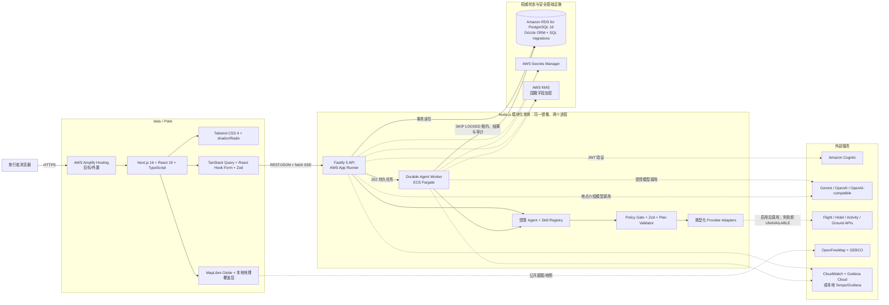
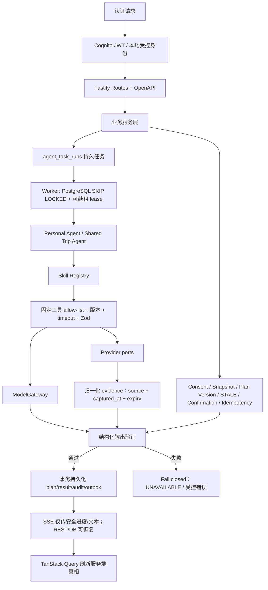
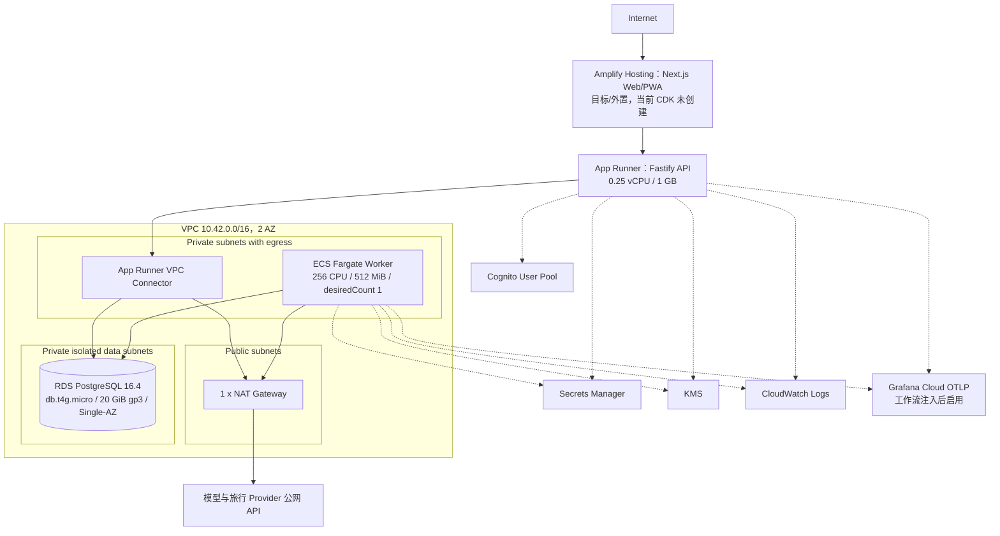

# AI Travel Agent 当前技术架构与技术栈全景

**核对日期：** 2026-09-07  
**事实来源：** `TECH_STACK.md`、`apps/api/ARCHITECTURE.md`、`apps/api/src/`、`apps/web/`、`infra/`、`.github/workflows/`。  
**阅读约定：** “已实现”表示仓库已有生产代码；“默认关闭”表示 adapter 已实现，但当前 CDK 生产环境变量不会启用；“目标/外置”表示技术决策已确定，但不由当前 CDK stack 创建。

## 1. 一图总览

核心判断：系统是一个共享代码库和数据库的**模块化单体**。HTTP API 只负责认证、命令接收和结果读取；已接受的 Agent 任务写入 PostgreSQL，由独立 Worker 通过租约执行，因此浏览器或 SSE 断线不会取消任务。

## 2. 核心业务与 Agent 控制流

模型不是业务状态机，也不能直接访问数据库。以下不变量由服务端和 PostgreSQL维护：

- Profile、私聊、国籍和证件默认私有；Shared Agent 只能读取当前 Trip 已明确授权的最小字段投影。
- `constraint_snapshot` 不可变；授权撤回、成员约束变化、价格/库存失效会令依赖 plan 与 confirmation 进入 `STALE`。
- 只有三位 required members 对同一最新未过期 plan version 明确确认后，才允许调用 booking sandbox。
- provider 结果必须通过 Zod 归一化并携带来源和采集时间；缺失、超时、schema 漂移或不可信结果统一 fail closed，不使用运行时 fixture fallback。
- SSE 是可丢失的展示通道，不是权威状态；任务、最终结果、幂等和 callback 去重均以数据库为准。

## 3. AWS 部署拓扑

`FoundationStack` 创建 VPC、RDS、Cognito、KMS 和运行时 secrets；`RuntimeStack` 构建同一 API Docker 镜像，并分别启动 App Runner API 与 Fargate Worker。生产 migration 作为一次性 Fargate task 运行，不由 API 启动时隐式执行。

## 4. 技术栈清单

| 层 | 当前选型 | 仓库中的职责 |
| --- | --- | --- |
| 语言与运行时 | TypeScript 5、Node.js >= 20 | Web、API、Worker、CDK 统一语言栈 |
| Web 框架 | Next.js 16.3、React 19.2、next-intl | 响应式 Web/PWA、国际化、SSR/客户端页面 |
| UI | Tailwind CSS 4、shadcn、Radix Slot、Lucide | 组件、样式、图标和可访问交互 |
| 前端状态 | TanStack Query 5、React Hook Form、Zod 4 | 服务端状态缓存、表单草稿、边界校验；未使用 Redux，当前依赖中也没有 Zustand |
| 地图 | MapLibre GL 6、OpenFreeMap Liberty、GEBCO WMS、Natural Earth 派生边界、版本化本地地点数据 | 探索 globe 与视觉参考；不得成为路线、签证、价格或库存事实来源 |
| API | Fastify 5、REST/JSON、Swagger/OpenAPI、fetch-based SSE | 认证边界、命令接收、查询、流式展示 |
| Agent | `@openai/agents`、自研受限 Agent/Skill Registry、ModelGateway | Personal/Shared agent、固定能力白名单、schema/timeout/audit |
| 模型 | OpenAI SDK 7；Gemini OpenAI-compatible、OpenAI 或自定义 compatible endpoint | 结构化规划、私聊回复、计划差异和公共地点介绍 |
| 数据库 | PostgreSQL 16、`postgres` driver、Drizzle ORM、手写 SQL migrations | 唯一业务真相、事务、不变量、任务租约、审计、outbox、缓存 |
| 身份与密钥 | Cognito、`aws-jwt-verify`、Secrets Manager、KMS、HMAC-SHA256 | 用户身份、secret 注入、provider-only 国籍加密、callback/邀请签名 |
| 异步执行 | PostgreSQL `agent_task_runs` + `FOR UPDATE SKIP LOCKED` + renewable lease | 无 Redis、SQS、Temporal、Step Functions 或 WebSocket；Worker 可恢复/重试/取消 |
| 可观测性 | Pino、Prometheus text metrics、OpenTelemetry OTLP、CloudWatch Logs、Grafana Cloud；本地 Tempo/Grafana | 结构化脱敏日志、低基数指标、API→DB→Worker→provider 跨进程 trace |
| 部署/IaC | AWS CDK 2、Docker、ECR asset、App Runner、ECS Fargate、RDS、VPC/NAT | Foundation/Runtime 两栈部署与可回滚 Worker service |
| 测试与质量 | Vitest、Testing Library、jsdom、ESLint、TypeScript、CDK assertions、GitHub Actions + PostgreSQL 16 service | 单元/集成/契约、类型、lint、docs-source 一致性和 IaC 测试 |

## 5. Provider 能力矩阵

| 能力 | 已实现 adapter | 当前 CDK 默认 |
| --- | --- | --- |
| 航班 | Amadeus Flight Offers、FlightAPI.io、SerpAPI Google Flights | `FLIGHT_PROVIDER` 未设置，等价于 `disabled` |
| 酒店实时报价 | Nuitee Connect、SerpAPI Google Hotels | `PLAN_ENABLE_HOTEL=false`，且未绑定 provider |
| 活动 | Viator Experiences MCP | 未配置，返回 `UNAVAILABLE` |
| 地点检索 | openrouteservice Geocoding；OpenTripMap POI | `PLAN_ENABLE_PLACES=false` |
| 路线 | openrouteservice Directions | `PLAN_ENABLE_NAVIGATION=false` |
| 地面交通报价 | Amadeus Transfer Search | 无凭据时不可用；可由 `PLAN_ENABLE_MOBILITY` 关闭 |
| 住宿发现 | OpenTripMap（非价格 evidence） | `PLAN_ENABLE_ACCOMMODATION_DISCOVERY=false` |
| 公共交通 | 仅保留 `TransitJourneyProvider` port | 无 live adapter，固定 `UNAVAILABLE` |
| Visa readiness | 服务端 readiness 编排与 provider port | 只允许个人 checklist/缺口/官方核验下一步，不声称法律结论或获批 |

所有 adapter 都遵循同一结果边界：`LIVE` 必须有来源与 `capturedAt`；其余状态不得携带伪造 data。模型和浏览器都不能选择 provider，durable task 在接受时绑定 provider，运行中配置变化不得静默切换供应商。

## 6. 当前状态与边界

- **已经落地：** Web、Fastify API、独立 Worker、PostgreSQL schema/migrations、受限 Agent/Skill、ModelGateway、主要旅行 adapter、Cognito/KMS/Secrets/RDS/App Runner/Fargate CDK、日志/指标/trace 代码与 CI。
- **当前 CDK 默认可运行主路径：** Cognito 身份、Fastify API、Worker、PostgreSQL、Gemini `gemini-3.1-flash-lite` 模型网关。
- **当前 CDK 默认关闭：** hotel/place/navigation/accommodation discovery、Personal conversation tool dispatch、offer cue、OTel exporter；航班 provider 也因未选择而关闭。
- **仓库外或需单独接入：** Amplify Hosting 配置、真实 provider 凭据/商业授权、Grafana Cloud endpoint/token 注入、生产 DNS/域名。
- **明确不采用：** 自由多 Agent 群、Redis、独立消息队列、Temporal、Step Functions、WebSocket、真实支付/真实预订/签证申请、运行时 fixture fallback、客户端全局业务真相。

## 7. 本地开发拓扑

`apps/api/docker-compose.yml` 提供 PostgreSQL、API、Worker，并可选启用 location-reference sidecar；`docker-compose.observability.yml` 可叠加 Tempo 与 Grafana。Web 由 `apps/web` 的 Next.js dev server 单独启动。API 与 Worker都先初始化 tracing，再加载可被自动 instrumentation patch 的模块。

## 8. 维护规则

架构或边界变化时，同一变更至少核对并同步：`TECH_STACK.md`、`docs/PRD.md`、`docs/backlog.md`、`docs/test-scenarios.md` 以及本页。尤其要区分“adapter 已实现”“feature flag 已启用”“凭据已配置”“生产链路已验证”四种不同状态。
