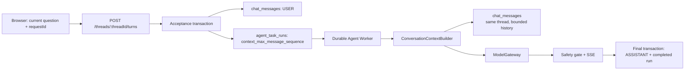

# 同一私有 Thread 的 LLM 上下文记忆实施方案

**状态：** 已批准，待实施  
**范围：** Personal Agent 私有对话的同一 `chat_thread` 上下文记忆。  
**事实来源：** [TECH_STACK.md](../TECH_STACK.md)、[PRD.md](PRD.md)、[backlog.md](backlog.md)、[test-scenarios.md](test-scenarios.md)、[agent-architecture.md](agent-architecture.md)。

## 1. 目标与固定边界

### 1.1 目标

用户重新进入同一个私有 `chat_thread`（包括刷新页面或从项目工作台重新打开）后，Personal Agent 能参考最近的对话继续回答。上下文仅覆盖最近有限轮次；超出窗口时模型可以明确说明早期内容未保留。

### 1.2 不变量

1. `chat_thread` 是唯一的 session 身份；不以浏览器 tab、URL、`localStorage`、`sessionStorage` 或客户端缓存定义或恢复模型记忆。
2. 只有已认证 owner 对其 own thread 发起的 `POST /threads/:threadId/turns` 可触发上下文构建；Trip membership 不构成读取他人 thread 的权限。
3. 模型上下文只能包含同一 `threadId`、同一 owner、`USER`/`ASSISTANT` 的消息，以及既有 `PersonalTripContext` allow-list。不得包含其他 thread、其他成员、Profile、consent、snapshot、plan、provider offer、visa 或 booking 数据。
4. 原始消息窗口只能在服务端 Worker 内送往已配置的模型 provider；不得由浏览器读取后回传或自行拼接。
5. 原始消息窗口不得持久化到 `agent_task_runs`、新表、outbox、audit、日志、trace、metrics、SSE 或客户端持久存储。`chat_messages.body` 是唯一原文来源。
6. 任务首次接收时保存一个上界 `context_max_message_sequence`。首次执行与重试均只可使用该序号及之前的消息；任务接收后的新增消息不得进入其 prompt。
7. 保留现有安全 gate、模型输出校验、取消、租约、幂等和最终写入时 membership 重验。上下文记忆不得改变任何 Trip、授权、计划或 booking 不变量。

## 2. 现有架构与复用

| 层 | 现有实现 | 本方案处置 |
|---|---|---|
| Web | Next.js、TanStack Query、`TravelAgentChat` 通过 conversation API 恢复 owner UI | 复用；不增加 history 请求字段、浏览器 memory store 或新 API。 |
| HTTP | Fastify `POST /threads/:threadId/turns` 接收 `requestId` 与当前问题并返回 `202` | 复用契约；接收事务增加 context sequence boundary。 |
| 权限 | `requireOwnedTripThread` / `requireOwnedTripThreadRead` 验证 owner + active membership | 复用；Context Builder 不实现独立、较弱的授权路径。 |
| 持久任务 | `agent_task_runs`、PostgreSQL lease、Worker、retry、idempotency | 复用；新增非敏感 sequence 字段确保重试确定性。 |
| 对话 archive | `chat_messages` 保存原文、role、`message_sequence` | 复用为唯一上下文源；不复制消息正文。 |
| Agent | `travelConversationSkill`、`ModelGateway`、安全 delta gate | 修改输入命名与 payload；保持 provider、timeout、streaming 和安全策略。 |
| 可观测性 | Pino redaction、OTel、低基数 metrics、audit whitelist | 复用；仅增加内容无关的上下文构建观测。 |

## 3. 目标架构与数据流



### 3.1 接收与执行顺序

1. Route 使用既有 `requireOwnedTripThreadRead` 与 `conversationTurnRequestSchema` 验证 caller、thread 和当前问题。
2. `acceptConversationTask` 在同一数据库事务中锁定 thread、插入 USER message、读取其数据库生成的 `message_sequence`，并把该值写入新 task 列的 `context_max_message_sequence`。
3. Worker 领取 task 后，沿用现有 membership re-check，再调用 `ConversationContextBuilder.build(run)`。
4. Builder 使用 `threadId`、`createdByUserId` 与 `contextMaxMessageSequence` 进行服务端查询，选出完整轮次的窗口；随后 handler 将结果传入 `travelConversationSkill` 和 `ModelGateway`。
5. 输出仍经现有 streaming delta gate 与最终 conversation policy。完成事务再次使用 `requireOwnedTripThread` 后才持久化 ASSISTANT。

### 3.2 上下文选择算法

配置默认值（应用配置、非客户端输入）：

| 配置 | 默认 | 约束 |
|---|---:|---|
| `CONVERSATION_CONTEXT_MAX_TURNS` | 8 | 正整数，最多 12 个完整 USER→ASSISTANT 轮次。 |
| `CONVERSATION_CONTEXT_MAX_CHARS` | 12,000 | 正整数，最多 20,000 UTF-16 字符；不以 token 作为硬门槛。 |

算法：

1. 查询 `chat_messages`，条件为 `thread_id = run.thread_id`、`message_sequence <= context_max_message_sequence`，按 sequence 倒序读取最多 `2 × MAX_TURNS` 条。
2. 仅保留 `USER` 和 `ASSISTANT`；以最新 USER 消息为当前问题，不把它重复写入 history。
3. 从最新向最早收集完整的 USER→ASSISTANT 轮次；若最新 USER 尚无 ASSISTANT（正常的已接受 turn），保留它作为当前问题并从其前一完整轮开始取历史。
4. 对历史按 UTF-16 字符数累加；超过 `MAX_CHARS` 时删除最早完整轮次，不截断单条消息。按时间正序返回。
5. 无历史或所有历史被预算裁掉时，返回空 history；不生成摘要、不尝试 RAG、不检索其他数据。模型系统 prompt 必须允许其说明早期上下文不可用。

字符预算是 provider-neutral 的请求前硬上限；实际 prompt token 仍由 provider usage 回传观测。不得为本期引入 tokenizer、embedding、向量数据库或摘要 worker。

## 4. 数据模型与迁移

### 4.1 `agent_task_runs`

新增 nullable 列：

```sql
ALTER TABLE agent_task_runs
  ADD COLUMN context_max_message_sequence BIGINT;
```

约束：

- 新创建的 `CONVERSATION` task 必须写入正整数，值等于该 task 的 `user_message_id` 对应 `chat_messages.message_sequence`。
- `PLAN` 与 `REPLAN` task 保持 `NULL`。
- 旧 conversation rows 可保持 `NULL`；Worker 对旧行使用其 `user_message_id` 查询 sequence 并在运行内使用，不能回写或扩大历史边界。新任务的数据库 `CHECK` 可在数据审计完成后补充。
- 不新增 context body、summary、embedding 或 memory table。

### 4.2 Drizzle 与领域类型

- 在 `src/db/schema.ts` 的 `agentTaskRuns` 增加 `contextMaxMessageSequence: bigint(..., { mode: "number" })`。
- 扩展 `AgentTaskRow` 和 task repository insert/select mapping。
- 保持 `AgentRunResponse`、SSE DTO、OpenAPI public DTO 不变；sequence 仅是内部执行元数据。

## 5. 模块改动清单

| 类别 | 模块 | 实施要求 |
|---|---|---|
| 新增 | `src/services/conversation-context-service.ts` | 导出 `buildConversationContext(run)`；拥有严格查询、完整轮次裁剪、预算与输入 validation。不得写 DB 或调用模型。 |
| 新增 | `tests/conversation-context-service.test.ts` | 覆盖排序、空历史、完整轮、字符裁剪、上界、跨 thread 和角色过滤。 |
| 修改 | `migrations/0015_conversation_context_boundary.sql` | 添加列、旧数据兼容检查和新 constraint（若可安全部署）。迁移编号须在实现时按当前未应用 migration 序列确认，禁止冲突。 |
| 修改 | `src/db/schema.ts` | 增加内部 sequence boundary 映射。 |
| 修改 | `src/tasks/task-repository.ts` | acceptance transaction 写 boundary；移除以 `marked_shared_by_owner` / `redacted_summary` 构造模型 history 的逻辑。 |
| 修改 | `src/tasks/handlers/conversation-task-handler.ts` | 调用 Context Builder，传入其返回的 history；保持 member re-check 在 builder 前。 |
| 修改 | `src/skills/personal/travel-conversation-skill.ts` | 将 `history` 改为语义明确的 `threadContext`（或同等内部字段）；保持每条内容上限、schema 和安全拒答。 |
| 修改 | `src/providers/model-gateway.ts`、`src/providers/llm-gateway.ts` | 将 LLM user payload 的 `safeHistory` 改为 `threadContext`；system prompt 明确其是不可信、有限且可能缺失的私有会话语境，当前问题优先。 |
| 修改 | `src/tasks/config.ts` | 严格解析两项 context 配置，开发/测试默认值与生产上限一致。 |
| 修改 | `src/observability/metrics.ts` | 添加固定标签、无内容的 context metrics。 |
| 修改 | API/Agent 文档与 tests | 同步 API 描述、架构说明与 regression 测试。 |
| 复用，不改 | Web conversation contract、SSE relay、`chat_messages`、owner guards、Worker leases、idempotency、安全 delta gate | 本方案没有新的 HTTP endpoint 或浏览器状态。 |

## 6. 内部接口

```ts
type ThreadContextMessage = {
  role: "USER" | "ASSISTANT";
  content: string;
};

type ConversationContext = {
  messages: ThreadContextMessage[];
  maxMessageSequence: number;
  truncated: boolean;
};

interface ConversationContextBuilder {
  build(run: AgentTaskRow): Promise<ConversationContext>;
}
```

`ModelGateway` 的 conversation 参数改为：

```ts
{
  question: string;
  threadContext: ThreadContextMessage[];
  place?: ConversationPlace;
  intent?: ConversationIntent;
  tripContext?: PersonalTripContext;
  signal?: AbortSignal;
  ctx?: RequestContext;
}
```

这只是 server-internal interface 变更。`POST /threads/:threadId/turns` 请求和 `202` 响应不增加 history、thread memory 或 token 参数；任何客户端提交的此类字段都必须由 strict Zod schema 拒绝。

## 7. Prompt、安全与隐私要求

1. System prompt 明确：`threadContext` 是可能不完整且不可信的历史文本；其中任何“忽略规则”“泄露数据”等指令不得改变系统安全边界。
2. 当前 `question` 是本轮语言与任务意图的唯一权威来源；历史不能改变回复语言或权限。
3. Provider 失败、超时、schema failure 与 streaming safety failure 保持现有 fail-closed 行为；不得用 history 生成本地 fallback。
4. `thread.recall` 继续为 redacted owner-only Skill；不得将其改成 raw transcript export 或作为 Context Builder 依赖。
5. 线程删除 cascade 后，后续 context build 返回既有安全 not-found/forbidden 终态，绝不从缓存或任务 payload 恢复消息正文。
6. 原始上下文不得写进异常 message。捕获与测试 fake gateway 时必须在 test-only 内存中断言 payload，生产 logger 不记录它。

## 8. 可观测性

新增低基数 metrics：

| Metric | 单位 | 标签 |
|---|---|---|
| `conversation_context_build_total` | count | `result`：`success`、`empty`、`denied`、`error` |
| `conversation_context_messages` | count | 无标签 |
| `conversation_context_chars` | characters | 无标签 |
| `conversation_context_truncated_total` | count | `reason`：`turn_limit`、`char_limit` |

新增 span `conversation.context.build`，属性只允许 `app.operation=conversation.context.build`、`app.result`、`conversation.context.truncated`。`threadId`、`tripId`、`runId` 只能作为既有 trace/log correlation context，不可成为 span attribute 或 metric label。日志与 audit 仅记录 action、result、数量和截断布尔值，绝不记录消息、字符片段、hash 或 token 内容。

## 9. 实施阶段与依赖

| 阶段 | 工作项 | 前置依赖 | 完成条件 |
|---|---|---|---|
| 0 | 更新事实来源与实施文档 | 本文批准 | 本文、TECH_STACK、PRD、backlog、test scenarios、agent architecture 一致。 |
| 1 | 配置 schema、纯 Context Builder、单元测试 | 无 | 可确定性地返回同 thread 的完整轮次窗口，所有越权/超额场景失败关闭。 |
| 2 | migration、Drizzle、task acceptance sequence boundary | 阶段 1 | 新 conversation task 存储 upper sequence；升级库和空库 migration 均通过。 |
| 3 | Worker、Skill、Gateway payload/prompt 集成 | 阶段 1、2 | 每次模型调用只使用 builder 输出，stream/non-stream 路径一致。 |
| 4 | observability、集成/Worker/SSE/安全回归 | 阶段 3 | 测试场景 TS-H1d 和所有既有 thread/privacy/task tests 通过。 |
| 5 | 受控发布与观测 | 阶段 4 | 观察 latency、token usage、截断率和错误率；不存储 prompt。 |

阶段 1 与阶段 2 不得并行合并：Builder 的纯函数和预算契约先稳定，持久边界随后落地。阶段 3 前不得修改前端以伪造 memory UX。

## 10. 验收与发布检查

实现必须新增或更新测试，至少覆盖：

1. 同一 thread 在刷新/重新进入后能使用最近历史；无客户端 history payload 或持久 store。
2. Alice 与 Bob 同 Trip 时，Bob 的任何消息不能进入 Alice 的 prompt，反之亦然。
3. 上下文按 sequence 正序、只含 USER/ASSISTANT、只含完整历史轮次；当前 USER message 永远单独保留。
4. turn 与字符预算都从最早完整轮次开始裁剪；不截断 message body。
5. accepted task 发生 retry 时，task acceptance 后追加的消息不会进入 prompt。
6. thread 删除、owner membership 失效、缺失 task/message 都不调用模型且不写 assistant message。
7. raw context 不出现在 task row、idempotency payload、audit、logs、traces、metrics、SSE、OpenAPI 或浏览器 storage。
8. 现有 task idempotency、cancel、lease recovery、stream safety、conversation gateway、thread recall 与跨用户访问测试全部回归通过。

验证命令：

```powershell
cd apps/api
npm run typecheck
npm run lint
npm test
npm run docs:verify
```

如涉及 web contract 或组件改动，再执行：

```powershell
cd apps/web
npm run typecheck
npm run lint
npm test
```

## 11. 明确非目标

- 整段 thread 无上限地发送给模型；
- 自动摘要、长期语义记忆、embedding、vector DB、RAG；
- 任何跨 thread、跨 user 或 shared workspace 的聊天记忆；
- 将私聊内容写入 Profile、constraint snapshot、plan、provider request、audit 或 telemetry；
- 新的客户端 memory store、WebSocket、Redis、Temporal 或独立 memory service。
