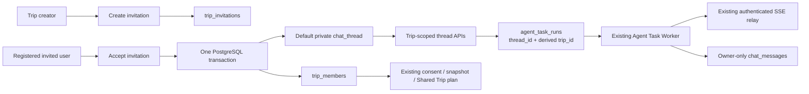

# Trip 绑定私有对话线程实施方案

**状态：** Approved for implementation  
**适用范围：** Hackathon MVP  
**实施边界：** 本文只定义 Trip 范围内的私有 Personal Agent 对话、已注册用户邀请和成员线程初始化。不改变 consent、snapshot、Shared Trip planning、确认或 booking sandbox 的权威状态边界。

## 1. 决策与不变量

### 1.1 已确认决策

1. 所有可创建、可使用的 Personal Agent 对话线程必须绑定一个已存在的 `tripId`；不再提供未绑定 Trip 的个人通用线程。
2. 一个 Trip 可有多个线程；线程只能属于一个 Trip、一个 owner。一个成员可在同一 Trip 下拥有多条线程。
3. 用户接受邀请并成为 Trip 成员时，服务端在同一数据库事务内为其创建一条空白的默认私有线程。
4. Trip 内所有线程均为私有：其他成员、Trip 创建者和 Shared Trip Agent 都不得读取 thread 元数据以外的他人线程，且不得读取消息正文、摘要或对话历史。
5. 邀请仅面向已注册用户。邀请记录指定受邀 `userId`；不实现邮箱领取、注册后匹配、群组邀请或公开链接加入。
6. 从 thread 发起的对话绝不创建新的 Trip。服务端从 `threadId` 推导既有 `tripId`；浏览器不得提交或覆盖该关联。
7. Personal Agent 仅获得最小只读 Trip 上下文，不自动获得其他成员资料、私聊、consent、constraint snapshot、报价、确认或 booking 数据。

### 1.2 强制不变量

- `chat_threads` 中一条 active Trip thread 必须同时满足 `owner_user_id`、`trip_id` 非空，且 owner 是该 Trip 的 active member。
- 每个 active `(owner_user_id, trip_id)` 最多一条默认 thread；默认 thread 可为空消息记录。
- 所有消息和对话 task 访问均须验证 `thread.owner_user_id = request.user.id`。Trip membership 不能代替 owner 校验。
- 对话 task 的 `trip_id` 由服务端的 thread row 派生并持久化；客户端输入不可信。
- 私聊正文、红摘要、stream delta 和模型输出不得进入 `constraint_snapshot`、Shared Agent 输入、同行者响应、audit summary、日志、trace 属性或 metric label。
- 接受邀请是幂等操作：重复请求只返回既有成员和既有默认 thread，绝不创建重复 membership 或默认 thread。

## 2. 现有架构与复用点

| 层 | 当前实现 | 本方案处置 |
|---|---|---|
| Web | Next.js 16、React 19、TanStack Query、typed `TravelApi` | 复用；新增 Trip workspace 的 thread queries/mutations，删除全局 thread 指针作为 Trip 对话入口。 |
| API | Fastify 5，统一 `/api/v1` 前缀，Cognito/local-dev 身份中间件 | 复用；新增 invitation 与 Trip-scoped thread 路由。 |
| 数据库 | PostgreSQL + Drizzle；`shared_trips`、`trip_members`、`chat_threads`、`chat_messages` | 修改 `chat_threads`；新增 invite 表、约束和迁移。 |
| 异步 Agent | `agent_task_runs`、PostgreSQL lease worker、fetch-SSE relay、`ModelGateway` | 复用；在对话 task 中写入服务端派生的 `tripId`，提供最小上下文。 |
| 权限 | thread owner guard、Trip membership guard、Cognito subject → user ID | 复用并组合；所有 Trip-scoped thread 命令执行 owner + membership 双重校验。 |
| 审计与遥测 | `recordAudit`、Pino redaction、OTel trace、低基数 metrics | 复用；添加 invitation/thread provisioning 审计 action，ID 只作 log/trace 关联。 |

现有 `POST /threads` 接受可选 `tripId`，但不验证调用者是否为该 Trip member；现有 `POST /trips/:tripId/join` 也不校验邀请。实施本方案时必须移除这两个绕过路径，而不是在新路由旁保留它们。

## 3. 目标系统架构



`SP` 不读取 `MSG`。thread 关联只提供私人组织和最小上下文，不构成共享授权。

## 4. 数据模型与迁移

### 4.1 `chat_threads` 修改

保留既有主键、owner、title、timestamps 与 `chat_messages` 外键；新增以下字段：

```sql
CREATE TYPE chat_thread_scope AS ENUM ('TRIP');

ALTER TABLE chat_threads
  ADD COLUMN scope chat_thread_scope NOT NULL DEFAULT 'TRIP',
  ADD COLUMN is_default boolean NOT NULL DEFAULT false;

ALTER TABLE chat_threads
  ALTER COLUMN trip_id SET NOT NULL;

CREATE UNIQUE INDEX chat_threads_one_active_default_per_member_trip
  ON chat_threads (owner_user_id, trip_id)
  WHERE is_default = true AND archived_at IS NULL;

CREATE INDEX chat_threads_trip_owner_active_idx
  ON chat_threads (trip_id, owner_user_id, created_at DESC)
  WHERE archived_at IS NULL;
```

`scope` 在 MVP 只有 `TRIP`，保留该显式字段是为了让数据库和 API 契约表达“不存在 general thread”这一业务不变量。不要为未来类型预先新增行为。

迁移前必须处理已有 nullable `trip_id` thread：本项目当前数据若包含未绑定 thread，迁移不得静默分配任意 Trip。生产/演示迁移策略为：先归档这些 legacy thread 并删除正文，或在一次人工确认的 data migration 中为每条 thread 指定真实 Trip；在没有可证明映射时，采用前者。迁移应在执行 `SET NOT NULL` 前显式失败并输出待处理数量。

### 4.2 新表：`trip_invitations`

```sql
CREATE TYPE trip_invitation_status AS ENUM (
  'PENDING', 'ACCEPTED', 'REVOKED', 'EXPIRED'
);

CREATE TABLE trip_invitations (
  id uuid PRIMARY KEY DEFAULT gen_random_uuid(),
  trip_id uuid NOT NULL REFERENCES shared_trips(id) ON DELETE CASCADE,
  invited_user_id uuid NOT NULL REFERENCES users(id) ON DELETE CASCADE,
  invited_by_user_id uuid NOT NULL REFERENCES users(id) ON DELETE RESTRICT,
  status trip_invitation_status NOT NULL DEFAULT 'PENDING',
  token_hash varchar(128) NOT NULL UNIQUE,
  expires_at timestamptz NOT NULL,
  accepted_at timestamptz,
  revoked_at timestamptz,
  created_at timestamptz NOT NULL DEFAULT now(),
  CONSTRAINT trip_invitation_status_timestamps CHECK (
    (status = 'ACCEPTED') = (accepted_at IS NOT NULL)
  )
);

CREATE UNIQUE INDEX trip_invitations_one_pending_invitee
  ON trip_invitations (trip_id, invited_user_id)
  WHERE status = 'PENDING';
CREATE INDEX trip_invitations_accept_lookup_idx
  ON trip_invitations (token_hash, status, expires_at);
```

Token 只以高熵随机明文在创建响应中返回一次；数据库、日志、audit、trace 均只保存 hash 或 invite ID。接受邀请时使用 timing-safe hash comparison。MVP 的 token 不是身份凭据，调用者仍必须以 Cognito 登录，并匹配 `invited_user_id`。

### 4.3 `agent_task_runs` 修改

`agent_task_runs.trip_id` 已存在。修改 `acceptConversationTask`：锁定并读取 `chat_threads` 后，写入 `thread.trip_id` 到 task row。增加一致性检查：对 `operation = CONVERSATION`，`thread_id` 与 `trip_id` 必须同时存在；其 `trip_id` 必须等于 thread 的 `trip_id`。可用 database trigger 或写入路径的 transaction assertion 实现，MVP 至少应在 repository 内强制并增加集成测试。

### 4.4 审计 enum

新增：`TRIP_INVITATION_CREATE`、`TRIP_INVITATION_ACCEPT`、`TRIP_INVITATION_REVOKE`、`TRIP_DEFAULT_THREAD_PROVISION`。audit summary 仅允许 `invitationId`、`threadId`、`tripId`、状态和布尔结果；不得包含 token、邮箱、消息或 profile 字段。

## 5. 服务端模块改动

| 类型 | 模块 | 实施内容 |
|---|---|---|
| 修改 | `src/db/schema.ts` | 新增 invitation table/enums，扩展 chat thread schema 与索引。 |
| 新增 | `src/services/trip-invitation-service.ts` | 创建、接受、撤销 invite；token hash；状态机；原子 provision。 |
| 修改 | `src/routes/trips.ts` | 删除无授权 `POST /trips/:tripId/join`；保留 Trip 创建但不允许其绕过 invitation acceptance。 |
| 新增 | `src/routes/trip-invitations.ts` | invitation create/accept/revoke HTTP 边界。 |
| 修改 | `src/routes/chat-threads.ts` | 移除通用 `POST /threads` 的 Trip 绑定能力；新增或注册 Trip-scoped routes。 |
| 新增 | `src/routes/trip-threads.ts` | `GET/POST /trips/:tripId/threads` 与默认 thread get-or-create。 |
| 修改 | `src/services/chat-conversation-service.ts` | `requireThreadOwner` 后再校验 owner 仍是 Trip member；返回的 thread metadata 保持 owner-only。 |
| 修改 | `src/tasks/task-repository.ts` | 从锁定的 thread row 派生 task `tripId`；不得接收客户端 trip ID。 |
| 修改 | `src/tasks/handlers/conversation-task-handler.ts` | 构造最小只读 `PersonalTripContext`；不得加载 snapshot 或他人数据。 |
| 修改 | `src/app.ts` | 注册新路由。 |
| 修改 | `src/types/schemas.ts` | 替换 thread create contract，新增 invitation/Trip thread DTO 与 OpenAPI schema。 |
| 修改 | `src/services/audit-service.ts` / schema enum | 允许新审计 action，并保持 summary whitelist。 |

### 5.1 统一鉴权 helper

新增 `requireOwnedTripThread(tx, threadId, ownerUserId)`，必须：

1. `SELECT chat_threads ... FOR UPDATE`；
2. 验证 thread 存在；
3. 验证 `owner_user_id = ownerUserId`；
4. 验证存在 `(trip_id, ownerUserId)` 的 `trip_members`；
5. 返回 thread row（含可信 `tripId`）。

它替代各处仅检查 owner 的重复实现，并由 thread conversation、message append、delete、task acceptance 使用。若成员已被移除，则所有 active Trip thread 返回 `403`，不再接受新 turn；历史保留策略由 Trip membership removal 功能实现时一并定义，当前 MVP 不新增 member removal endpoint。

### 5.2 Invitation 服务状态机

```text
PENDING --accept by invited authenticated user--> ACCEPTED
PENDING --creator revoke------------------------> REVOKED
PENDING --read/accept after expiry--------------> EXPIRED
ACCEPTED / REVOKED / EXPIRED -------------------> terminal
```

`accept` transaction 顺序：锁 invite → 检查受邀人/状态/expiry → upsert `trip_members` → select-or-insert default thread → 更新 invite `ACCEPTED` → 写两个 audit event。遇到已接受邀请或既有 membership 时，返回同一 default thread，不产生新的审计“成功接受”事件。

## 6. API 契约

所有接口均在 `/api/v1` 下，使用 Cognito bearer authentication；`local-dev` 仅沿用现有 loopback 限制。

### 6.1 Invitations

#### `POST /trips/:tripId/invitations`

仅 Trip `CREATOR` 可调用。

```json
{ "invitedUserId": "uuid", "expiresAt": "2026-09-01T00:00:00.000Z" }
```

响应 `201`：

```json
{ "invitationId": "uuid", "inviteToken": "one-time-secret", "expiresAt": "..." }
```

不得邀请已是 member 的用户；同一受邀人存在 pending invitation 时返回 `409`。

#### `POST /trip-invitations/:inviteToken/accept`

只允许 token 指定的已认证用户调用。响应 `200`：

```json
{
  "tripId": "uuid",
  "membership": "MEMBER",
  "defaultThread": { "id": "uuid", "tripId": "uuid", "isDefault": true }
}
```

#### `POST /trips/:tripId/invitations/:invitationId/revoke`

仅 creator 可撤销 `PENDING` invitation。已接受的 invitation 不能通过 revoke 移除成员。

### 6.2 Trip-scoped threads

#### `GET /trips/:tripId/threads`

仅当前 Trip member。仅返回调用者自己拥有的 active threads，按 `isDefault DESC, createdAt DESC` 排序。

#### `POST /trips/:tripId/default-thread`

仅当前 Trip member，幂等 get-or-create。用于兼容历史数据与网络重试；正常 invitation acceptance 已自动创建，因此前端通常只读调用。

#### `POST /trips/:tripId/threads`

仅当前 Trip member，创建额外私有 thread。

```json
{ "title": "Flight options" }
```

服务端固定 `ownerUserId = request.user.id`、`tripId = path param`、`scope = TRIP`、`isDefault = false`。

### 6.3 Existing thread/run APIs

保留 `GET /threads/:threadId/conversation`、`POST /threads/:threadId/turns`、`POST /threads/:threadId/messages`、`DELETE /threads/:threadId` 及 agent-run read/cancel/SSE API，但均使用新的 `requireOwnedTripThread`。

删除 `POST /threads` 和 `GET /threads` 的产品入口与公开 OpenAPI contract；若需短期迁移兼容，可让它们固定返回 `410 Gone` 与安全迁移说明，不能继续接受 `tripId`。

## 7. Personal Agent 最小只读 Trip 上下文

对话 worker 仅可使用下列 server-derived DTO：

```ts
type PersonalTripContext = {
  tripId: string;
  tripName: string;
  tripStatus: "PLANNING" | "STALE" | "CONFIRMED";
  travelDateStart: string | null;
  travelDateEnd: string | null;
  destinationCandidates: string[];
};
```

加载条件为：task creator 是 thread owner，且在 task 执行时仍为 trip member。禁止字段：`tripMembers`、display name 列表、profile、consent、snapshot、provider offers、plan payload、confirmation、visa output、booking execution、其他 thread 或其他 message。执行期间 membership 不再成立时，task 以 `STALE` 或 `POLICY_DENIED` 终态结束，不写 assistant message。

## 8. 前端实现

### 8.1 路由与状态

- 将 `apps/web/src/app/[locale]/trips/[tripId]/page.tsx` 从 placeholder 替换为 Trip workspace。
- workspace 首屏并行请求 Trip detail、`GET /trips/:tripId/threads`；无 default thread 时调用幂等 default endpoint。
- 线程选择只保存在 URL segment/query 或组件局部 UI state；TanStack Query server keys 使用 `['trips', tripId, 'my-threads']` 和 `['threads', threadId, 'conversation']`。
- 删除 `travel-agent-chat.tsx` 中全局 `localStorage` thread pointer 作为 Trip 对话选择器。它不能表示当前 Trip，也不能作为业务真相。
- Home 的地图对话框继续沿用既有的收起输入条、打开与关闭交互；`ExploreChatHost` 只为该 UI 提供当前 Trip 的默认私有 thread，不得恢复浏览器本地 thread 创建或存储逻辑。Trip/default thread 尚在准备或失败时，对话入口必须保持可见且禁止发送，并分别显示准备状态或可重试错误。
- `ExploreChatHost` 的包装层必须使用 `display: contents`，不得新增布局或定位容器；Home 地图 `main` 是历史 UI 的绝对定位上下文。
- 新 thread 成功后只失效当前 Trip 的 thread list，并切换到服务端返回的 thread ID。

### 8.2 可见性规则

- Workspace 可展示 Trip 成员安全 presentation data，但 thread rail 仅展示当前用户自己的 title、createdAt/default status。
- 不展示其他成员的 thread 数、标题、时间、是否活跃、run 状态或任何消息。
- 所有 UI 错误使用已有统一 API error handling；`403` 显示“无权限或成员资格已失效”，不泄露具体 thread 或 invitation 状态。

## 9. 实施阶段与依赖

| 阶段 | 工作项 | 前置依赖 | 完成条件 |
|---|---|---|---|
| 0 | 更新 PRD、TECH_STACK、backlog、test scenarios 与 API reference | 本文批准 | 旧的 optional/general thread 与无 token join 说明被移除。 |
| 1 | 数据库 migration、Drizzle schema、audit enum | 无 | 新约束在干净测试库和升级库均可执行。 |
| 2 | invitation service/routes；accept 原子 provision | 阶段 1 | 已注册受邀人可幂等获得 member + default thread。 |
| 3 | Trip-scoped thread routes、统一 auth helper、废弃通用 thread create/list | 阶段 1 | 非成员不能创建/读/写绑定其他 Trip 的 thread。 |
| 4 | task repository/context handler | 阶段 3 | conversation task 有可信 trip ID 且只用 allow-listed context。 |
| 5 | Web Trip workspace、thread rail/new-thread/empty/loading/error states | 阶段 2、3 | 成员可从原 Trip 进入其默认或新增私有 thread。 |
| 6 | 回归、安全、并发和端到端测试；docs verify | 阶段 1–5 | 所有验收场景与现有 planning/consent regression 通过。 |

阶段 1–4 是后端可独立交付链路；前端不得在阶段 3 前假设 API 或 client state。

## 10. 测试与验收

新增后端集成测试至少覆盖：

1. creator 只能邀请已注册、非成员用户；非 creator 创建 invitation 返回 `403`。
2. 非受邀用户、过期 token、撤销 token、重放 token 和无 bearer token 不能加入。
3. 同一 invitation 并发 accept 20 次后，恰有一条 membership 和一条 active default thread。
4. 同一 member 同一 Trip 可创建多条 non-default thread，但不能创建第二条 default thread。
5. 非成员不能通过 `POST /trips/:tripId/threads` 绑定 thread；旧 `POST /threads` 不能绕过该限制。
6. Alice 与 Bob 同属一个 Trip 时，Bob 对 Alice 的 conversation/message/turn/delete/run read/run SSE 均为 `403`，响应不含正文或 thread metadata。
7. owner 被移出 membership（直接 fixture/DB setup）后，后续 turn 拒绝，未完成 task 不写 assistant message。
8. conversation task row 的 `tripId` 等于 thread trip ID；篡改 path/body 无法改变它。
9. Personal Agent tool input 只含 `PersonalTripContext` allow-list；静态和运行时测试均断言没有 snapshot、member/profile 或 message body 泄露。
10. invite/thread/audit/trace/log/metric 输出不含 token、正文、国籍、profile 字段；Trip/thread/run IDs 不成为 metric labels。

新增前端测试至少覆盖：Home 对话入口在 Trip/default thread 加载、创建和失败时保持可见且不可发送；默认 thread 自动进入、额外 thread 创建与切换、不同 Trip 不串 thread、无成员权限、空/加载/错误状态，以及 thread rail 不渲染其他成员信息。

## 11. 风险与实施注意事项

| 风险 | 控制措施 |
|---|---|
| 并发 accept 导致重复默认线程 | 部分唯一索引 + lock/in-transaction upsert + 并发 integration test。 |
| 旧 `join` 或通用 thread API 成为越权旁路 | 在同一发布中删除或 410 旧入口；路由级回归测试。 |
| 前端 localStorage 将不同 Trip 的 thread 混用 | 用 URL/current Trip query key 驱动；localStorage 仅可保存无敏感 UI 偏好，不保存 thread 选择真相。 |
| 将 Trip 绑定误解为共享授权 | worker context 的 compile-time DTO allow-list；Shared Agent 不引用 chat tables。 |
| 迁移时无法为 legacy 未绑定 thread 找到真实 Trip | 显式数据审计和 fail-fast；禁止静默补写。 |
| 邀请 token 泄露 | token 高熵、仅返回一次、hash 存储、短期 expiry、登录身份绑定、可撤销、日志脱敏。 |
| 成员资格在长运行期间变化 | task final persistence 前重新检查 membership/version；失效时 terminal stale，不写 assistant output。 |

## 12. 非目标

- 公开邀请链接、邮箱/手机号邀请后注册、组织/群组邀请；
- 原生共享群聊、同行者之间查看或搜索私聊；
- 用私聊文本直接更新 Profile、consent、snapshot 或计划；
- 新建 Trip 作为对话副作用；
- Redis、WebSocket、Temporal、额外 Agent 服务或新的外部旅行 provider。
